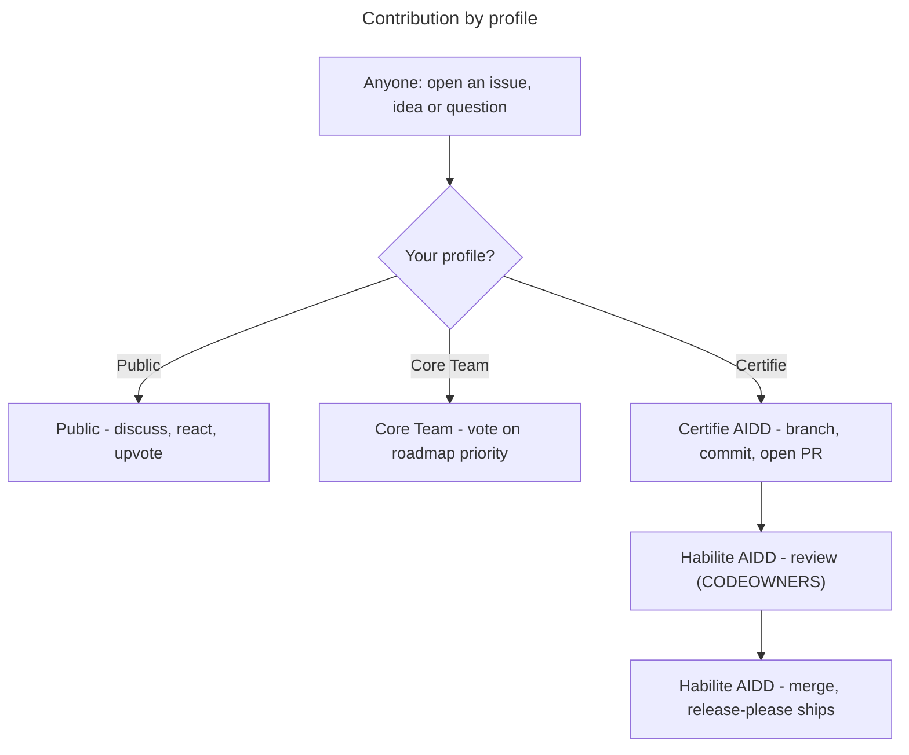

# Contributing to the AIDD Framework

The source of truth for AIDD skills, agents, rules, and templates. Authored in Claude Code syntax; at release time the CLI generates archives adapted to each supported tool.

> Wider AIDD community, roles, and the training programme live at [ai-driven-dev.fr](https://www.ai-driven-dev.fr/). This file covers contributing to **this repository**.

## Who does what (by profile)



**Pull-request rights are held by Certifié and Habilité only** (Certifié via [certification](https://www.ai-driven-dev.fr/), Habilité by promotion). Full role ladder, voting weights, and promotion: [`GOVERNANCE.md`](./GOVERNANCE.md#roles). The rest of this guide is the *how* for those opening PRs.

## 1. Set up

Needs **Node 20+**, **pnpm**, **jq**, **python3**, and **pipx** (`gh` and the Claude/Codex CLI optional). Then:

```bash
make setup
```

- installs deps + git hooks
- registers this checkout as a local marketplace
- installs the plugins into Claude + Codex (`y/N` confirm, since it writes your global config; `YES=1` skips)

`make` lists every target; `make doctor` / `make check` verify the environment and run the pre-commit checks.

### Markdown links

Lefthook runs the Markdown link checker during pre-commit. `make setup` installs the hooks; if dependencies are already installed and you only need the hook wiring, run:

```bash
pnpm exec lefthook install --force
```

Run `node scripts/check-markdown-links.js` to scan the repository. Detailed usage, supported forms, exclusions, and fix guidance live in `node scripts/check-markdown-links.js --help`.

### Test your changes locally

Exercise the skills you touched before opening a PR. Neither tool hot-reloads the checkout (both serve a copied cache), so after editing:

```bash
make reload                        # all plugins; or PLUGIN="aidd-refine aidd-pm" for a subset
```

- reinstalls each plugin from the checkout (current versions, no bump - nothing to revert)
- Claude installs straight from the raw repo (already native Claude format); Codex installs from a tree the `aidd` CLI builds (Claude syntax -> Codex, e.g. agents -> TOML)
- refreshes the cache in Claude + Codex; Codex agents are copied to `~/.codex/agents/` (Codex does not load plugin-bundled agents yet)
- restart the session to load it (`/reload-plugins` covers a Claude-only edit to an existing skill)

## 2. Commit

Format: `<type>(<scope>): description`.

```bash
git commit -m "feat(aidd-dev): add for-sure skill"
```

One scope per commit (split cross-plugin changes). The types, the scopes, and the rules live in [`aidd_docs/memory/vcs.md`](aidd_docs/memory/vcs.md#commit-convention) - it mirrors `commitlint.config.cjs`, the source of truth. **Type** drives the release; see [`RELEASE.md`](./RELEASE.md) for what each type produces.

## 3. Open a pull request

- Branch off `next` and target `next` (the integration branch); only `hotfix/*` branches off `main` for urgent production fixes. The branch prefix alone decides the target — the full prefix → label → target table is in [`aidd_docs/memory/vcs.md`](aidd_docs/memory/vcs.md#types).
- **Fill the PR template** (applied automatically): explain *what* changed and *how* you resolved it technically - that narrative is the point of the PR. The conventional title and pre-commit hooks are already enforced by CI, so don't spend the description re-asserting them.
- **Label the PR** so reviewers and the [Roadmap board](https://github.com/orgs/ai-driven-dev/projects/8) triage at a glance. The triage label follows your branch kind and the PR skill applies it automatically; the label per kind is in that same [routing table](aidd_docs/memory/vcs.md#types) (`security` is cross-cutting — add it to any kind).
- The PR title follows the same conventional format (the **Commitlint** CI job enforces it); PRs are squash-merged using that title.
- A **Habilité** review gates every merge ([`CODEOWNERS`](./.github/CODEOWNERS)); Certifié contributors cannot self-merge.
- Decision rules (lazy consensus, explicit consensus for cross-plugin/contract changes, the quality veto) live in [`GOVERNANCE.md`](./GOVERNANCE.md#code-decisions-merging).

## Releases

How releases flow (the `main`/`next` model, weekly cadence, hotfix, auto-merge) is in [`RELEASE.md`](./RELEASE.md); the release tooling is in [`aidd_docs/memory/vcs.md`](aidd_docs/memory/vcs.md). What a release produces, for contributors:

- **7 independently-versioned packages** (root `aidd-framework` + the 6 plugins).
- On release, CI attaches the bundles:
  - `aidd-framework-marketplace-X.Y.Z.zip` - the Claude Code marketplace (`.claude-plugin/` + `plugins/`); kept as the legacy Claude alias of `aidd-framework-claude-marketplace-X.Y.Z.zip`.
  - `<plugin>-vX.Y.Z.zip` - per released plugin.
  - `aidd-framework-<tool>-<mode>-X.Y.Z.zip` - **per-tool distributions** built by `aidd-cli` (`framework build`) on the root release: 4 marketplace (claude/cursor/copilot/codex) + 5 flat (+opencode, flat-only) = 9 archives. Produced by the `build-per-tool` matrix job in `.github/workflows/ci.yml`, pinned to a specific `@ai-driven-dev/cli` version.

## Reporting issues

[Open an issue](https://github.com/ai-driven-dev/framework/issues/new/choose) (🐛 Bug or ✨ Feature). New issues are auto-added to the [AIDD Roadmap board](https://github.com/orgs/ai-driven-dev/projects/8). For **usage questions**, use [Discussions](https://github.com/ai-driven-dev/framework/discussions), not issues (see [`SUPPORT.md`](./.github/SUPPORT.md)).

## Reference

- **Build a plugin** - [`docs/CREATE_PLUGIN.md`](docs/CREATE_PLUGIN.md)
- **Architecture & terms** - [`docs/ARCHITECTURE.md`](docs/ARCHITECTURE.md), [`docs/GLOSSARY.md`](docs/GLOSSARY.md)
- **Patterns to follow**: a minimal plugin [`aidd-refine`](plugins/aidd-refine/), a router skill [`00-onboard`](plugins/aidd-context/skills/00-onboard/), agents [`aidd-dev/agents`](plugins/aidd-dev/agents/).
- **Syntax & per-tool builds**: source files use Claude Code syntax; at release time the `aidd-cli` generates an archive per supported tool, mapping each surface to that tool's equivalent. In frontmatter, `name` / `description` / `argument-hint` are universal; other keys (`model`, `color`, `paths`, …) are tool-specific and ignored where unsupported.

---

■ [Back to framework](./README.md)
