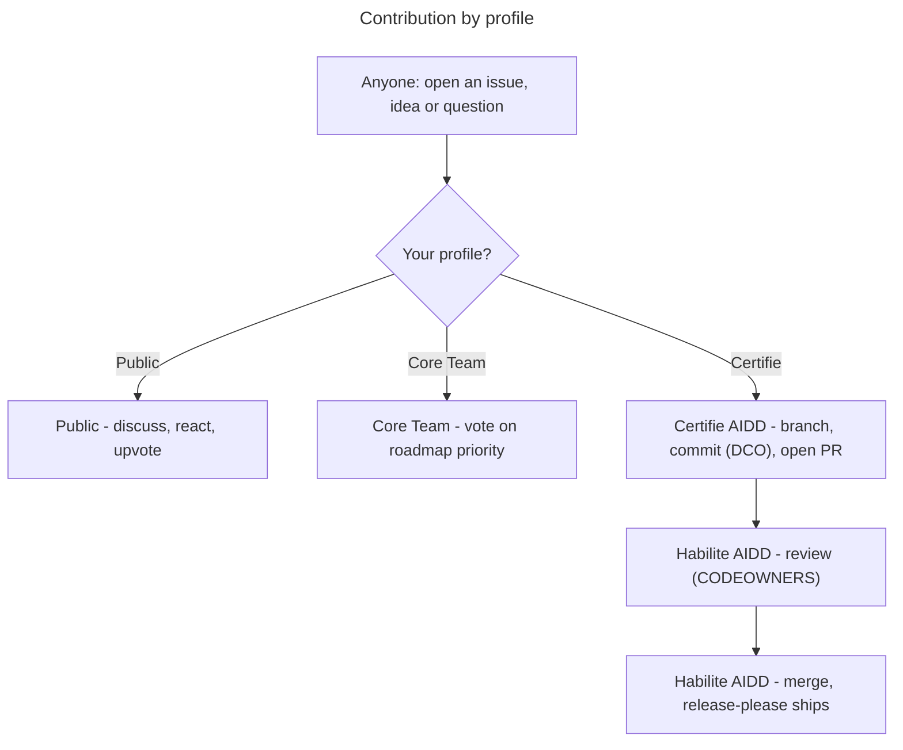

# Contributing to the AIDD Framework

The source of truth for AIDD skills, agents, rules, and templates. Authored in Claude Code syntax; at release time the CLI generates archives adapted to each supported tool.

> Wider AIDD community, roles, and the training programme live at [ai-driven-dev.fr](https://www.ai-driven-dev.fr/). This file covers contributing to **this repository**.

## Who does what (by profile)



**Pull-request rights are held by Certifié and Habilité only** (Certifié via [certification](https://www.ai-driven-dev.fr/), Habilité by promotion). Full role ladder, voting weights, and promotion: [`GOVERNANCE.md`](./GOVERNANCE.md#roles). The rest of this guide is the *how* for those opening PRs.

## 1. Set up

Needs **Node 20+** and **pnpm**, plus **jq**, **python3**, and **pipx** for the pre-commit hooks (`gh` optional). Then:

```bash
pnpm install
pnpm exec lefthook install
```

Every commit then runs the framework checks (json/yaml validity, schema validation, SKILL.md frontmatter, CATALOG regeneration, commitlint). Check your environment anytime with `./scripts/doctor.sh`.

### Test your changes locally

Before opening a PR, exercise the skills you touched in a real session. Clone the framework, then point your assistant at the checkout instead of a published release:

```bash
git clone https://github.com/ai-driven-dev/aidd-framework ~/projects/aidd-framework
```

#### Claude Code

Register the checkout as a local marketplace, then install the plugins:

```text
/plugin marketplace add ~/projects/aidd-framework
/plugin install aidd-context@aidd-framework
/plugin install aidd-dev@aidd-framework
/plugin install aidd-vcs@aidd-framework
/plugin install aidd-pm@aidd-framework
/plugin install aidd-orchestrator@aidd-framework
/plugin install aidd-refine@aidd-framework
```

After **editing** an existing `SKILL.md`, agent, or action, run `/reload-plugins` in the same session to pick up the change - no reinstall needed.

**Adding a _new_ skill is different.** A new `skills[]` entry in a `plugin.json` is not discovered by `/reload-plugins` (it only refreshes skills already loaded). Reinstall the plugin to surface it:

```
/plugin uninstall aidd-<plugin>
/plugin install aidd-<plugin>@aidd-framework
```

To load the plugins into a personal project, point its `.claude/settings.local.json` at the checkout:

```json
{
  "extraKnownMarketplaces": {
    "aidd-framework": {
      "source": {
        "source": "directory",
        "path": "~/projects/aidd-framework"
      }
    }
  },
  "enabledPlugins": {
    "aidd-context@aidd-framework": true,
    "aidd-dev@aidd-framework": true,
    "aidd-vcs@aidd-framework": true,
    "aidd-pm@aidd-framework": true,
    "aidd-orchestrator@aidd-framework": true,
    "aidd-refine@aidd-framework": true
  }
}
```

#### Codex

Register the checkout (pass an absolute path; `./` is rejected), then install the plugins:

```bash
codex plugin marketplace add ~/projects/aidd-framework
codex plugin add aidd-context@aidd-framework
codex plugin add aidd-dev@aidd-framework
codex plugin add aidd-vcs@aidd-framework
codex plugin add aidd-pm@aidd-framework
codex plugin add aidd-orchestrator@aidd-framework
codex plugin add aidd-refine@aidd-framework
codex plugin list --marketplace aidd-framework   # confirm every plugin is `installed, enabled`
```

No live reload - run `codex plugin marketplace upgrade` after each change to refresh the marketplace snapshot. **A new skill needs a reinstall too** - Codex installs from a snapshot, so a fresh `skills[]` entry only surfaces after re-adding the plugin:

```bash
# codex plugin marketplace upgrade aidd-framework # ❌ only works if git installed marketplace
codex plugin remove aidd-<plugin>
codex plugin add aidd-<plugin>@aidd-framework
```

## 2. Commit

Format: `<type>(<scope>): description`, **signed off** for the [DCO](https://developercertificate.org/).

```bash
git commit -s -m "feat(aidd-dev): add for-sure skill"
```

**Scope** - one per commit (split cross-plugin changes):

| Scope | Path |
| ----- | ---- |
| `aidd-context` / `aidd-dev` / `aidd-vcs` / `aidd-pm` / `aidd-orchestrator` / `aidd-refine` | the matching `plugins/<name>/` |
| `marketplace` | `.claude-plugin/marketplace.json` |
| `framework` | root: scripts, CI, configs, docs, `aidd_docs/` |

**Type** - drives the release:

- `feat` → minor · `fix` / `perf` → patch · `!` or `BREAKING CHANGE:` → major
- `docs` / `refactor` / `style` / `test` / `build` / `ci` / `chore` → no release

**DCO** - `-s` adds the `Signed-off-by` trailer. Forgot one?

```bash
git commit --amend --signoff       # last commit
git rebase --signoff origin/main   # whole branch
```

The [`DCO`](./.github/workflows/dco.yml) check fails any unsigned commit. Versioning and the release bundles are automated - see [Releases](#releases).

## 3. Open a pull request

- Work on a branch, not `main`.
- **Fill the PR template** (applied automatically): explain *what* changed and *how* you resolved it technically - that narrative is the point of the PR. The conventional title, DCO sign-off, and pre-commit hooks are already enforced by CI, so don't spend the description re-asserting them.
- **Label the PR** so reviewers and the [Roadmap board](https://github.com/orgs/ai-driven-dev/projects/8) triage at a glance:

  | Label | When to use |
  | ----- | ----------- |
  | `bug` | A fix for broken behaviour. |
  | `enhancement` | A new skill, agent, rule, or feature. |
  | `documentation` | A docs-only change (README, CONTRIBUTING, skill docs). |
  | `security` | A security-sensitive change or fix. |
- The PR title follows the same conventional format (the **Commitlint** CI job enforces it); PRs are squash-merged using that title.
- A **Habilité** review gates every merge ([`CODEOWNERS`](./.github/CODEOWNERS)); Certifié contributors cannot self-merge.
- Decision rules (lazy consensus, explicit consensus for cross-plugin/contract changes, the quality veto) live in [`GOVERNANCE.md`](./GOVERNANCE.md#code-decisions-merging).

## Releases

Automated by [release-please](https://github.com/googleapis/release-please) in manifest mode. The repo ships **7 independently-versioned packages** (root `aidd-framework` + the 6 plugins); each bumps from the conventional commits touching its path.

- Every push to `main` opens / updates a `chore: release main` PR (changelog + version bumps).
- Merging it tags each bumped package and creates the GitHub Releases; CI then attaches the bundles:
  - `aidd-framework-marketplace-X.Y.Z.zip` - the Claude Code marketplace (`.claude-plugin/` + `plugins/`); kept as the legacy Claude alias of `aidd-framework-claude-marketplace-X.Y.Z.zip`.
  - `<plugin>-vX.Y.Z.zip` - per released plugin.
  - `aidd-framework-<tool>-<mode>-X.Y.Z.zip` - **per-tool distributions** built by `aidd-cli` (`framework build`) on the root release: 4 marketplace (claude/cursor/copilot/codex) + 5 flat (+opencode, flat-only) = 9 archives. Produced by the `build-per-tool` matrix job in `.github/workflows/ci.yml`, pinned to a specific `@ai-driven-dev/cli` version.

Config: `release-please-config.json` + `.release-please-manifest.json` (pre-releases, forced versions, and recovery are driven through those files).

## Reporting issues

[Open an issue](https://github.com/ai-driven-dev/aidd-framework/issues/new/choose) (🐛 Bug or ✨ Feature). New issues are auto-added to the [AIDD Roadmap board](https://github.com/orgs/ai-driven-dev/projects/8). For **usage questions**, use [Discussions](https://github.com/ai-driven-dev/aidd-framework/discussions), not issues (see [`SUPPORT.md`](./.github/SUPPORT.md)).

## Reference

- **Build a plugin** - [`docs/CREATE_PLUGIN.md`](docs/CREATE_PLUGIN.md)
- **Architecture & terms** - [`docs/ARCHITECTURE.md`](docs/ARCHITECTURE.md), [`docs/GLOSSARY.md`](docs/GLOSSARY.md)
- **Patterns to follow**: a minimal plugin [`aidd-refine`](plugins/aidd-refine/), a router skill [`00-onboard`](plugins/aidd-context/skills/00-onboard/), agents [`aidd-dev/agents`](plugins/aidd-dev/agents/).
- **Syntax & per-tool builds**: source files use Claude Code syntax; at release time the `aidd-cli` generates an archive per supported tool, mapping each surface to that tool's equivalent. In frontmatter, `name` / `description` / `argument-hint` are universal; other keys (`model`, `color`, `paths`, …) are tool-specific and ignored where unsupported.

---

■ [Back to framework](./README.md)
