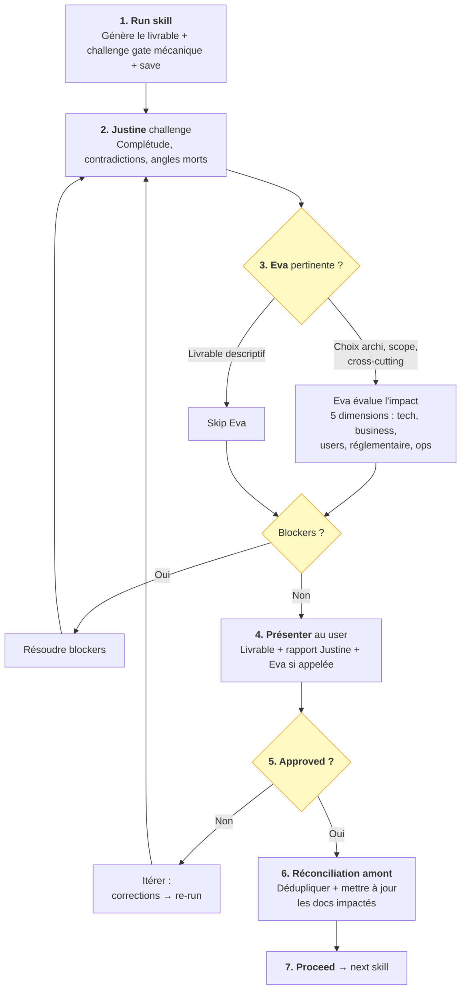

# AIDD Flows

## Flow Greenfield

```mermaid
flowchart TB
    start(("Idée brute"))

    subgraph CLAIRE["Phase 0 — Claire · Clarification"]
        C1["Brain Dump → Brief structuré"]
    end

    subgraph PM["Phase 1 — Oriane · PM"]
        direction TB
        P1["<b>constitution</b><br/>Vision, objectifs, contraintes projet"]
        P2["<b>product-brief</b><br/>Problème validé, personas, marché"]
        P3["<b>prd</b><br/>Exigences complètes, user journeys, NFRs"]
        P4["<b>user-stories</b><br/>Stories INVEST, critères d'acceptation"]
        P1 --> P2 --> P3 --> P4
    end

    subgraph ARCH["Phase 2 — Ariane · Architecture"]
        A1["<b>architecture-decision</b><br/>Stack, patterns, modules, API boundaries, trade-offs"]
    end

    subgraph UX["Phase 3 — Diane · UX/Design"]
        direction TB
        U1["<b>design-system</b><br/>Composants, tokens, guidelines, wireframes"]
        U2["<b>flow-map</b><br/>Flux utilisateur, 7 états par étape"]
        U3["<b>accessibility</b><br/>ARIA, clavier, focus, contraste par composant"]
        U4["<b>copywriting</b><br/>Voice & tone, erreurs, empty states, i18n keys"]
        U1 --> U2 --> U3 --> U4
    end

    subgraph PLAN["Phase 4 — Ariane · Plan"]
        M1["<b>milestones</b><br/>Milestones séquencés, Gantt, chemin critique"]
    end

    done(("Prêt pour l'implémentation"))

    start --> C1
    C1 --> P1
    P4 --> A1
    A1 --> U1
    U4 --> M1
    M1 --> done

    style CLAIRE fill:#e8f4fd,stroke:#4a9eda
    style PM fill:#fff3e0,stroke:#f5a623
    style ARCH fill:#e8eaf6,stroke:#5c6bc0
    style UX fill:#fce4ec,stroke:#e91e63
    style PLAN fill:#e8eaf6,stroke:#5c6bc0
```

## Flow Brownfield

```mermaid
flowchart TB
    start(("Demande de changement"))

    subgraph CLAIRE["Phase 0 — Claire · Clarification"]
        C1["Brain Dump → Brief structuré"]
    end

    subgraph PM["Phase 1 — Oriane · PM"]
        direction TB
        P1["<b>system-overview</b><br/>État actuel : modules, stack, dette"]
        P2["<b>change-brief</b><br/>As-is → To-be, ce qui change vs reste"]
        P3["<b>change-spec</b><br/>Spécification détaillée du changement"]
        P1 --> P2 --> P3
    end

    subgraph ARCH1["Phase 2 — Ariane · Impact"]
        A1["<b>architecture-impact</b><br/>Modules impactés, migrations, risques"]
    end

    subgraph UX["Phase 3 — Diane · UX/Design"]
        direction TB
        U1["<b>design-system-update</b><br/>Audit patterns existants, nouveaux composants"]
        U2["<b>flow-update</b><br/>Flux modifiés, jonctions avec l'existant"]
        U3["<b>accessibility-update</b><br/>A11y nouveaux composants, WCAG AA"]
        U4["<b>copywriting-update</b><br/>Microcopy nouveaux états, ton cohérent"]
        U1 --> U2 --> U3 --> U4
    end

    subgraph ARCH2["Phase 4 — Ariane · Rollout"]
        M1["<b>impact-plan</b><br/>Plan de déploiement, feature flags, rollback"]
    end

    done(("Prêt pour l'implémentation"))

    start --> C1
    C1 --> P1
    P3 --> A1
    A1 --> U1
    U4 --> M1
    M1 --> done

    style CLAIRE fill:#e8f4fd,stroke:#4a9eda
    style PM fill:#fff3e0,stroke:#f5a623
    style ARCH1 fill:#e8eaf6,stroke:#5c6bc0
    style UX fill:#fce4ec,stroke:#e91e63
    style ARCH2 fill:#e8eaf6,stroke:#5c6bc0
```

## Execution Loop

Protocole partagé, appliqué à chaque skill dans les deux flows.

```mermaid
flowchart TB
    S1["<b>1. Run skill</b><br/>Génère le livrable + challenge gate mécanique + save"]
    S2["<b>2. Justine</b> challenge<br/>Complétude, contradictions, angles morts"]
    S3{"<b>3. Eva</b> pertinente ?"}
    S3Y["Eva évalue l'impact<br/>5 dimensions : tech, business,<br/>users, réglementaire, ops"]
    S3N["Skip Eva"]
    S4{"Blockers ?"}
    S4Y["Résoudre blockers"]
    S5["<b>4. Présenter</b> au user<br/>Livrable + rapport Justine + Eva si appelée"]
    S6{"<b>5. Approved ?</b>"}
    S6N["Itérer :<br/>corrections → re-run"]
    S7["<b>6. Réconciliation amont</b><br/>Dédupliquer + mettre à jour<br/>les docs impactés"]
    S8["<b>7. Proceed</b> → next skill"]

    S1 --> S2 --> S3
    S3 -->|"Choix archi, scope,<br/>cross-cutting"| S3Y
    S3 -->|"Livrable descriptif"| S3N
    S3Y --> S4
    S3N --> S4
    S4 -->|Oui| S4Y --> S2
    S4 -->|Non| S5 --> S6
    S6 -->|Non| S6N --> S2
    S6 -->|Oui| S7 --> S8

    style S3 fill:#fff9c4,stroke:#f9a825
    style S4 fill:#fff9c4,stroke:#f9a825
    style S6 fill:#fff9c4,stroke:#f9a825
```
