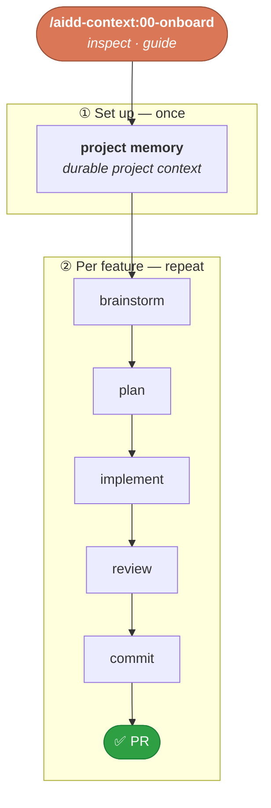

<p align="right">
  <a href="https://github.com/ai-driven-dev/framework/stargazers">
    <picture>
      <source media="(prefers-color-scheme: dark)" srcset="docs/assets/star-cta-dark.svg" />
      
    </picture>
  </a>
</p>

<div align="center">


# AI-Driven Dev Framework

### A French framework for AI-Driven Developers to ship high-quality code.

<p>
  <!--counts:start--><kbd>7 plugins</kbd> · <kbd>40 skills</kbd> · <kbd>2 agents</kbd><!--counts:end--> · <kbd>MIT</kbd>
</p>

[](LICENSE)
[](https://github.com/ai-driven-dev/framework/releases)
[](https://github.com/ai-driven-dev/framework/actions/workflows/ci.yml)
[](https://www.ai-driven-dev.fr/)

<p>🗺️ <a href="https://github.com/orgs/ai-driven-dev/projects/8"><b>Live roadmap</b></a></p>

</div>

---

The **AI-Driven Dev Framework** installs a working SDLC (Software Development Life Cycle) into your AI coding tool — **skills, agents, commands, rules** — that turns a rough idea into a reviewed, shipped pull request:

```text
/aidd-dev:00-sdlc "add rate limiting to the /login endpoint"
→ spec → plan → implement → review → ship (commit + PR opened)
```

Why not just write your own commands? → [FAQ](docs/FAQ.md#-why-aidd-instead-of-your-own-skills).

## ✅ Prerequisites

- **An AI coding tool** — Claude Code (native), or Cursor / Copilot / Codex / OpenCode (see [Compatibility](#-compatibility)).
- **[Node](https://nodejs.org)** on your `PATH` — for the plugins that ship hooks ([what they do](docs/ARCHITECTURE.md#-bundled-hooks)).

## 🔌 Compatibility

| Tool | Status | Release dist |
| --- | --- | --- |
| **Claude Code** | ✅ Native · recommended | Marketplace |
| **Cursor** | ✅ Supported | Marketplace · Flat |
| **GitHub Copilot** | ✅ Supported | Marketplace · Flat |
| **Codex** | ✅ Supported | Marketplace · Flat |
| **OpenCode** | ✅ Supported | Flat |
| **Gemini · Mistral** | 🚧 In progress | — |

<sub>**Marketplace** = installed and updated through your tool's plugin manager. **Flat** = files copied directly into your project, no plugin manager involved. Install steps per tool → [Other tools](#other-tools).</sub>

## 📦 Install

### Claude Code

Installs the 6 stable plugins (`aidd-ui` is 🚧 alpha, install separately — see [Plugins](#-plugins)).

**In the session** (slash commands)

```text
/plugin marketplace add ai-driven-dev/framework
/plugin install aidd-context@aidd-framework
/plugin install aidd-refine@aidd-framework
/plugin install aidd-dev@aidd-framework
/plugin install aidd-vcs@aidd-framework
/plugin install aidd-pm@aidd-framework
/plugin install aidd-orchestrator@aidd-framework
/plugin install aidd-ui@aidd-framework # 🚧 alpha, install separately
```


<details>
<summary><strong>Command line</strong> (same, prefixed with `claude`)</summary>

```bash
claude plugin marketplace add ai-driven-dev/framework
claude plugin install aidd-context@aidd-framework
claude plugin install aidd-refine@aidd-framework
claude plugin install aidd-dev@aidd-framework
claude plugin install aidd-vcs@aidd-framework
claude plugin install aidd-pm@aidd-framework
claude plugin install aidd-orchestrator@aidd-framework
claude plugin install aidd-ui@aidd-framework # 🚧 alpha, install separately
```
</details

<br/>Update anytime: `/plugin marketplace update aidd-framework`.

### Other tools

Same plugin names as Claude Code.

Download your tool's bundle from the [latest release](https://github.com/ai-driven-dev/framework/releases/latest), then follow its steps:

<details>
<summary><strong>Cursor</strong></summary>

**Marketplace**

1. Unzip the `cursor-marketplace` archive.
2. Copy the plugins, then reload (**Developer → Reload Window**):

```bash
cp -r plugins/aidd-* ~/.cursor/plugins/local/
```

**Flat**

1. Unzip the `cursor-flat` archive into your project root → `.cursor/`.

_All plans; team marketplaces need Teams/Enterprise. Also reads Claude format (`.claude/skills/`)._

[Docs](https://cursor.com/docs/plugins)

</details>

<details>
<summary><strong>GitHub Copilot</strong></summary>

**Marketplace**

1. Unzip the `copilot-marketplace` archive.
2. Run:

```bash
copilot plugin marketplace add ./aidd-framework-copilot-marketplace-<version>
copilot plugin install aidd-context@aidd-framework   # per plugin
```

**Flat**

1. Unzip the `copilot-flat` archive into your project root → `.github/`.

_Also reads Claude format (`.claude/skills/`, `.claude/agents/`)._

[Docs](https://docs.github.com/en/copilot/how-tos/copilot-cli/customize-copilot/plugins-finding-installing)

</details>

<details>
<summary><strong>Codex</strong></summary>

**Marketplace**

1. Unzip the `codex-marketplace` archive.
2. Run:

```bash
codex plugin marketplace add ./aidd-framework-codex-marketplace-<version>
codex plugin add aidd-context@aidd-framework   # per plugin
```

**Flat**

1. Unzip the `codex-flat` archive into your project root → `.codex/`.

[Docs](https://developers.openai.com/codex/plugins/build)

</details>

<details>
<summary><strong>OpenCode</strong> — Flat only</summary>

1. Unzip the `opencode-flat` archive into your project root → `.opencode/`.

[Docs](https://opencode.ai/docs/config/)

</details>

## 🚀 Quick start

Three ways in — pick one:

| Start with | Command | When |
| --- | --- | --- |
| 🧭 **Guided onboarding** | `/aidd-context:00-onboard` | First time, or unsure what to run — it inspects the project and routes you. |
| 🧠 **Project memory** | `/aidd-context:02-project-memory` | Build the project memory bank by hand. |
| ⚙️ **Feature flow** | `/aidd-dev:00-sdlc` | Ship a feature end to end (plan → implement → review → PR). |

The full loop, and how onboarding sets it up:



> 🍳 **More flows** → the [recipes](recipes/): [start a project](recipes/start-a-project.md), [ship a feature](recipes/ship-a-feature.md), and more.

## 🧩 Plugins

Seven plugins covering the whole SDLC — **install all of them**; they work together. (`aidd-ui` is 🚧 **alpha**, off the curated path.)

<table>
<tr>
<td width="33%" valign="top">

### 🧭 [aidd-context](plugins/aidd-context/README.md)

`13 skills` · stable

Project init, memory bank, context-artifact generation, diagrams, learning, exploration.

</td>
<td width="33%" valign="top">

### ⚙️ [aidd-dev](plugins/aidd-dev/README.md)

`11 skills` · stable

SDLC loop: plan, implement, assert, audit, review, test, refactor, debug.

</td>
<td width="33%" valign="top">

### 🌿 [aidd-vcs](plugins/aidd-vcs/README.md)

`5 skills` · stable

Repo init, commits, pull / merge requests, release tags, issues.

</td>
</tr>
<tr>
<td width="33%" valign="top">

### 📋 [aidd-pm](plugins/aidd-pm/README.md)

`4 skills` · stable

Ticket info, user stories, PRD, spec drafting.

</td>
<td width="33%" valign="top">

### 🪞 [aidd-refine](plugins/aidd-refine/README.md)

`5 skills` · stable

Brainstorm, challenge, condense, shadow-areas, fact-check.

</td>
<td width="33%" valign="top">

### 🎼 [aidd-orchestrator](plugins/aidd-orchestrator/README.md)

`1 skill` · stable

Async dev: label an issue → get a PR.

</td>
</tr>
<tr>
<td width="33%" valign="top">

### 🎨 [aidd-ui](plugins/aidd-ui/README.md) 🚧

`1 skill` · **alpha**

UI / UX design — smoke-test only, not ready for use.

</td>
<td width="33%" valign="top"></td>
<td width="33%" valign="top"></td>
</tr>
</table>

Full catalog → [`CATALOG.md`](docs/CATALOG.md).

## 📚 Learn more

| | |
| --- | --- |
| 🍳 **[Recipes](recipes/)** | How-to sheets: [start a project](recipes/start-a-project.md), [ship a feature](recipes/ship-a-feature.md), [MCP installations](recipes/mcp-installation.md). |
| 🏛️ **[Architecture](docs/ARCHITECTURE.md)** | How the framework composes: plugins, skills, hooks, agents. |
| 🧩 **[Create a plugin](docs/CREATE_PLUGIN.md)** | Build and publish your own. |
| 🛒 **[Marketplace](docs/MARKETPLACE.md)** | Install scopes, versioning, LLM tiers. |
| ❓ **[FAQ & Troubleshooting](docs/FAQ.md)** · **[Glossary](docs/GLOSSARY.md)** | Common questions, fixes, and terms. |

## 🔒 Trust and safety

Plugins act with **your permissions**, and some run **Node hooks automatically** at session events ([the list](docs/ARCHITECTURE.md#-bundled-hooks)).

Before installing any plugin, skim its `README`, `hooks/`, and `.mcp.json`. Found a vulnerability? Report it privately → [`SECURITY.md`](SECURITY.md).

## 🧑‍💻 The AI-Driven Dev

Built by the [AI-Driven Dev](https://www.ai-driven-dev.fr/) community: 3 years of R&D, 500+ developers trained in English 🇬🇧 and French 🇫🇷, shipping production software with 100% AI-generated code.

- **[Join the Discord 🇫🇷](https://discord.gg/EWySJSpjWs)** — public [roadmap](ROADMAP.md) decisions every Thursday morning.
- **Want to train your team?** [See the programme](https://www.ai-driven-dev.fr/entreprise).
- **AI is important to you?** [Join the ecosystem](https://www.ai-driven-dev.fr/ecosysteme).

## 🤝 Contributing

Free and open-source (MIT). If it saves you time, [a ⭐](https://github.com/ai-driven-dev/framework/stargazers) helps others find it.

- **Idea or bug?** [Open an issue](https://github.com/ai-driven-dev/framework/issues) or [start a discussion](https://github.com/ai-driven-dev/framework/discussions).
- **Contribute code** → [`CONTRIBUTING.md`](CONTRIBUTING.md).

---

<div align="center">


Made with care in France 🇫🇷 · ← [AIDD organisation](https://github.com/ai-driven-dev)

</div>
