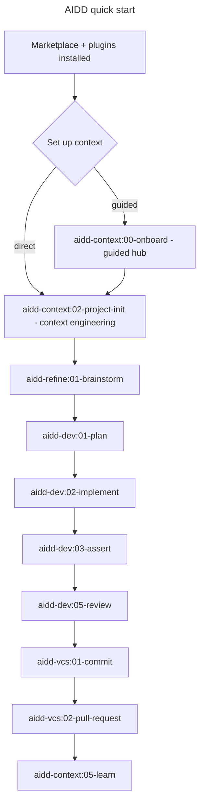

<div align="center">


# AI-Driven Dev Framework

### A community-maintained marketplace of skills, agents, and rules for Claude Code.

<p>
  <!--counts:start--><kbd>6 plugins</kbd> · <kbd>31 skills</kbd> · <kbd>3 agents</kbd><!--counts:end--> · <kbd>MIT</kbd>
</p>

<p>
  <a href="#quick-start"><strong>Quick start →</strong></a> ·
  <a href="#plugins"><strong>Browse plugins →</strong></a> ·
  <a href="docs/ARCHITECTURE.md"><strong>How it works →</strong></a> ·
  <a href="https://discord.gg/ai-driven-dev"><strong>Join Discord →</strong></a>
</p>

[](LICENSE)
[](CONTRIBUTING.md)
[](https://www.conventionalcommits.org/)
[](https://lefthook.dev/)
[](https://code.claude.com/docs/en/discover-plugins)
[](https://github.com/ai-driven-dev/framework/commits/main)
[](https://www.ai-driven-dev.fr/)

[](https://github.com/ai-driven-dev/framework/releases)
[](https://github.com/ai-driven-dev/framework/actions/workflows/ci.yml)

</div>

---

## What is the AIDD Framework?

The **AIDD Framework** is a marketplace of **skills, agents, rules, and conventions** that make the AI-Driven Development flow concrete inside your AI coding assistant - the full SDLC (plan → implement → review → ship) under rigorous human supervision. It is the open toolset of the [AI-Driven Dev](https://www.ai-driven-dev.fr/) community.

The framework is **authored for Claude Code**, and this repository is its native marketplace. Every release **also attaches archives adapted to each tool we support** - Cursor, GitHub Copilot, Codex, OpenCode (marketplace or flat format per tool) - so you grab the build that matches your assistant. See [Another AI tool?](#another-ai-tool) for the per-tool download + install table.

Founded by Alex Soyes - [Blog](https://alexsoyes.com/) · [GitHub](https://github.com/alexsoyes) · [LinkedIn](https://www.linkedin.com/in/alexsoyes/) · [X](https://x.com/alexsoyes).

Join the conversation: [Discord](https://discord.gg/ai-driven-dev) · [YouTube](https://www.youtube.com/@aidd_off) · [LinkedIn](https://www.linkedin.com/company/ai-driven-dev) · [Website](https://www.ai-driven-dev.fr/)

---

## Prerequisites

Just an **AI coding assistant**. Everything else is per-plugin and optional.

| To… | You need |
| --- | -------- |
| Register & run the marketplace | An AI assistant - **Claude Code** runs this marketplace natively; for another tool, grab the release archive the `aidd-cli` builds for it |
| Use a plugin's extras | Only what *that* plugin's README lists - e.g. `gh` / `glab` for VCS, a ticketing tool for PM |

Nothing beyond the AI tool is required just to register the marketplace.

## Quick start

Register the marketplace and install the core plugins (Claude Code slash commands, not shell):

```text
/plugin marketplace add ai-driven-dev/framework
/plugin install aidd-context@aidd-framework
/plugin install aidd-refine@aidd-framework
/plugin install aidd-dev@aidd-framework
/plugin install aidd-vcs@aidd-framework
```

Then set up project context (guided **onboard**, or direct **project-init**) and run the dev flow:



- **New here?** Run `/aidd-context:00-onboard` - it inspects the project and guides you.
- **Whole loop in one command?** `/aidd-dev:00-sdlc` runs plan → implement → review → ship.
- **More plugins?** Browse the [catalog](#plugins) or the `/plugin` Discover tab.

### Another AI tool?

The marketplace is Claude Code native. For Cursor, GitHub Copilot, Codex, or OpenCode, each
[release](https://github.com/ai-driven-dev/framework/releases/latest) attaches a target-native
archive. Download the one for your tool, unzip it, and install per the table - then map each tier to
that tool's model via the **LLM tier reference** below.

| Tool | Download (release asset) | Install |
| --- | --- | --- |
| **Claude Code** | — (native) | `/plugin marketplace add ai-driven-dev/framework` (no download needed) |
| **GitHub Copilot** | `aidd-framework-copilot-marketplace-<version>.zip` | unzip, then `aidd marketplace add aidd-framework ./aidd-framework-copilot-marketplace-<version>` |
| **Codex** | `aidd-framework-codex-marketplace-<version>.zip` | unzip, then `aidd marketplace add aidd-framework ./aidd-framework-codex-marketplace-<version>` |
| **Cursor** | `aidd-framework-cursor-flat-<version>.zip` | unzip into your project (materializes `.cursor/`) |
| **OpenCode** | `aidd-framework-opencode-flat-<version>.zip` | unzip into your project (materializes `.opencode/`) |

> Today this is **download → unzip → install** (no one-command remote fetch yet). Marketplace
> archives (`-marketplace-`) register through `aidd marketplace add`; flat archives (`-flat-`)
> materialize straight into a project workspace. A flat variant of every tool and a marketplace
> variant for Claude/Copilot/Codex are attached too - pick the format that fits your workflow.

> **Private repo?** `/plugin marketplace add` needs read access (`gh auth login` or a PAT) - see the Anthropic [install docs](https://code.claude.com/docs/en/discover-plugins).

---

## Plugins

<table>
<tr>
<td width="33%" valign="top">

### 🧭 [aidd-context](plugins/aidd-context/README.md)

`7 skills` · stable

Project init, architecture, generation of Claude Code context artifacts (skills, agents, rules, commands, hooks, plugins, marketplaces), diagrams, learning, discovery.

</td>
<td width="33%" valign="top">

### ⚙️ [aidd-dev](plugins/aidd-dev/README.md)

`10 skills` · stable

SDLC loop: sdlc, plan, implement, assert, audit, review, test, refactor, debug, for-sure.

</td>
<td width="33%" valign="top">

### 🌿 [aidd-vcs](plugins/aidd-vcs/README.md)

`4 skills` · stable

Commits, pull / merge requests, release tags, issue creation.

</td>
</tr>
<tr>
<td width="33%" valign="top">

### 📋 [aidd-pm](plugins/aidd-pm/README.md)

`4 skills` · stable

Ticket info, user stories, PRD, spec drafting.

</td>
<td width="33%" valign="top">

### 🪞 [aidd-refine](plugins/aidd-refine/README.md)

`5 skills` · stable

Meta-cognition: brainstorm, challenge, condense, shadow-areas, fact-check.

</td>
<td width="33%" valign="top">

### 🎼 [aidd-orchestrator](plugins/aidd-orchestrator/README.md)

`1 skill` · stable (`async-dev`)

Label an issue, get a PR; re-label, get the review applied. Router-based skill: one entry point, three sub-flows (setup, run, review).

</td>
</tr>
</table>

Each plugin's README links to per-skill READMEs covering when to use, how to invoke, prerequisites, and outputs.

---

## Recommended MCP servers

> **Prefer the CLI over MCP. It is more efficient.**

An MCP server loads its full tool schema into every turn. That bloats the context window and is less optimized.

A CLI call costs a few tokens. It returns only what you ask for.

Reach for MCP only when no CLI covers the service.

**Always verify your sources. Audit what you install before connecting any server.**

| Service | Official MCP | CLI alternative | Recommended |
| --- | --- | --- | --- |
| **GitHub** | [`api.githubcopilot.com/mcp/`](https://github.com/github/github-mcp-server) | [`gh`](https://cli.github.com/) | **CLI** - `gh` covers issues, PRs, releases, API at a fraction of the context |
| **Atlassian** (Jira / Confluence) | [`mcp.atlassian.com/v1/mcp`](https://www.atlassian.com/platform/remote-mcp-server) | [`acli`](https://developer.atlassian.com/cloud/acli/guides/introduction/) (Jira only at GA) | **CLI** for Jira · **MCP** for Confluence (no CLI yet) |
| **Playwright** | [`@playwright/mcp`](https://github.com/microsoft/playwright-mcp) | [`npx playwright`](https://playwright.dev/docs/test-cli) + [official skill](https://claude.com/plugins/playwright) | **CLI** - the CLI drives a real browser (`playwright open`, `codegen`, `--headed`). The skill wraps it |
| **Figma** | [`mcp.figma.com/mcp`](https://developers.figma.com/docs/figma-mcp-server/remote-server-installation/) | none for design data | **MCP** |
| **Notion** | [`mcp.notion.com/mcp`](https://developers.notion.com/guides/mcp/get-started-with-mcp) | none official | **MCP** |

---

## How marketplaces work in Claude Code

A marketplace is a Git repository that publishes plugins. When you run `/plugin marketplace add <owner>/<repo>`, Claude Code clones the repo, reads its `.claude-plugin/marketplace.json`, and offers the plugins listed there for install.

`aidd-framework` is a **community-maintained, methodology-driven complement** to Anthropic's [official marketplace](https://github.com/anthropics/claude-plugins-official). The official catalog covers broadly useful plugins curated by Anthropic; AIDD ships plugins that materialise a specific way of working (the AI-Driven Development flow) inside Claude Code. The two are designed to coexist; you can register both and install plugins from either.

The official Anthropic documentation covers the full model:

- [Discover and install plugins](https://code.claude.com/docs/en/discover-plugins) - the user-facing flow
- [Plugin marketplaces](https://code.claude.com/docs/en/plugin-marketplaces) - host your own
- [Plugins reference](https://code.claude.com/docs/en/plugins-reference) - manifest + marketplace.json schemas
- [Anthropic's official marketplace](https://github.com/anthropics/claude-plugins-official) - canonical example

### Scopes

Plugins can be installed at three different scopes:

| Scope     | Stored in                  | Lifetime         | Best for |
| --------- | -------------------------- | ---------------- | -------- |
| `user`    | `~/.claude/plugins/`       | All your projects| Personal toolbelt |
| `project` | `.claude/settings.json` (`enabledPlugins`) in the repo | This repo only | Team-shared setup |
| `local`   | A local directory          | This machine     | Plugin development |

Set scope at install time with the `/plugin` UI, or by editing `enabledPlugins` directly in `.claude/settings.json`.

---

## Versioning and updates

- Each plugin versions independently via `release-please`. Tags look like `aidd-<plugin>-vX.Y.Z`.
- The root marketplace (`marketplace.json`) versions independently as `vX.Y.Z`.
- Pull updates inside Claude Code with `/plugin marketplace update aidd-framework`.

See [`CHANGELOG.md`](./CHANGELOG.md) for the full history.

---

## Trust and safety

This is a community-maintained marketplace. Plugins can execute commands, edit files, and call external services on your behalf. Before installing any plugin from any third-party marketplace, including this one:

- Read its README and SKILL.md files.
- Inspect the action files under `actions/`.
- Check what permissions it requests in its hooks (`hooks/hooks.json`) and MCP servers (`.mcp.json`).

If you spot a vulnerability, please report it privately via [SECURITY.md](./SECURITY.md).

---

## Documentation

| Resource | Where |
| -------- | ----- |
| Architecture overview | [`docs/ARCHITECTURE.md`](docs/ARCHITECTURE.md) |
| Skills catalog | [Plugins](#plugins) (each links its own `CATALOG.md`) |
| Glossary | [`docs/GLOSSARY.md`](docs/GLOSSARY.md) |
| Build your own plugin | [`docs/CREATE_PLUGIN.md`](docs/CREATE_PLUGIN.md) |
| Frequently asked questions | [`docs/FAQ.md`](docs/FAQ.md) |
| Troubleshooting & limits | [`docs/TROUBLESHOOTING.md`](docs/TROUBLESHOOTING.md) |
| Contribution guide | [`CONTRIBUTING.md`](./CONTRIBUTING.md) |
| Maintainers guide | [`docs/MAINTAINERS.md`](docs/MAINTAINERS.md) |
| Governance | [`GOVERNANCE.md`](./GOVERNANCE.md) |
| Roadmap | [`ROADMAP.md`](./ROADMAP.md) |
| Contributors | [`CONTRIBUTORS.md`](./CONTRIBUTORS.md) |
| Code of Conduct | [`CODE_OF_CONDUCT.md`](./CODE_OF_CONDUCT.md) |
| Support | [`.github/SUPPORT.md`](./.github/SUPPORT.md) |
| Security policy | [`SECURITY.md`](./SECURITY.md) |
| Third-party licenses | [`THIRD_PARTY_LICENSES.md`](./THIRD_PARTY_LICENSES.md) |
| Changelog | [`CHANGELOG.md`](./CHANGELOG.md) (see also [GitHub Releases](https://github.com/ai-driven-dev/framework/releases)) |
| Anthropic plugin docs | [code.claude.com/docs/en/plugins](https://code.claude.com/docs/en/plugins) |

Note: `aidd_docs/` and similar directories generated by `aidd-context:02-project-init` belong to user projects, not to this marketplace. Do not link them from framework-level documentation.

---

<details>
<summary><strong>LLM tier reference</strong> (used by skills that target a specific model tier)</summary>

Some skills target a model **tier** when they need a particular capability. The framework is authored against Claude; on another AI tool, map each tier to that tool's nearest model.

| Tier | Best for | Claude | Other tools (examples) |
| ---- | -------- | ------ | ---------------------- |
| **T1 Fast** | Mechanical, deterministic tasks, templates, git ops | Haiku 4.5 | GPT-5.5 mini, Gemini Flash, Grok fast |
| **T2 Balanced** | Implementation, validation, code generation | Sonnet 4.6 | GPT-5.5, Gemini Pro |
| **T3 Thinking** | Deep reasoning, synthesis, planning, onboarding | Opus 4.8 | GPT-5.5 (thinking), Gemini Pro thinking |

</details>

---

## Troubleshooting

Install issues, load problems, and the framework's current limits → [`docs/TROUBLESHOOTING.md`](docs/TROUBLESHOOTING.md).

---

## Contributing

Everyone can shape this project. **Anyone** can open issues, react, and upvote ideas in [Discussions](https://github.com/ai-driven-dev/framework/discussions) (a signal); a counted roadmap vote is a benefit of **Core Team** membership in the [AIDD](https://www.ai-driven-dev.fr/) programme (training/community/coaching) and up, and **pull-request rights** are held by [Certifié and Habilité contributors](./GOVERNANCE.md#roles) so the standard stays consistent. See [`CONTRIBUTING.md`](./CONTRIBUTING.md) for the contribution flow, the commit scope discipline, and the templates each surface (skill, agent, rule, command) follows, and [`GOVERNANCE.md`](./GOVERNANCE.md) for the roles and how decisions get made.

To build and ship a brand-new plugin through this marketplace, see [`docs/CREATE_PLUGIN.md`](docs/CREATE_PLUGIN.md).

By participating you agree to the [Code of Conduct](./CODE_OF_CONDUCT.md).

---

## Acknowledgements

- [Anthropic](https://www.anthropic.com/) for Claude Code, the plugin marketplace model, and the [`claude-code-action`](https://github.com/anthropics/claude-code-action) GitHub Action.
- [SchemaStore](https://www.schemastore.org/) for the canonical JSON schemas the lefthook hooks validate against.
- [lefthook](https://lefthook.dev/), [release-please](https://github.com/googleapis/release-please), and [Contributor Covenant](https://www.contributor-covenant.org/) for the OSS toolchain underneath.
- Everyone in the AIDD community who shares prompts, skills, and feedback. Without you this catalog would be empty.

---

<div align="center">

🇫🇷 🥖 🐓 · Made with care in France by the AIDD community · 🐓 🥖 🇫🇷

← [Back to the AIDD organisation](https://github.com/ai-driven-dev)

</div>
