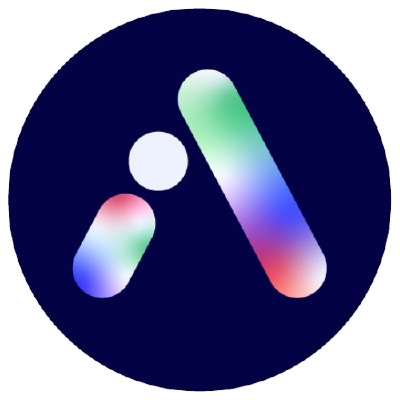
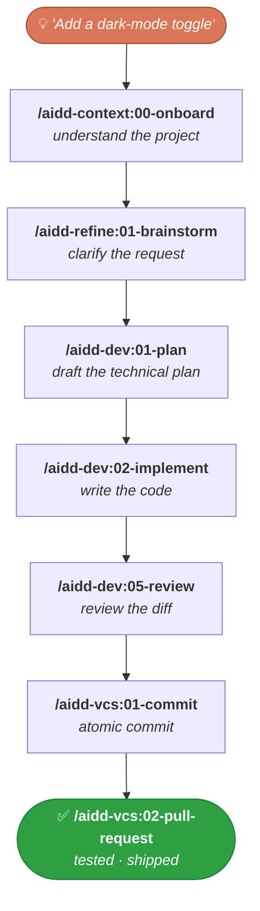

<div align="center">



# AI-Driven Dev Framework

### Vibe Coding for professional developers — focused on 100% quality on AI-generated code.

<p>
  <!--counts:start--><kbd>6 plugins</kbd> · <kbd>38 skills</kbd> · <kbd>3 agents</kbd><!--counts:end--> · <kbd>MIT</kbd>
</p>

[](LICENSE)
[](https://github.com/ai-driven-dev/framework/releases)
[](https://github.com/ai-driven-dev/framework/actions/workflows/ci.yml)
[](https://www.ai-driven-dev.fr/)

</div>

---

The **AI-Driven Dev Framework** is a marketplace — **skills, agents, commands, rules, prompts, templates, recipes…** — that helps you ship **high-quality features to production**.

> Orchestrate your SDLC (Software Development Life Cycle) at scale, the agentic engineering way.

## 🧑‍💻 The AI-Driven Dev

Built by the [AI-Driven Dev](https://www.ai-driven-dev.fr/) community: 3 years of R&D, 500+ developers trained in English 🇬🇧 and French 🇫🇷, shipping production software with 100% AI-generated code.

- **[Join the Discord 🇫🇷](https://discord.gg/ai-driven-dev)** — public [roadmap](./ROADMAP.md) decisions every Thursday morning.
- **Want to train your team?** [See the programme](https://www.ai-driven-dev.fr/entreprise).
- **AI is important to you?** [Join the ecosystem](https://www.ai-driven-dev.fr/ecosysteme).

## ✅ Compatibility

> Primarily built on **Claude Code** (they set the standards), but compatibility with the other tools is ensured.

| Tool | Status |
| --- | --- |
| **Claude Code** | ✅ Native · **recommended** |
| **GitHub Copilot** | ✅ Supported |
| **Codex** | ✅ Supported |
| **Cursor** | ✅ Supported |
| **OpenCode** | ✅ Supported |
| **Gemini** | 🚧 In progress |
| **Mistral** | 🚧 In progress |

## 📦 Installation

Two install formats, depending on your tool:

1. **Marketplace** *(recommended)* — register once, then install and update plugins on demand. Native in Claude Code; for Copilot and Codex, grab the `-marketplace-` archive and run `aidd marketplace add`.
2. **Flat** — unzip a `-flat-` archive straight into your project (it materializes `.cursor/`, `.opencode/`, …). For tools without marketplace support.

All builds are attached to each [GitHub release](https://github.com/ai-driven-dev/framework/releases) → [latest release](https://github.com/ai-driven-dev/framework/releases/latest).

**Claude Code** — register the marketplace and install the plugins (slash commands, not shell):

```text
/plugin marketplace add ai-driven-dev/framework
/plugin install aidd-context@aidd-framework
/plugin install aidd-refine@aidd-framework
/plugin install aidd-dev@aidd-framework
/plugin install aidd-vcs@aidd-framework
/plugin install aidd-pm@aidd-framework
/plugin install aidd-orchestrator@aidd-framework
```

**Other tools** — every release attaches a per-tool archive. Grab yours from the [latest release](https://github.com/ai-driven-dev/framework/releases/latest):

<details>
<summary><strong>GitHub Copilot</strong> — marketplace</summary>

1. Download [`aidd-framework-copilot-marketplace-<version>.zip`](https://github.com/ai-driven-dev/framework/releases/latest) and unzip it.
2. Register the marketplace:
   ```bash
   aidd marketplace add aidd-framework ./aidd-framework-copilot-marketplace-<version>
   ```
3. Install the plugins from the registered `aidd-framework` marketplace (same plugin names as Claude Code).

</details>

<details>
<summary><strong>Codex</strong> — marketplace</summary>

1. Download [`aidd-framework-codex-marketplace-<version>.zip`](https://github.com/ai-driven-dev/framework/releases/latest) and unzip it.
2. Register the marketplace:
   ```bash
   aidd marketplace add aidd-framework ./aidd-framework-codex-marketplace-<version>
   ```
3. Install the plugins from the registered `aidd-framework` marketplace (same plugin names as Claude Code).

</details>

<details>
<summary><strong>Cursor</strong> — flat</summary>

1. Download [`aidd-framework-cursor-flat-<version>.zip`](https://github.com/ai-driven-dev/framework/releases/latest).
2. Unzip it into your project root — it materializes `.cursor/`, ready to use.

</details>

<details>
<summary><strong>OpenCode</strong> — flat</summary>

1. Download [`aidd-framework-opencode-flat-<version>.zip`](https://github.com/ai-driven-dev/framework/releases/latest).
2. Unzip it into your project root — it materializes `.opencode/`, ready to use.

</details>

## 🚀 Quick start

1. **Onboard** — one command inspects your project and guides you:
   ```text
   /aidd-context:00-onboard
   ```
2. **Run the flow** — take a feature from idea to a tested, shipped PR:



> Prefer one command for the whole loop? `/aidd-dev:00-sdlc` runs plan → implement → review → ship.

## 🧩 Plugins

Six plugins covering the whole SDLC — **install all of them**; they're designed to work together.

<table>
<tr>
<td width="33%" valign="top">

### 🧭 [aidd-context](plugins/aidd-context/README.md)

`13 skills` · stable

Project init, architecture, generation of Claude Code context artifacts (skills, agents, rules, commands, hooks), diagrams, learning, discovery.

</td>
<td width="33%" valign="top">

### ⚙️ [aidd-dev](plugins/aidd-dev/README.md)

`11 skills` · stable

SDLC loop: sdlc, plan, implement, assert, audit, review, test, refactor, debug, for-sure.

</td>
<td width="33%" valign="top">

### 🌿 [aidd-vcs](plugins/aidd-vcs/README.md)

`4 skills` · stable

Commits, pull / merge requests, release tags, issue creation.

</td>
</tr>
<tr>
<td width="33%" valign="top">

### 📋 [aidd-pm](plugins/aidd-pm/README.md)

`4 skills` · stable

Ticket info, user stories, PRD, spec drafting.

</td>
<td width="33%" valign="top">

### 🪞 [aidd-refine](plugins/aidd-refine/README.md)

`5 skills` · stable

Meta-cognition: brainstorm, challenge, condense, shadow-areas, fact-check.

</td>
<td width="33%" valign="top">

### 🎼 [aidd-orchestrator](plugins/aidd-orchestrator/README.md)

`1 skill` · stable (`async-dev`)

Label an issue, get a PR; re-label, get the review applied.

</td>
</tr>
</table>

## 📖 Recipes

Task-oriented how-to sheets. **[Browse all recipes →](recipes/)**

| Recipe | What you'll do |
| --- | --- |
| [MCP installations](recipes/mcp-installation.md) | Choose CLI vs MCP, and wire up the recommended servers (GitHub, Atlassian, Figma, Notion…) |

## 🤝 Contributing

> ### 🗺️ [See the roadmap →](./ROADMAP.md)
> Actively maintained — see what's shipping next and help shape what comes after.

Got an idea or hit a bug? **[Open an issue](https://github.com/ai-driven-dev/framework/issues)** or **[start a discussion](https://github.com/ai-driven-dev/framework/discussions)**. For everything else, **[join the Discord 🇫🇷](https://discord.gg/ai-driven-dev)**.

> **Note** — code (pull-request) rights on this repo are reserved for **certified Core Team members** ([`GOVERNANCE.md`](./GOVERNANCE.md)). Everyone else can open issues, join discussions, and shape the roadmap.

## 🔒 Trust & safety

Plugins can run commands, edit files, and call external services on your behalf. Before installing any plugin from any marketplace, including this one: read its `README` and `SKILL.md`, inspect its actions, and check the permissions in its hooks and MCP servers. Spot a vulnerability? Report it privately via [`SECURITY.md`](./SECURITY.md).

## 📚 Documentation

| Doc | What's inside |
| --- | --- |
| [`ARCHITECTURE.md`](docs/ARCHITECTURE.md) | How the framework is structured |
| [`MARKETPLACE.md`](docs/MARKETPLACE.md) | Marketplaces, install scopes, versioning, LLM tiers |
| [`CATALOG.md`](docs/CATALOG.md) | Full skills catalog |
| [`CREATE_PLUGIN.md`](docs/CREATE_PLUGIN.md) | Build your own plugin |
| [`FAQ.md`](docs/FAQ.md) | Frequently asked questions |
| [`TROUBLESHOOTING.md`](docs/TROUBLESHOOTING.md) | Install issues, load problems, limits |
| [`GLOSSARY.md`](docs/GLOSSARY.md) | Terms used across the framework |
| [`MAINTAINERS.md`](docs/MAINTAINERS.md) | Maintainer guide |

---

<div align="center">

Made with care in France 🇫🇷 by the AIDD community

← [Back to the AIDD organisation](https://github.com/ai-driven-dev)

</div>
