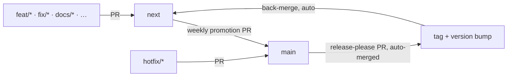

# Release

How the AI-Driven Dev Framework ships, and what to follow when you open a
change. Weekly rolling releases, with a fast lane for urgent fixes.

For branch naming, commit format, and the release tooling, see [`aidd_docs/memory/vcs.md`](aidd_docs/memory/vcs.md).

For who may merge and release, see [`GOVERNANCE.md`](GOVERNANCE.md).

## Principle

- `main` is production. The marketplace tracks it, so users only ever get
  released, versioned code.
- `next` is integration. The week's work batches here, and ships in one weekly
  release.
- A release happens only when there is work, and is cut automatically by
  release-please.
- A `hotfix/*` skips `next`: it branches from `main` and ships its own release
  out of cycle, for urgent production fixes.

## Where your change goes

Almost everything flows through `next` and ships in the weekly release. Only an
urgent production fix takes the fast lane straight to `main`. The branch prefix
decides the target; the canonical prefix → target table lives in
[`aidd_docs/memory/vcs.md`](aidd_docs/memory/vcs.md#types).

Two merges reach `main`: the weekly promotion PR from `next`, then the
auto-merged Release PR that release-please raises.

## What your commit produces

The commit type drives the changelog section it lands under.

| Commit type | Changelog section |
| ----------- | ----------------- |
| `feat`      | Features          |
| `fix`       | Bug Fixes         |
| `perf`      | Performance       |
| `refactor`  | Refactoring       |
| `docs`      | Documentation     |
| `chore`     | Miscellaneous     |
| `revert`    | Reverts           |

The version bump is release-please's call: `feat` → minor, `fix` → patch, a `!`
suffix or `BREAKING CHANGE` footer → major. The other types ride along in a
release triggered by a `feat` or `fix`.

## The two rules that keep it safe

- **The Release PR is auto-merged.** Otherwise `main` briefly holds merged but
  unversioned code, and a new user installing in that window picks it up.
- **The `main` → `next` back-merge is automatic.** Otherwise the version
  manifest and the changelog on `next` drift from `main`.

## Weekly release, step by step

1. Open the promotion PR `next` → `main` once the week's work is ready.
2. release-please opens a Release PR on `main`; it is auto-merged.
3. Tags and version bumps are created; release artifacts are attached.
4. `main` is back-merged into `next` automatically.

## Hotfix

1. Branch `hotfix/*` from `main`, fix, PR back to `main`.
2. release-please cuts a dedicated patch release.
3. `main` is back-merged into `next` automatically.
