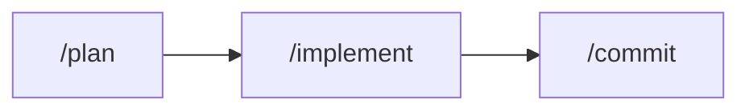
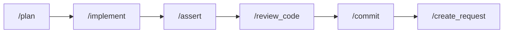
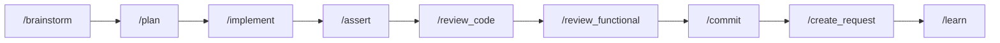
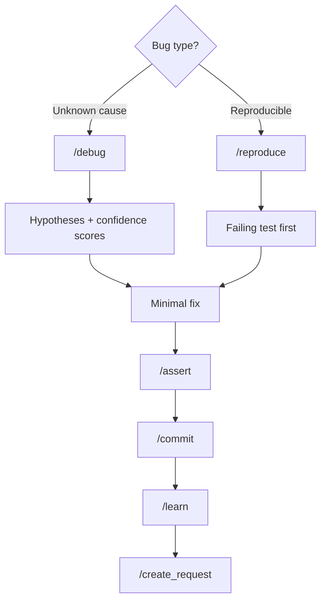

# AI-Driven Dev Docs

AIDD structures your AI coding assistant with commands, agents, rules, and memory so it produces consistent, high-quality code. This guide walks you through setup, your first feature, and daily workflows.

- [📦 What You Get](#-what-you-get)
  - [Concepts](#concepts)
  - [Framework Structure](#framework-structure)
- [🚀 Getting Started](#-getting-started)
  - [Initialize the Framework](#initialize-the-framework)
  - [Keep Your Context Up to Date](#keep-your-context-up-to-date)
- [🔄 Daily Workflows](#-daily-workflows)
  - [Build a Feature](#build-a-feature)
  - [Fix a Bug](#fix-a-bug)
- [✅ Validation Rules](#-validation-rules)
- [⚡ Advanced](#-advanced)
  - [Use Existing Agents](#use-existing-agents)
  - [Customize the Framework](#customize-the-framework)
- [📚 References](#-references)

## 📦 What You Get

When you install AIDD, your project gets a ready-to-use framework: 36 slash commands, 5 specialized agents, coding rules, and a memory system — all pre-configured. You just type commands like `/plan`, `/implement`, `/commit` and the AI follows structured workflows instead of guessing.

This structure has been designed to be **scalable**, **standardized**, and **fully customizable** across any project. Every command, agent, and rule is built from templates you can adapt to your needs. It's the result of two years of experimentation on real codebases.

### Concepts

The framework is built on 6 building blocks:

1. 🧠 **Memory** (`{{DOCS}}/memory/`) — Your project context. Generated by `/init`, read by the AI on every conversation. Architecture, conventions, testing setup, deployment — all in one place.
2. 💬 **Commands** — Slash commands (`/plan`, `/implement`, `/commit`...) that trigger structured prompts. Each command follows a defined workflow.
3. 🤖 **Agents** — Specialized AI personas for specific tasks (TDD, frontend validation, code quality).
4. 📏 **Rules** — Coding standards the AI follows automatically (naming, structure, patterns). Auto-loaded by file glob matching.
5. 🔧 **Skills** — Reusable workflows and scripts the AI loads when the context matches.
6. 📐 **Templates** — Scaffolding for all of the above. Used to generate new agents, commands, rules, and skills.

### Framework Structure

AIDD installs alongside your code. Commands, agents, and rules go into your IDE's configuration directory (`.claude/`, `.cursor/`, or `.github/`). Documentation and memory go into `{{DOCS}}/`.

```text
my-project/
├── .claude/                 # ⚙️ Claude Code (commands, agents, rules, skills)
├── .cursor/                 # ⚙️ Cursor (commands, agents, rules, skills)
├── .github/                 # ⚙️ GitHub Copilot (prompts, agents, instructions)
├── {{DOCS}}/
│   ├── memory/              # 🧠 Your project context (generated by /init)
│   │   ├── internal/        #   Internal docs (API specs, DB schema, design...)
│   │   └── external/        #   External documentation
│   ├── tasks/               # 📋 Implementation plans and task tracking
│   ├── templates/           # 📐 Scaffolding templates
│   │   ├── aidd/            #   Agent, command, rule, skill, plan templates
│   │   ├── dev/             #   ADR, code review, decision, tech choice
│   │   ├── pm/              #   Brief, PRD, persona, user story, milestones
│   │   └── vcs/             #   Commit, PR, branch, issue, release
│   ├── CATALOG.md           # 📦 Full reference of all commands, agents, rules, skills
│   ├── README.md
│   └── CONTRIBUTING.md
├── src/                     # 📁 Your application code
│   ├── controllers/
│   ├── services/
│   ├── repositories/
│   └── models/
├── tests/
└── package.json

```

## 🚀 Getting Started

First, make sure you installed [the AI-Driven Development framework]({{DOCS}}/templates/docs/INSTALL.md).

### Initialize the Framework

Run **`/init`** to analyze your project and generate memory files in `{{DOCS}}/memory/`:

| 📄 File                | 🎯 Purpose                                  |
| ---------------------- | ------------------------------------------- |
| `project_brief.md`     | Vision, objectives, what the project does   |
| `architecture.md`      | Tech stack, patterns, folder structure      |
| `codebase_map.md`      | Key files, entry points, dependencies       |
| `coding_assertions.md` | Linting, formatting, type checking commands |
| `testing.md`           | Test framework, patterns, coverage targets  |
| `deployment.md`        | CI/CD, environments, infrastructure         |
| `vcs.md`               | Branching model, commit conventions         |

The AI reads these files on every conversation start — accurate context means better code.

### Keep Your Context Up to Date

Your context accuracy directly impacts code quality. After initialization:

1. **Review and manually correct** each generated file in `{{DOCS}}/memory/`. The AI gives you a solid first draft, but you know your project best.
2. **Use `/learn`** after features that introduce new patterns or decisions. It analyzes your changes and routes knowledge to memory, rules, or skills automatically.

The more accurate your memory files, the better every command performs.

## 🔄 Daily Workflows

You're set up. Here's how you work with AIDD every day.

### Build a Feature

Pick the flow that matches your situation:

#### 🟢 Minimal — Clear task, small scope



#### 🟡 Standard — Needs validation and review



#### 🔴 Full — Vague requirements or complex feature



**All available commands:**

1. **`/brainstorm`** — Interactive Q&A to refine requirements. _Skip if requirements are already clear._
2. **`/plan`** — Generates a technical plan in `{{DOCS}}/tasks/`. Always required. Example: `/plan "https://github.com/org/repo/issues/42"`
3. **`/implement`** — Codes the plan phase by phase. Always after a plan.
4. **`/assert`** — Runs all assertions (tests, types, build, lint). Always after implement.
5. **`/review_code`** — Analyzes git diff against project rules. _Skip for trivial changes._
6. **`/review_functional`** — Compares implementation against plan. _Skip for pure refactors._
7. **`/commit`** — Creates standardized git commits. Always required.
8. **`/create_request`** — Creates draft PR/MR. _Skip if working on main._
9. **`/learn`** — Routes knowledge to memory, rules, or skills. _Skip for routine changes._

See [`CATALOG.md`](CATALOG.md) for the full command reference.

### Fix a Bug



**Unknown cause:** `/debug` → hypotheses with confidence scores → fix

**Reproducible bug:** `/reproduce` → failing test first → fix

**Then both converge:** minimal fix → `/assert` → `/commit` → `/learn` → `/create_request`

Use `/new_issue` to create a GitHub issue and defer the fix to later.

## ✅ Validation Rules

- **Never implement a plan with < 90% confidence.** If the plan is uncertain, go back to `/plan`.
- **`/assert` after every implementation phase.** Tests, types, build, lint must pass.
- **Max 3-5 iterations** before escalating to human. AI loops have guardrails.
- **Separate structural from behavioral changes.** Different commits for refactoring vs. new behavior.

## ⚡ Advanced

### Use Existing Agents

Agents are specialized AI personas you invoke for focused tasks. Each agent loops on its task until completion.

| 🤖 Agent  | What it does                                                    | When to use                           |
| --------- | --------------------------------------------------------------- | ------------------------------------- |
| `/kent`   | TDD — Red-Green-Refactor cycles following Tidy First principles | Writing tests, test-driven features   |
| `/iris`   | Frontend — Compares render against specs until conformity       | UI implementation from designs        |
| `/martin` | Quality — Runs tests, types, build, lint after changes          | Post-implementation validation        |
| `/alexia` | Autonomous — End-to-end feature implementation                  | Full feature with minimal supervision |
| `/claire` | Clarity — Challenges and questions until the request is precise | Vague requirements, discovery phase   |

Example:

```text
@kent Write tests for the UserService class, then implement the missing methods using TDD.
```

See the full [agents coordination guide]({{DOCS}}/templates/aidd/agents_coordination.md) for multi-agent workflows and communication flow.

### Customize the Framework

#### 🛠️ Generate New Content

| Command             | Creates                                 | When                                           | Example                                                          |
| ------------------- | --------------------------------------- | ---------------------------------------------- | ---------------------------------------------------------------- |
| `/generate_rules`   | Coding rules (auto-loaded by file glob) | Project has conventions to enforce             | `/generate_rules "We use camelCase and barrel exports"`          |
| `/generate_agent`   | Specialized AI persona                  | Recurring behavioral loop needed               | `/generate_agent "A security reviewer that checks OWASP top 10"` |
| `/generate_command` | Custom slash command                    | One-off action you repeat often                | `/generate_command "Generate API client from OpenAPI spec"`      |
| `/generate_skill`   | Reusable workflow package               | Pattern repeats 2-3x with 90%+ identical steps | `/generate_skill "Database migration workflow"`                  |

An agent defines _who_ does the work (role, scope, behavior). A skill defines _how_ to do the work (workflow, conventions, scripts). Agents can load skills; skills can be used by multiple agents.

#### ✏️ Modify Existing Prompts

All commands, agents, and rules are built from templates in `{{DOCS}}/templates/aidd/`. You can edit any generated file directly to adapt it to your project. The templates serve as scaffolding — once generated, the output is yours to modify.

Example: edit the `/implement` command file directly to change the implementation workflow.

See [CONTRIBUTING.md](CONTRIBUTING.md) for guidelines on modifying or contributing to the framework.

## 📚 References

- [`CATALOG.md`](CATALOG.md) — Full reference: all commands, agents, rules, skills, and templates.
- [`CONTRIBUTING.md`](CONTRIBUTING.md) — Guidelines for adding or modifying content.
