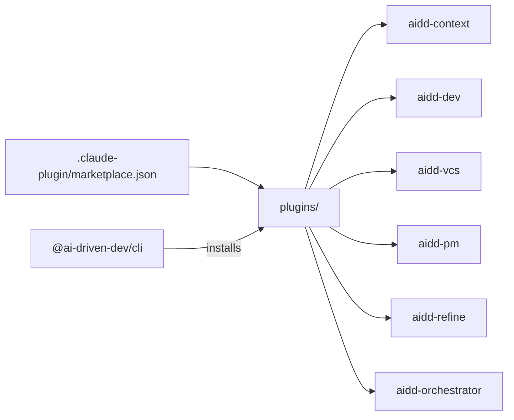
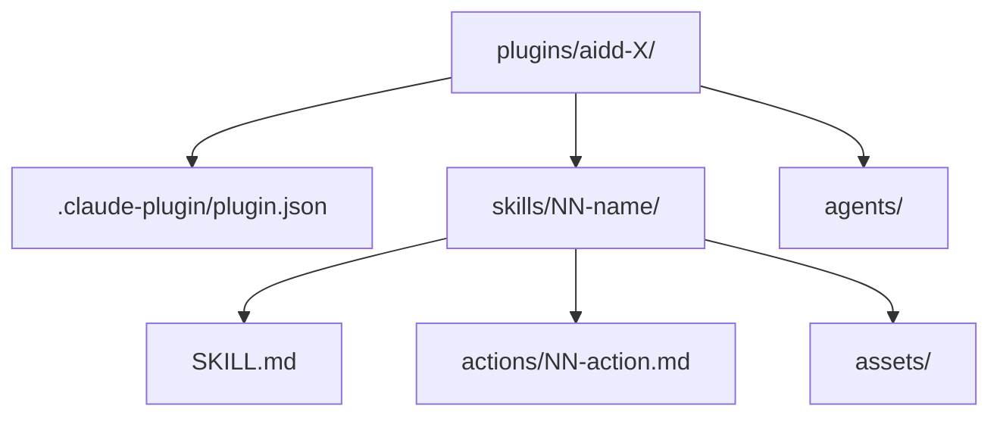
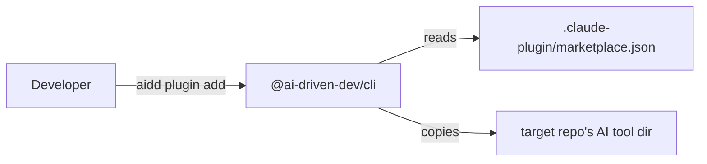
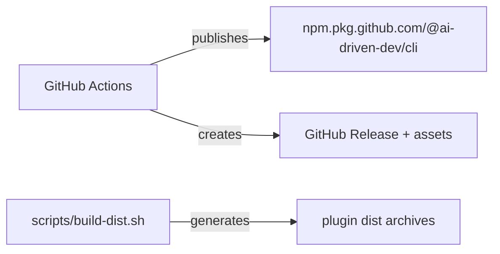

# Architecture

## Language/Framework

```json
{
  "runtime": "Node.js 20",
  "primary_format": "Markdown (skills, agents, rules, memory)",
  "package_manager": "pnpm",
  "devDependencies": ["@commitlint/cli", "@commitlint/config-conventional", "lefthook"]
}
```



### Naming Conventions

- **Plugins**: `aidd-<domain>` — kebab-case
- **Skills**: `NN-slug/SKILL.md` — numbered prefix + kebab-case slug
- **Actions**: `NN-action-name.md` — numbered, kebab-case
- **Agents**: `name.md` — flat, kebab-case
- **Rules**: `N-name.md` — numbered, kebab-case
- **Memory files**: `topic.md` — kebab-case noun

## Plugin Structure

Each plugin follows this layout:



## Services Communication

### CLI to Marketplace



### External Services

#### GitHub Package Registry


