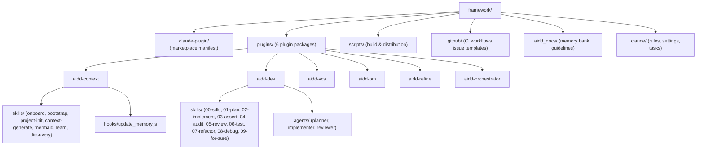

# Codebase Structure

```mermaid
flowchart TD
    Root["framework/"] --> ClaudePlugin[".claude-plugin/ (marketplace manifest)"]
    Root --> Plugins["plugins/ (6 plugin packages)"]
    Root --> Scripts["scripts/ (build & distribution)"]
    Root --> GH[".github/ (CI workflows, issue templates)"]
    Root --> AiddDocs["aidd_docs/ (memory bank, guidelines)"]
    Root --> DotClaude[".claude/ (rules, settings, tasks)"]

    Plugins --> AiddContext["aidd-context"]
    Plugins --> AiddDev["aidd-dev"]
    Plugins --> AiddVCS["aidd-vcs"]
    Plugins --> AiddPM["aidd-pm"]
    Plugins --> AiddRefine["aidd-refine"]
    Plugins --> AiddOrchestrator["aidd-orchestrator"]

    AiddContext --> CtxSkills["skills/ (onboard, bootstrap, project-init, context-generate, mermaid, learn, discovery)"]
    AiddContext --> CtxHooks["hooks/update_memory.js"]
    AiddDev --> DevSkills["skills/ (00-sdlc, 01-plan, 02-implement, 03-assert, 04-audit, 05-review, 06-test, 07-refactor, 08-debug, 09-for-sure)"]
    AiddDev --> DevAgents["agents/ (planner, implementer, reviewer)"]
```
