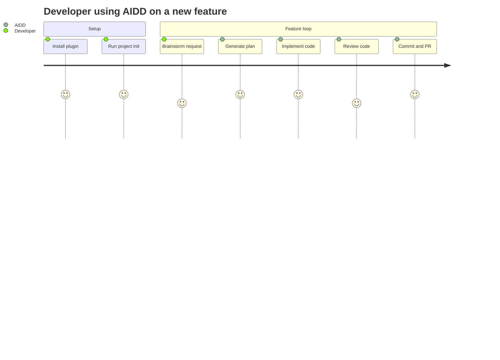

# Project Brief

## Executive Summary

- **Project Name**: AIDD Framework (AI-Driven Dev Framework)
- **Vision**: Universal plugin marketplace for AI coding assistants
- **Mission**: Provide structured, reusable skill sets that make AI assistants follow repeatable, high-quality development workflows

### Full Description

AIDD Framework is a plugin system that installs focused skill sets into AI coding tools (Claude Code, Cursor, GitHub Copilot, Codex, OpenCode). Plugins deliver SDLC workflows — from brainstorming to PR creation — as slash-command-driven skills backed by structured markdown actions.

## Context

### Core Domain

AI-assisted software development tooling. The framework ships workflows, not code. Every artifact is a markdown file (skill, agent, rule, memory template) interpreted by an LLM at runtime.

### Ubiquitous Language

| Term | Definition | Synonyms |
| --- | --- | --- |
| Plugin | Installable package grouping related skills | package |
| Skill | Router-based workflow triggered by user phrase or slash command | command |
| Action | Single step inside a skill, containing inputs/outputs/process/test | step |
| Agent | Specialized AI persona for a focused sub-task | subagent |
| Rule | Coding standard injected into LLM context automatically | guardrail |
| Memory | Structured context file loaded at conversation start | context file |
| SDLC | Software Development Life Cycle — the end-to-end pipeline from idea to deployed PR | |
| Marketplace | Central registry listing available plugins with version metadata | |

## Features & Use-cases

- Install plugins per AI tool with `aidd plugin add <plugin> --tool <tool>`
- Execute skills via slash commands (`/sdlc`, `/commit`, `/plan`, etc.)
- Bootstrap project memory bank and context files with `aidd-context:02-project-init`
- Sync memory references across all AI context files automatically
- Generate plans, assertions, reviews, and PRs through structured action chains
- Run async development pipelines via `aidd-orchestrator`

## User Journey maps

### Developer

- Uses an AI coding assistant daily
- Wants predictable, structured AI workflows
- Needs memory of project context across sessions
