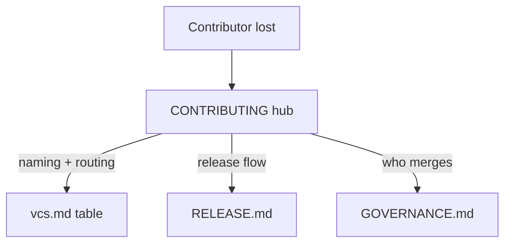

# Instruction: Docs point to canonical (no duplication)

Part of [`plan.md`](./plan.md). Depends on phase 1 (the anchor target must exist).

## Architecture projection

```txt
.
├── CONTRIBUTING.md   🔁  Inline label table (L75-80) → link to vcs.md table;
│                         routing prose (L71) → short pointer + link.
└── RELEASE.md        🔁  "Where your change goes" links the vcs.md table;
                          flow mermaid kept; any restated routing prose trimmed.
```

## User Journey



## Tasks to do

### `1)` De-duplicate `CONTRIBUTING.md`

> It is already a hub; remove the one restated taxonomy.

1. Replace the inline label table (the `| Label | When to use |` block) with a one-line pointer to the canonical table: triage labels + routing live in `aidd_docs/memory/vcs.md` (link to the `#types` anchor). Keep the PR-labelling instruction itself.
2. Trim the routing prose ("Branch off `next`… `hotfix/*` off `main`…") to a short gist + link to the vcs.md table; do not restate the full table.
3. Verify the three hub links resolve and are one hop each: naming/routing → vcs.md, release → RELEASE.md, merge → GOVERNANCE.md.
4. Confirm the issue-template path still holds: opening a 🐛 / ✨ issue applies `bug` / `enhancement` automatically (no edit — verification only).

### `2)` Point `RELEASE.md` at the canonical table

> Anyone landing here finds the table by link, not a copy.

1. In `## Where your change goes`, add a sentence linking the canonical prefix→target table at `aidd_docs/memory/vcs.md#types`.
2. Keep the existing flow mermaid and the commit-type→changelog table (release domain, matches release-please-config — leave as-is).
3. Ensure no prefix→target *table* is restated here (the mermaid is a flow diagram, allowed).

## Test acceptance criteria

| Task | Acceptance criteria |
| ---- | ------------------- |
| 1 | `CONTRIBUTING.md` no longer contains the `| Label | When to use |` table; a link to `vcs.md` triage/routing replaces it. |
| 1 | CONTRIBUTING contains exactly one link each to vcs.md, RELEASE.md, GOVERNANCE.md reachable in one hop. |
| 1 | Creating an issue via each template yields it pre-labelled (`labels:` keys confirmed present in both templates). |
| 2 | `RELEASE.md` "Where your change goes" links `vcs.md#types`; no prefix→target table restated. |
| 1+2 | A text search for a unique cell of the canonical grid returns hits only in `vcs.md`, not in CONTRIBUTING/RELEASE/GOVERNANCE. |
