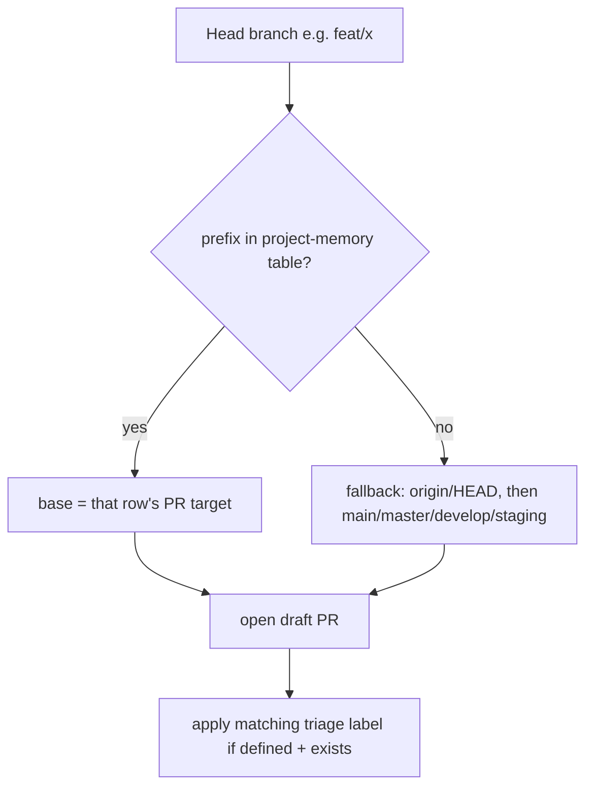

# Instruction: PR automation routes by prefix

Part of [`plan.md`](./plan.md). Depends on phase 1 (the skill reads the canonical table from memory). Keep the plugin **generic** — it reads project memory, never hardcodes `next`.

## Architecture projection

```txt
plugins/aidd-vcs/skills/02-pull-request/
├── actions/01-pull-request.md   🔁  Base resolution derives target from branch
│                                    prefix via project memory; +auto-label step.
└── assets/branch.md             🔁  Stale `aidd_docs/` → `docs/` prefix.
```

## User Journey



## Tasks to do

### `1)` Base resolution by branch prefix

> Fixes feat/→main: `next` was absent from the candidate list.

1. In `## Process` step 3 (Base resolution), insert a match BEFORE the `origin/HEAD` fallback: if the project's branch-naming convention (project memory) maps the head branch's prefix to a PR target, use that target.
2. Keep the existing `origin/HEAD` → `main/master/develop/staging` as the fallback when no prefix mapping exists.
3. Keep it generic: phrase as "the branch-naming convention in project memory", never hardcode `next`.
4. Surface the chosen base and the reason ("prefix `feat/` → `next` per project convention") during the step-7 validation.

### `2)` Auto-apply the triage label

> A PR is born typed, matching the issue model.

1. Add a numbered step after "Open draft": when the convention maps the head prefix to a triage label and that label exists in the repo, apply it; skip silently otherwise.
2. State explicitly: labels triage only; this step never changes the base resolved earlier.
3. Update the `## Test` checklist to cover prefix-derived base + label application; extend Outputs if a label field is warranted.

### `3)` Fix the stale generic template

> `branch.md` is a generic distributable template; correct the bug only.

1. In `assets/branch.md` Types table, change the `aidd_docs/` prefix row to `docs/`.
2. No other change — it stays a generic naming template (no `next`/`main`, no repo-specific routing).

## Test acceptance criteria

| Task | Acceptance criteria |
| ---- | ------------------- |
| 1 | Step 3 lists a prefix→target derivation via project memory BEFORE the origin/HEAD fallback; no literal `next` hardcoded. |
| 1 | Tracing the doc logic: a `feat/*` head resolves base `next`; `hotfix/*` resolves `main` (per the vcs.md table). |
| 2 | A numbered step applies the prefix-mapped triage label post-open, gated on label existence, marked triage-only. |
| 2 | `## Test` checklist asserts the prefix-derived base and the applied label. |
| 3 | `assets/branch.md` shows `docs/`; no `aidd_docs/` remains; no `next`/`main` added. |
