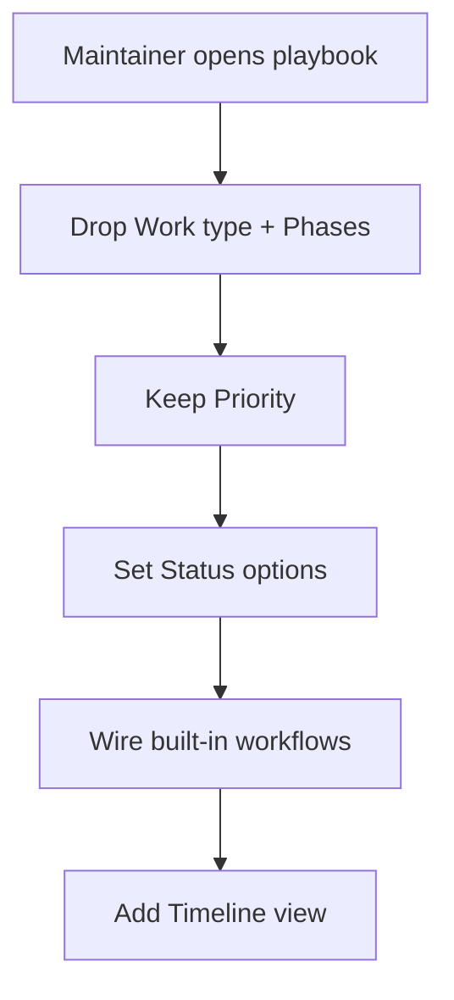

# Instruction: Board playbook (Project 8)

Part of [`plan.md`](./plan.md). The board is GitHub Project config, not repo files — deliver a **playbook** the maintainer applies. Independent of phases 1-4 (can run in parallel).

## Architecture projection

```txt
docs/
└── MAINTAINERS.md   🔁  New "## Project board (Project 8)" section: the
                         field/status/view playbook (gh commands + UI steps).
```

> Confirm `MAINTAINERS.md` is the right host at implement; if it does not fit, create `docs/BOARD.md` and link it from MAINTAINERS + CONTRIBUTING.

## User Journey



## Tasks to do

### `1)` Write the field-cleanup steps

> Each board property answers one question; kill the duplicates.

1. **Drop "Work type"** (duplicates the Type label) and **"Phases"** (duplicates Status/Milestone). Provide the `gh` inspection + deletion commands, e.g.:
   - `gh project field-list 8 --owner ai-driven-dev` to read field IDs.
   - `gh project field-delete <field-id>` for each dropped field.
2. **Keep Priority** — state explicitly it stays (P0·P1·P2), no action.

### `2)` Status options + automation

> Status carries the flow and advances itself.

1. Set Status single-select options: `Todo · In progress · In review · Ready · Done`. Note this is a single-select field edit (UI; `gh project field-create` only creates new fields — document the UI path to edit the existing Status options, with the `gh` create path as the from-scratch alternative).
2. Document the built-in workflow wiring (Project → Workflows, UI):
   - item added → **Todo**
   - PR linked / ready for review → **In review**
   - code review approved → **Ready**
   - PR merged / issue closed → **Done**
3. Flag which transitions are GitHub built-ins vs. manual moves (In progress is typically manual).

### `3)` Timeline view + verification checklist

> The "phases" replacement Alex asked for.

1. Add a **Timeline** view (UI: New view → Timeline; date field = target/milestone). Document the steps.
2. End the section with a tick-box checklist mirroring the spec board done-when: Work type removed · Phases removed · Priority kept · Status options set · automation enabled · Timeline view present.

## Test acceptance criteria

| Task | Acceptance criteria |
| ---- | ------------------- |
| 1 | Playbook gives concrete `gh project field-list`/`field-delete` commands for Work type + Phases, and states Priority is kept. |
| 2 | Playbook lists the 5 Status options and the 4 built-in transitions, marking built-in vs manual. |
| 3 | Playbook documents adding a Timeline view and ends with a board-done-when checklist. |
| all | Section is self-contained: a maintainer can apply it end-to-end without re-deriving anything from the Loom. |
