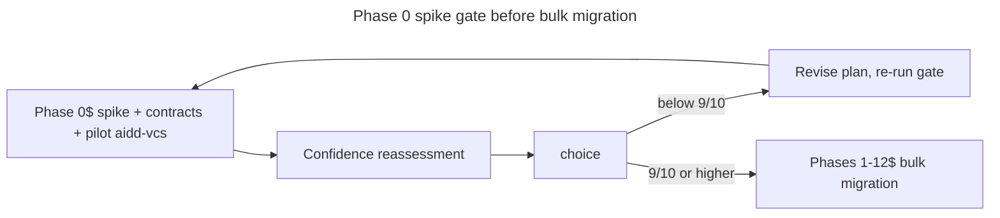

# Instruction: plugin architecture — Part 8: Framework restructure into 4-plugin marketplace (skills-first)

## Feature

- **Summary**: Restructure `aidd-framework` repo from flat `agents/`, `commands/`, `rules/`, `skills/` layout into Claude Code plugin marketplace with 4 plugins (`aidd-context`, `aidd-dev`, `aidd-vcs`, `aidd-pm`) and 24 skills total, per `ARCHITECTURE.md` (skills-first). Migration v1 = 1:1 (each existing command → 1 numbered action in target skill). Reuses 5 already-refactored skills as-is. Splits `config/mcp.json` and the `update_memory` SessionStart hook into the relevant plugins. Adopts release-please monorepo with per-plugin versioning. Breaking change — no backward-compat for old flat installs. Supersedes the original `2026_04_27-#260-plugin-architecture-part-8.md` (6-plugin flat model).
- **Stack**: `TypeScript 5.x` (build scripts), `Node.js >= 24`, `release-please` (monorepo mode), Claude Code plugin marketplace format
- **Branch name**: `feat/260-plugin-architecture-part-8` (on `aidd-framework` repo)
- **Parent Plan**: `aidd-cli://aidd_docs/tasks/2026_04/2026_04_27-#260-plugin-architecture-master.md`
- **Sequence**: `8 of 8`
- Confidence: 7/10 (raises to 9/10 after Phase 0 spike gate completes)
- Time to implement: 3-4 sessions (+ 0.5–1 session for Phase 0)

## Source of truth

- `https://github.com/ai-driven-dev/aidd-framework/blob/e6de0b5e1e694b625bd2d0c05bd1fcb4043fcb51/ARCHITECTURE.md`
- File overrides any decision from the original 6-plugin Part 8.

## Existing files (aidd-framework repo)

- @../framework/agents/ (5 agents: alexia, claire, iris, kent, martin)
- @../framework/commands/ (phase-numbered command files)
- @../framework/rules/ (rule conventions)
- @../framework/skills/ (5 already-refactored skills)
- @../framework/skills/aidd-auto-implement/SKILL.md
- @../framework/skills/challenge/SKILL.md
- @../framework/skills/clarity/SKILL.md
- @../framework/skills/for-sure/ (SKILL.md + sub-actions/ + references/)
- @../framework/skills/generate-skill/ (full anatomy: actions/, assets/, evals/, references/, scripts/)
- @../framework/config/.claude/settings.json
- @../framework/config/.opencode/opencode.json
- @../framework/config/codex/hooks.json
- @../framework/config/copilot/settings.json
- @../framework/config/vscode/extensions.json
- @../framework/config/vscode/keybindings.json
- @../framework/config/vscode/settings.json
- @../framework/config/mcp.json
- @../framework/config/scripts/update_memory.js
- @../framework/aidd_docs/templates/{aidd,dev,vcs,pm,docs,memory}/
- @../framework/aidd_docs/CATALOG.md
- @../framework/aidd_docs/README.md
- @../framework/aidd_docs/CONTRIBUTING.md
- @../framework/version.txt
- @../framework/release-please-config.json
- @../framework/.release-please-manifest.json
- @../framework/scripts/build.js
- @../framework/README.md
- @../framework/CONTRIBUTING.md
- @../framework/CHANGELOG.md

### New files to create

- ../framework/.claude-plugin/marketplace.json
- ../framework/plugins/aidd-context/.claude-plugin/plugin.json
- ../framework/plugins/aidd-context/README.md
- ../framework/plugins/aidd-context/CATALOG.md
- ../framework/plugins/aidd-context/hooks/hooks.json
- ../framework/plugins/aidd-context/hooks/update_memory.js
- ../framework/plugins/aidd-context/skills/[1.1] project-init/SKILL.md
- ../framework/plugins/aidd-context/skills/[1.1] project-init/actions/01-init.md
- ../framework/plugins/aidd-context/skills/[1.1] project-init/actions/02-init-skeleton-rules.md
- ../framework/plugins/aidd-context/skills/[1.1] project-init/assets/golden-principles.md
- ../framework/plugins/aidd-context/skills/[1.1] project-init/assets/AGENTS.md
- ../framework/plugins/aidd-context/skills/[1.1] project-init/assets/templates/memory/{README.md,architecture.md,codebase_map.md,coding_assertions.md,deployment.md,project_brief.md,testing.md,vcs.md}
- ../framework/plugins/aidd-context/skills/[1.1] project-init/assets/templates/memory/frontend/{browsing.md,design.md,forms.md}
- ../framework/plugins/aidd-context/skills/[1.1] project-init/assets/templates/memory/backend/{api_docs.md,communication.md,database.md}
- ../framework/plugins/aidd-context/skills/[1.1] project-init/assets/templates/stack/README.md
- ../framework/plugins/aidd-context/skills/[1.1] project-init/assets/templates/workflows/README.md
- ../framework/plugins/aidd-context/skills/[1.2] architecture-generate/SKILL.md
- ../framework/plugins/aidd-context/skills/[1.2] architecture-generate/actions/01-generate-architecture.md
- ../framework/plugins/aidd-context/skills/[1.3] context-generate/* (full anatomy from existing generate-skill/ + new rules/ + agents/ subcategories)
- ../framework/plugins/aidd-context/skills/[1.4] brainstorm/{SKILL.md,actions/01-brainstorm.md}
- ../framework/plugins/aidd-context/skills/[1.5] challenge/{SKILL.md,actions/01-challenge.md,actions/02-clarity.md}
- ../framework/plugins/aidd-context/skills/[1.6] mermaid/{SKILL.md,actions/01-mermaid.md,references/mermaid-conventions.md}
- ../framework/plugins/aidd-context/skills/[1.7] learn/{SKILL.md,actions/01-learn.md,assets/install-template.md,assets/adr-template.md,assets/decision-template.md}
- ../framework/plugins/aidd-context/skills/[1.8] discovery/{SKILL.md,actions/01-find-skill.md}
- ../framework/plugins/aidd-dev/.claude-plugin/plugin.json
- ../framework/plugins/aidd-dev/README.md
- ../framework/plugins/aidd-dev/CATALOG.md
- ../framework/plugins/aidd-dev/.mcp.json
- ../framework/plugins/aidd-dev/agents/{alexia.md,claire.md,iris.md,kent.md,martin.md}
- ../framework/plugins/aidd-dev/skills/[2.0] sdlc/{SKILL.md,actions/01-implement.md,actions/02-auto-implement.md,actions/03-projection.md}
- ../framework/plugins/aidd-dev/skills/[2.1] plan/{SKILL.md,actions/01-plan.md,assets/plan-template.md,assets/master-plan-template.md,assets/spec-template.md,assets/tech-choice-template.md}
- ../framework/plugins/aidd-dev/skills/[2.2] assert/{SKILL.md,actions/01-assert.md,actions/02-assert-architecture.md,actions/03-assert-frontend.md}
- ../framework/plugins/aidd-dev/skills/[2.3] audit/{SKILL.md,actions/01-audit.md}
- ../framework/plugins/aidd-dev/skills/[2.4] review/{SKILL.md,actions/01-review-code.md,actions/02-review-functional.md,assets/code-review-template.md,assets/review-template.md}
- ../framework/plugins/aidd-dev/skills/[2.5] test/{SKILL.md,actions/01-test.md,actions/02-test-journey.md}
- ../framework/plugins/aidd-dev/skills/[2.6] refactor/{SKILL.md,actions/01-performance.md,actions/02-security.md}
- ../framework/plugins/aidd-dev/skills/[2.7] debug/{SKILL.md,actions/01-reproduce.md,actions/02-debug.md,actions/03-reflect-issue.md}
- ../framework/plugins/aidd-dev/skills/[2.8] for-sure/{SKILL.md,actions/01-init-tracking.md,actions/02-auto-accept.md,actions/03-autonomous-loop.md,assets/tracking-template.md}
- ../framework/plugins/aidd-vcs/.claude-plugin/plugin.json
- ../framework/plugins/aidd-vcs/README.md
- ../framework/plugins/aidd-vcs/CATALOG.md
- ../framework/plugins/aidd-vcs/skills/[3.1] commit/{SKILL.md,actions/01-commit.md,assets/commit-template.md}
- ../framework/plugins/aidd-vcs/skills/[3.2] pull-request/{SKILL.md,actions/01-create-pull-request.md,assets/pr-template.md,assets/branch-template.md,assets/contributing-template.md,assets/readme-template.md}
- ../framework/plugins/aidd-vcs/skills/[3.3] release-tag/{SKILL.md,actions/01-tag.md,assets/release-template.md}
- ../framework/plugins/aidd-vcs/skills/[3.4] issue-create/{SKILL.md,actions/01-new-issue.md,assets/issue-template.md}
- ../framework/plugins/aidd-pm/.claude-plugin/plugin.json
- ../framework/plugins/aidd-pm/README.md
- ../framework/plugins/aidd-pm/CATALOG.md
- ../framework/plugins/aidd-pm/.mcp.json
- ../framework/plugins/aidd-pm/skills/[4.1] ticket-info/{SKILL.md,actions/01-ticket-info.md}
- ../framework/plugins/aidd-pm/skills/[4.2] user-stories-create/{SKILL.md,actions/01-create-user-stories.md,assets/user-story-template.md}
- ../framework/plugins/aidd-pm/skills/[4.3] prd/{SKILL.md,actions/01-prd.md,assets/prd-template.md,assets/status-template.md,assets/task-template.md}

## User Journey

```mermaid
---
title: Part 8 — Framework 4-plugin marketplace migration
---
flowchart TD
  FlatLayout["Current$ flat agents/, commands/, rules/, skills/"]
  ReuseSkills["Reuse$ 5 pre-refactored skills (challenge, clarity, for-sure, generate-skill, aidd-auto-implement)"]
  CreatePluginsScaffold["Create$ plugins/<4 plugins>/.claude-plugin/plugin.json + README + CATALOG"]
  Marketplace["Create$ .claude-plugin/marketplace.json (4 entries, 3 recommended, aidd-pm RC)"]
  MoveSkills["Move$ existing skills into target plugin per ARCHITECTURE migration table"]
  MigrateCommands["Migrate$ each command → 1 numbered action in target skill (1:1)"]
  MoveAgents["Move$ 5 agents → aidd-dev/agents/"]
  SplitMcp["Split$ config/mcp.json → aidd-dev/.mcp.json (playwright+figma) + aidd-pm/.mcp.json (atlassian)"]
  MovePluginHook["Move$ update_memory.js → aidd-context/hooks/{hooks.json,update_memory.js}"]
  RelocateTemplates["Relocate$ aidd_docs/templates/* → matching skill assets/"]
  DropOrphans["Delete$ orphan templates (aidd/command.md, aidd/prompt.md)"]
  NewSkills["Create$ new skills (1.8 discovery, 2.0 sdlc, 2.3 audit) + 02-init-skeleton-rules action"]
  ReleasePleaseMonorepo["Update$ release-please-config.json + commitlint scopes (multi-package)"]
  BuildScript["Update$ scripts/build.js to walk plugins/* and generate CATALOG.md"]
  RewriteDocs["Rewrite$ aidd_docs/README.md, root README.md, CONTRIBUTING.md"]
  CliCoordination["Coordinate$ CLI framework-loader-adapter.ts paths (mcp + hook)"]
  ValidateE2E["Validate$ CLI install --recommended → 3 plugins installed per IDE"]

  FlatLayout --> CreatePluginsScaffold
  CreatePluginsScaffold --> Marketplace
  Marketplace --> ReuseSkills
  ReuseSkills --> MoveSkills
  MoveSkills --> MigrateCommands
  MigrateCommands --> MoveAgents
  MoveAgents --> SplitMcp
  SplitMcp --> MovePluginHook
  MovePluginHook --> RelocateTemplates
  RelocateTemplates --> DropOrphans
  DropOrphans --> NewSkills
  NewSkills --> ReleasePleaseMonorepo
  ReleasePleaseMonorepo --> BuildScript
  BuildScript --> RewriteDocs
  RewriteDocs --> CliCoordination
  CliCoordination --> ValidateE2E
```



## Confidence gate sequencing



## Plugin catalog

| Plugin | Recommended | Version | Description (short) |
|---|---|---|---|
| `aidd-context` | yes | `1.0.0` | Knowledge production: project init, architecture/context generation, brainstorm, challenge, mermaid, learn, discovery |
| `aidd-dev` | yes | `1.0.0` | Code transformation: SDLC orchestrator, plan, assert, audit, review, test, refactor, debug, for-sure. Hosts agents. |
| `aidd-vcs` | yes | `1.0.0` | External artifacts: commit, pull-request, release-tag, issue-create |
| `aidd-pm` | no | `1.0.0-rc.1` | Product management (release candidate): ticket-info, user-stories-create, prd |

## Skill migration map (24 skills)

### aidd-context (8)

| Skill | Source(s) | Notes |
|---|---|---|
| [1.1] project-init | commands/01_onboard/init.md | + new action 02-init-skeleton-rules.md, + assets/templates/{memory,stack,workflows}, + assets/golden-principles.md, + assets/AGENTS.md |
| [1.2] architecture-generate | commands/01_onboard/generate_architecture.md | 1:1 |
| [1.3] context-generate | FUSION: commands/01_onboard/{generate_rules,generate_agent,generate_skill}.md + skills/generate-skill/* | sub-categorized actions/assets (rules/, agents/, skills/); reuse generate-skill anatomy as-is |
| [1.4] brainstorm | commands/02_context/brainstorm.md | 1:1 |
| [1.5] challenge | FUSION: skills/challenge/SKILL.md + skills/clarity/SKILL.md | inline both as actions 01- and 02- |
| [1.6] mermaid | commands/07_documentation/mermaid.md + rules/01-standards/1-mermaid.md → references/ | 1:1 |
| [1.7] learn | commands/07_documentation/learn.md | + assets: install-template, adr-template, decision-template |
| [1.8] discovery | NEW (no source) | actions/01-find-skill.md |

### aidd-dev (9)

| Skill | Source(s) | Notes |
|---|---|---|
| [2.0] sdlc | FUSION: commands/04_code/{implement,run_projection}.md + skills/aidd-auto-implement/SKILL.md | orchestrator (juxtaposed actions in v1, chaining v2) |
| [2.1] plan | commands/03_plan/plan.md | + assets: plan, master_plan, spec, tech_choice templates |
| [2.2] assert | FUSION: commands/04_code/{assert,assert_architecture,assert_frontend}.md | 3 actions |
| [2.3] audit | NEW (extracted from refactor): commands/09_refactor/audit.md | standalone skill |
| [2.4] review | FUSION: commands/05_review/{review_code,review_functional}.md | + assets: code_review, review_code |
| [2.5] test | FUSION: commands/06_tests/{test,test_journey}.md | 2 actions |
| [2.6] refactor | FUSION: commands/09_refactor/{performance,security_refactor}.md | 2 actions (audit removed) |
| [2.7] debug | FUSION: commands/10_maintenance/{reproduce,debug,reflect_issue}.md | 3 actions |
| [2.8] for-sure | skills/for-sure/* + commands/00_behavior/auto_accept.md | rename sub-actions/ → actions/, add 02-auto-accept.md, renumber autonomous-loop → 03- |

### aidd-vcs (4)

| Skill | Source(s) | Notes |
|---|---|---|
| [3.1] commit | commands/08_deploy/commit.md | + assets/commit-template.md |
| [3.2] pull-request | commands/08_deploy/create_request.md | + assets: pr, branch, contributing, readme templates |
| [3.3] release-tag | commands/08_deploy/tag.md | + assets/release-template.md |
| [3.4] issue-create | commands/10_maintenance/new_issue.md | + assets/issue-template.md |

### aidd-pm (3, RC)

| Skill | Source(s) | Notes |
|---|---|---|
| [4.1] ticket-info | commands/02_context/ticket_info.md | 1:1 |
| [4.2] user-stories-create | commands/02_context/create_user_stories.md | + assets/user-story-template.md |
| [4.3] prd | (no command source) | + assets: prd, status, task templates |

## Implementation phases

### Phase 0: Spike & contract validation (confidence gate)

> Resolve unknowns before committing to bulk migration. Reassess confidence at end of phase. If any blocker found, revise plan before Phase 1.

1. **Pin Claude Code marketplace spec**. Fetch official schema/docs for `marketplace.json`, `plugin.json`, `hooks/hooks.json`. Add JSON-schema files under `scripts/schemas/` and a CI validation step. Output: `scripts/schemas/{marketplace,plugin,hooks}.schema.json` + validator script.
2. **Spike bracket-in-path skill names**. Test `[1.1] project-init/` in:
   - node `fs.readdir`, `glob`, `path.resolve`
   - `marketplace.json` `source.path` resolution
   - Each IDE install target path
   If broken, fall back to `1.1-project-init/` and re-confirm with ARCHITECTURE author. Output: decision recorded in `aidd_docs/memory/` or as a new ADR.
3. **CLI surface inventory**. Read CLI files end-to-end and list every framework-structure assumption:
   - `cli/src/infrastructure/adapters/framework-loader-adapter.ts` (lines 30, 40, 44 known legacy refs)
   - `cli/src/infrastructure/adapters/plugin-translator.ts`
   - `cli/src/infrastructure/adapters/plugin-distribution-reader-adapter.ts`
   - `cli/src/domain/tools/ai/{claude,cursor,copilot,codex,opencode}.ts`
   Output: a `cli-coordination.md` note listing every CLI change required for Part 8 to install cleanly.
4. **Read `scripts/build.js`**. Sketch diff for plugin-walking + per-IDE dist transformation. Estimate LoC. Output: pseudocode in plan annex.
5. **Pilot plugin: `aidd-vcs`**. Migrate end-to-end (Phases 1–6 scoped to `aidd-vcs` only). Install via CLI to all 5 IDEs locally. Validate:
   - `aidd plugin add aidd-vcs --tools claude` → installed
   - Same for cursor, copilot, codex, opencode
   - `aidd status` clean post-install
   - Modify file → drift reported → `aidd restore` succeeds
   Output: green install across 5 IDEs. Lessons feed Phases 1–6 for the other 3 plugins.
6. **Exhaustive command inventory**. `find framework/commands -type f -name '*.md'` → tag each with target skill per ARCHITECTURE migration table. Flag any unmapped. Output: a complete mapping table appended to this plan.
7. **Release-please monorepo dry-run**. Synthetic branch with fake commits per scope. Run `release-please --dry-run`. Verify:
   - 4 distinct package release proposals
   - `aidd-pm` `release-as: 1.0.0-rc.1` renders correctly as a pre-release tag
   - Per-plugin `CHANGELOG.md` proposed
   Output: dry-run logs committed to `aidd_docs/memory/`.
8. **Hook spec end-to-end**. Author one sample `aidd-context/hooks/hooks.json` (SessionStart, matcher `startup|resume`, command invokes `update_memory.js`). Run through CLI translator for each IDE locally. Confirm:
   - `node <plugin-install-path>/hooks/update_memory.js` resolves at install time per IDE
   - Codex `.codex/hooks.json` SessionStart entry generated
   - Cursor `hooks.json` generated
   - Other IDEs handled or explicitly noted as v2
   Output: per-IDE expected hook output documented.
9. **Audit all template dirs**. `find framework/aidd_docs/templates -type f` → cross-check with ARCHITECTURE migration table. List any not covered. Output: orphan list, with per-orphan disposition (relocate or delete).
10. **MCP merge behavior check**. Confirm whether multiple plugin `.mcp.json` files merge cleanly at install time per IDE, or if conflicts arise. Output: behavior note + any pre-merge step required in `build.js`.
11. **Validate generate-skill scripts**. Move `skills/generate-skill/scripts/validate-*.js` into `[1.3] context-generate/scripts/`. Run against new sub-categorized `actions/{rules,agents,skills}/` layout. Patch as needed. Output: scripts pass on new structure.
12. **Confidence reassessment**. Revise Confidence field at top of this plan. If new blockers found, update phases. Stop gate: must reach ≥9/10 before Phase 1 starts.

### Phase 1: Marketplace catalog + plugin scaffolding

> Create the 4 plugin shells with manifests, README, CATALOG. No content yet.

1. Create `.claude-plugin/marketplace.json` at framework root with 4 entries (`name`, `source.kind=local`, `source.path=./plugins/<name>`, `description`, `recommended`, `strict: true`).
2. For each plugin in `plugins/<name>/`:
   - Create `.claude-plugin/plugin.json` (`name`, `version`, `description`, `author: { name: "AI-Driven Dev" }`, `strict: true`).
   - Create `README.md` from template (purpose, skills table placeholder, no CLI mention).
   - Create empty `CATALOG.md` (build.js fills it).
3. Set initial versions: `aidd-context`, `aidd-dev`, `aidd-vcs` = `1.0.0`; `aidd-pm` = `1.0.0-rc.1`.
4. Commit: `feat(framework): scaffold 4-plugin marketplace catalog`.

### Phase 2: Reuse pre-refactored skills

> Move the 5 already-refactored skills into target plugins as-is.

1. `skills/generate-skill/` → `plugins/aidd-context/skills/[1.3] context-generate/` (move scripts/, evals/, references/ alongside; relocate actions to `actions/skills/` subcategory).
2. `skills/challenge/SKILL.md` → inline body into `plugins/aidd-context/skills/[1.5] challenge/actions/01-challenge.md`.
3. `skills/clarity/SKILL.md` → inline body into `plugins/aidd-context/skills/[1.5] challenge/actions/02-clarity.md`.
4. Create new `[1.5] challenge/SKILL.md` orchestrating both actions.
5. `skills/aidd-auto-implement/SKILL.md` → inline body into `plugins/aidd-dev/skills/[2.0] sdlc/actions/02-auto-implement.md`.
6. `skills/for-sure/` → `plugins/aidd-dev/skills/[2.8] for-sure/`:
   - Rename `sub-actions/` → `actions/`, prefix existing files: `01-init-tracking.md`, `03-autonomous-loop.md`.
   - Move `references/tracking-template.md` → `assets/tracking-template.md`.
   - Update `SKILL.md` to reference 3 actions (placeholder for `02-auto-accept.md`, filled in Phase 3).
7. Delete legacy `skills/` directory entries that have been moved.
8. Commit: `feat(framework): migrate 5 pre-refactored skills into plugins`.

### Phase 3: Migrate commands → numbered actions (1:1)

> Each command file becomes one numbered action in its target skill.

1. For each row in the Skill migration map: copy command body into target `actions/<NN>-<name>.md`.
2. Add `02-auto-accept.md` (from `commands/00_behavior/auto_accept.md`) into `[2.8] for-sure/actions/`.
3. Add `02-init-skeleton-rules.md` (NEW, no source) into `[1.1] project-init/actions/` — emits client `rules/00-architecture/` ... `09-other/` skeleton.
4. Create `SKILL.md` for each of the 24 skills (orchestrator listing actions). Use `generate-skill/SKILL.md` as the structural reference.
5. Delete legacy `commands/` directory.
6. Commit per plugin: `feat(aidd-<name>): migrate commands to numbered actions`.

### Phase 4: Move agents

> Agents centralized under `aidd-dev`.

1. Move 5 agents (`alexia.md`, `claire.md`, `iris.md`, `kent.md`, `martin.md`) from `agents/` → `plugins/aidd-dev/agents/`.
2. Delete legacy `agents/` directory.
3. Commit: `feat(aidd-dev): centralize agents`.

### Phase 5: Split MCP + relocate hook

> Per-plugin MCP and SessionStart hook.

1. Split `config/mcp.json`:
   - `plugins/aidd-dev/.mcp.json` ← `playwright`, `figma` entries
   - `plugins/aidd-pm/.mcp.json` ← `mcp-atlassian` entry
2. Move `config/scripts/update_memory.js` → `plugins/aidd-context/hooks/update_memory.js`.
3. Create `plugins/aidd-context/hooks/hooks.json` (Claude marketplace format, SessionStart event matching `startup|resume`, command = invoke `update_memory.js`).
4. Delete `config/mcp.json`, `config/scripts/`, `config/codex/hooks.json` (the AIDD hook; codex IDE settings stay if any).
5. Commit: `feat(framework): split MCP and SessionStart hook into plugins`.

### Phase 6: Relocate templates + drop orphans

> Templates move into matching skill `assets/`.

1. Move per the migration table:
   - `aidd_docs/templates/aidd/{golden_principles,AGENTS}.md` → `[1.1] project-init/assets/`
   - `aidd_docs/templates/aidd/memory/*` → `[1.1] project-init/assets/templates/memory/` (including `frontend/` + `backend/` subfolders, ex-`internal/`)
   - `aidd_docs/templates/aidd/{plan,master_plan,spec}.md` + `templates/dev/tech_choice.md` → `[2.1] plan/assets/`
   - `aidd_docs/templates/dev/{code_review,review_code,review_functional}.md` → `[2.4] review/assets/`
   - `aidd_docs/templates/dev/{adr,decision}.md` + `templates/docs/INSTALL.md` → `[1.7] learn/assets/`
   - `aidd_docs/templates/aidd/{status,task}.md` + `templates/pm/prd.md` → `[4.3] prd/assets/`
   - `aidd_docs/templates/pm/user_story.md` → `[4.2] user-stories-create/assets/`
   - `aidd_docs/templates/vcs/commit.md` → `[3.1] commit/assets/`
   - `aidd_docs/templates/vcs/{pull_request,branch,CONTRIBUTING,README}.md` → `[3.2] pull-request/assets/`
   - `aidd_docs/templates/vcs/release.md` → `[3.3] release-tag/assets/`
   - `aidd_docs/templates/vcs/issue.md` → `[3.4] issue-create/assets/`
   - `aidd_docs/templates/aidd/{rule,agent,skill}.md` + `templates/aidd/agents_coordination.md` → `[1.3] context-generate/assets/{rules,agents,skills}/` + references
2. Delete orphans: `aidd_docs/templates/aidd/command.md`, `aidd_docs/templates/aidd/prompt.md`.
3. Move convention rules → references:
   - `rules/01-standards/1-command-structure.md` → `[1.3] context-generate/references/skill-structure.md`
   - `rules/01-standards/1-rule-structure.md` → `[1.3] context-generate/references/rule-structure.md`
   - `rules/01-standards/1-rule-writing.md` → `[1.3] context-generate/references/rule-writing.md`
   - `rules/01-standards/1-mermaid.md` → `[1.6] mermaid/references/mermaid-conventions.md`
4. Delete now-empty `rules/` and `aidd_docs/templates/`.
5. Commit: `feat(framework): relocate templates and conventions into skill assets`.

### Phase 7: New skills (no command source)

> Create skills that have no existing command body.

1. `[1.8] discovery/actions/01-find-skill.md` — listing/search of installed skills.
2. `[2.0] sdlc/SKILL.md` — orchestrator (plan → code → test → review → commit → PR). v1: actions juxtaposed, no real chaining (deferred v2).
3. `[2.3] audit/actions/01-audit.md` — extracted from `commands/09_refactor/audit.md` (already moved in Phase 3, this phase only verifies the standalone skill structure).
4. `[4.3] prd/actions/01-prd.md` — RC content placeholder if no source.
5. Commit: `feat(framework): introduce new skills (discovery, sdlc, audit)`.

### Phase 8: Release-please monorepo

> Per-plugin versioning + commit scopes.

1. Update `release-please-config.json`:
   ```json
   {
     "$schema": "https://raw.githubusercontent.com/googleapis/release-please/main/schemas/config.json",
     "release-type": "simple",
     "include-component-in-tag": true,
     "include-v-in-tag": true,
     "bump-minor-pre-major": false,
     "changelog-sections": [...],
     "packages": {
       ".": {},
       "plugins/aidd-context": { "package-name": "aidd-context" },
       "plugins/aidd-dev": { "package-name": "aidd-dev" },
       "plugins/aidd-vcs": { "package-name": "aidd-vcs" },
       "plugins/aidd-pm": { "package-name": "aidd-pm", "release-as": "1.0.0-rc.1" }
     }
   }
   ```
2. Update `.release-please-manifest.json`:
   ```json
   {
     ".": "3.9.0",
     "plugins/aidd-context": "1.0.0",
     "plugins/aidd-dev": "1.0.0",
     "plugins/aidd-vcs": "1.0.0",
     "plugins/aidd-pm": "1.0.0-rc.1"
   }
   ```
3. Update `commitlint.config.cjs` to enforce scopes: `aidd-context`, `aidd-dev`, `aidd-vcs`, `aidd-pm`, `framework` (root-level).
4. Update `CONTRIBUTING.md` with scope discipline section.
5. Commit: `chore(framework): adopt release-please monorepo with per-plugin versioning`.

### Phase 9: Build script update

> `build.js` walks plugins, regenerates CATALOG, bundles dist per IDE.

1. Update `scripts/build.js`:
   - Walk `plugins/*/skills/*/SKILL.md` and emit `aidd_docs/CATALOG.md` (global) + each `plugins/<name>/CATALOG.md` (per-plugin).
   - Generate `dist/<ide>/` = full installed working environment per IDE (claude, cursor, copilot, codex, opencode), translated from Claude marketplace format.
   - Include IDE-level `config/<ide>/...` settings in the corresponding dist.
2. Verify `dist/` builds cleanly for all 5 IDEs.
3. Commit: `feat(scripts): build.js walks plugins and emits per-IDE dist`.

### Phase 10: Documentation rewrite

> Root + `aidd_docs/` user-facing docs reflect plugin model.

1. Rewrite `aidd_docs/README.md` for plugin model (new content, no past comparison; embed marketplace install section).
2. Update root `README.md` and `CONTRIBUTING.md`.
3. Update `CHANGELOG.md` baseline (release-please will manage going forward).
4. Each plugin `README.md` filled (purpose, skills list, install command not framework-side — stays neutral).
5. Verify each plugin `CATALOG.md` regenerated by build.js.
6. Commit: `docs(framework): rewrite for plugin marketplace model`.

### Phase 11: CLI coordination

> CLI's `framework-loader-adapter.ts` references old paths. Coordinate with CLI work.

1. Confirm CLI updates `framework-loader-adapter.ts:30,40,44` to drop legacy refs to `config/mcp.json`, `config/codex/hooks.json`, `config/scripts/update_memory.js`.
2. Confirm CLI's `plugin-distribution-reader-adapter.ts` and `plugin-translator.ts` correctly translate per-plugin `hooks/hooks.json` and `.mcp.json` for all 5 IDEs.
3. Block merge of framework Part 8 until matching CLI changes are merged or feature-flagged.

### Phase 12: End-to-end validation

> Full marketplace install via CLI.

1. Point CLI at local framework: `aidd install --framework /path/to/framework --tools claude --recommended --yes`.
2. Verify `.claude/plugins/aidd-context/`, `aidd-dev/`, `aidd-vcs/` installed; `aidd-pm` skipped (not recommended).
3. Verify per-plugin manifests, hooks, MCP files, agents, skills present in install target.
4. Run `aidd plugin list` → 3 installed.
5. Modify a plugin file → `aidd status` reports drift.
6. `aidd restore --plugin aidd-dev` → file restored.
7. Repeat for `--tools cursor`, `--tools copilot`, `--tools codex`, `--tools opencode`.
8. Verify SessionStart hook fires on each AI tool open and runs `update_memory.js`.

## Validation flow

0. Phase 0 spike gate passed: confidence reassessed ≥9/10, all 12 spike items closed.
1. `node scripts/build.js` exits 0; `dist/{claude,cursor,copilot,codex,opencode}/` populated.
2. `aidd_docs/CATALOG.md` and each `plugins/<name>/CATALOG.md` regenerated; matches skill inventory.
3. CLI install end-to-end (Phase 12) succeeds for all 5 tools.
4. CLI `aidd plugin add aidd-pm` succeeds with RC warning surfaced.
5. `release-please --dry-run` produces 5 distinct package proposals.
6. Commit with bad scope (`feat(unknown): ...`) rejected by commitlint.
7. SessionStart hook runs once per AI tool open.
8. Modify and restore round-trip for any plugin works.

## Risks

- **HIGH**: CLI ↔ framework path coordination. Moving hooks/MCP into plugins breaks `framework-loader-adapter.ts` until CLI updated. Mitigate: gate framework Part 8 merge on CLI counterpart merge; coordinate branch sequencing.
- **MEDIUM**: Release-please monorepo tagging. Per-plugin tags require commit scope discipline; one wrong-scoped commit splits across packages incorrectly. Mitigate: enforce via commitlint, document in CONTRIBUTING.md.
- **MEDIUM**: 24-skill 1:1 migration tedium. Some commands span multiple domains; misclassification likely. Mitigate: ARCHITECTURE migration table is authoritative; ambiguity resolved by primary domain.
- **MEDIUM**: Breaking change for users on flat install. No backward-compat. Mitigate: explicit major-version bump in release notes, migration guide in `aidd_docs/README.md`.
- **LOW**: Skill numbering convention (`[X.Y] name` with bracket+space) may break path globs in IDE tools. Mitigate: validate dist paths during Phase 9 build.
- **LOW**: Empty `evals/` and `references/` directories pollute repo. Mitigate: `.gitkeep` strategy or skip dirs until populated.

## Out of scope (deferred to v2)

- Hook events beyond SessionStart (PreCommit, PostEdit, etc.)
- MCP server splits beyond v1 mapping
- Workflow skills beyond `[2.0] sdlc` (bug-fix-workflow, release-workflow…)
- Real chaining inside `[2.0] sdlc` (actions invoking other skills)
- `When NOT to use` sections in each `SKILL.md`
- Skill-level versioning (per-skill, not just per-plugin)
- Agent rename/restructure (Alex)
- `aidd-ops` plugin (D7)
- Generation of skill from `aidd_docs/workflows/<workflow>.md`
- Real `evals/scenarios.json` per skill (v1 keeps existing one for context-generate, others empty)
