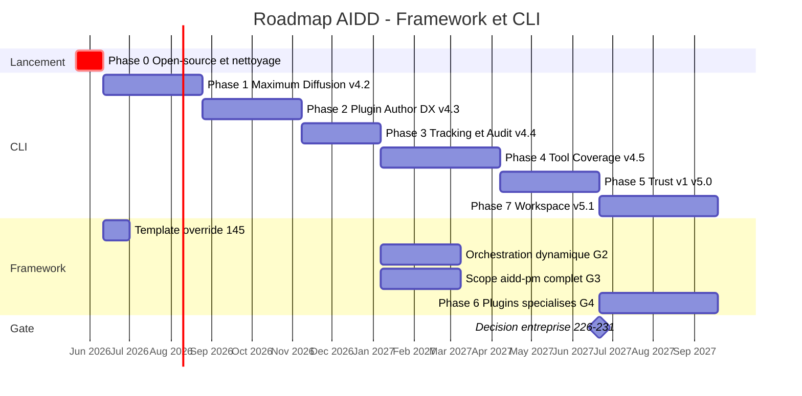

# Audit de backlog et roadmap - Framework + CLI

> Date: 2026-05-21
> Périmètre: `aidd-framework`, `aidd-cli`, et le repo méta `aidd` (issues produit)
> Source canonique: board GitHub Projects "AIDD - Produit" (#7, `PVT_kwDOCsgApM4BSgyh`)
>
> **MISE À JOUR 2026-05-21** - les 3 décisions stratégiques de la Partie 0 sont tranchées:
> 1. Monorepo OUI (CLI compagnon dans `aidd-framework/cli/`).
> 2. Entreprise OUI (#226-231 conservées et engagées).
> 3. Project dédié côté framework, source unique du backlog et de la roadmap.
> Le plan d'exécution complet est dans `2026_05_21-execution-plan-monorepo-oss.md`.

## Synthèse en une page

Le backlog compte environ 77 issues ouvertes réparties sur 3 repos. Le constat principal: **la structure d'epics est dédoublée et désynchronisée du code livré**.

1. Le milestone framework "Plugin Architecture" (#65-71) est **entièrement livré** mais aucune issue n'a été fermée. Le code montre 6 plugins en place et un `marketplace.json` fonctionnel.
2. Le repo méta `aidd` porte une couche d'epics "thème" (#250-260) qui a été **remplacée** par les epics de phase du CLI (#171-176), créés le 2026-05-14. Personne n'a fermé l'ancienne couche.
3. Plusieurs issues framework (#51, #53, #32, #35) référencent une **arborescence monolithique `rules/` / `config/` / `commands/` qui n'existe plus** depuis la migration plugin.
4. Le backlog CLR du CLI est globalement sain et bien structuré, sauf la Phase 6 "Enterprise & Trust" qui mélange du "trust" aligné avec la vision et de l'"enterprise" jamais inscrit dans aucun document de vision.

Résultat chiffré de l'audit:

- **À supprimer / fermer**: 24 issues (7 framework milestone + 8 epics méta + 4 framework obsolètes + scission Phase 6).
- **À modifier / recadrer**: 5 issues.
- **À garder tel quel**: l'essentiel du backlog CLI (epics #171-174, #176).
- **À ajouter**: 5 issues neuves (cible Vibe, orchestration dynamique, scope `aidd-pm`, plugins spécialisés, sous-issue #80 recadrée).

---

## Partie 0 - Décision stratégique à trancher en premier

**Le repo `aidd-cli` doit-il fusionner dans `aidd-framework/cli/` (monorepo) ? (issue CLI #207)**

Cette décision conditionne la moitié de l'audit. Tant qu'elle n'est pas tranchée, plusieurs recommandations ci-dessous restent conditionnelles.

| Option | Conséquences |
|---|---|
| **Monorepo** (`aidd-framework/cli/`) | Supprime la coordination cross-repo, supprime le doublon framework #35 / CLI #81, une seule ROADMAP, un seul board. Coût: migration release-please, historique git, CI. |
| **Statu quo** (2 repos) | Garde l'isolation de versions (le framework versionne par plugin, le CLI versionne le binaire). Maintient la taxe de coordination et le risque de drift entre les deux ROADMAP. |

Recommandation: **trancher avant tout nettoyage de backlog**. Le repo méta `aidd` ne doit dans tous les cas plus porter d'epics produit (voir Partie 1.C). Si monorepo retenu: faire #207 juste après le passage public (#203), avant la Phase 2.

---

## Partie 1 - Audit issue par issue

Verdicts: **FERMER** (travail fait ou prémisse morte), **RECADRER** (intention vivante, formulation/chemins morts), **GARDER** (aligné, prêt), **FUSIONNER** (doublon).

### A. Framework `aidd-framework` - 13 issues ouvertes

#### Milestone "Plugin Architecture" (#65-71) - livré, à fermer en bloc

| Issue | État réel | Verdict | Raison |
|---|---|---|---|
| #65 plugin architecture foundation | `plugins/` existe, 6 plugins | **FERMER** | Livré (cf. issue close #78 "refactor to marketplace plugin architecture"). |
| #66 marketplace catalog multi-tool | `.claude-plugin/marketplace.json` présent | **FERMER** | Catalog Claude livré. La traduction multi-outil est portée par le CLI (#204 + translator), pas par un `plugin/marketplace.json` agnostique. |
| #67 extract foundational plugins | `aidd-context` + `aidd-vcs` livrés | **FERMER** | Livré. |
| #68 extract developer plugins | `aidd-dev` livré, pas de `dev-frontend` séparé | **FERMER** | Livré, périmètre modifié: les skills frontend sont dans `aidd-dev`, le plugin séparé a été abandonné. |
| #69 extract role plugins | `aidd-pm` livré, pas de `qa` ni `architect` séparés | **FERMER** | Livré, périmètre modifié: testing dans `aidd-dev`, architecture dans `aidd-context`. |
| #70 plugin/agentic-factory | `aidd-orchestrator` + skill `aidd-dev:00-sdlc` livrés | **FERMER** | Livré sous un autre nom. |
| #71 plugin source convention `plugin/` agnostique | Non livré ainsi | **FERMER** | Approche rejetée: le framework est nativement Claude (`.claude-plugin/`), c'est le CLI qui traduit. La notion de dossier source agnostique est abandonnée. |

Action: fermer les 7 issues + **fermer le milestone "Plugin Architecture"**.

#### Issues framework hors milestone

| Issue | État réel | Verdict | Raison |
|---|---|---|---|
| #145 template override mechanism | Spec gelée du 2026-05-21 jointe | **GARDER** | Fraîche, spécifiée, alignée (DX du catalogue de skills). Candidate prioritaire. |
| #80 auto review PR | Boucle de revue par commentaires livrée dans `aidd-orchestrator` (`actions/review/`) | **RECADRER** | Partiellement livré. `01-collect-comments` + `03-fix-iteration` traitent les commentaires humains. Mais #80 vise explicitement "check qui passe pas" et "retour de Sonar": l'orchestrateur ne lit pas le statut CI (`gh pr checks`) et **filtre les commentaires de bots** (donc ignore Sonar). Recadrer en sous-issue de `aidd-orchestrator`: réagir aux checks CI en échec et aux retours de quality-gate. |
| #53 remplir les dossiers de rules | Référence `rules/02-07/` monolithique qui n'existe plus; issues sœurs #43-48 déjà fermées | **RECADRER** | Prémisse morte. L'intention (règles techno-spécifiques) survit comme "plugins spécialisés" de la ROADMAP "Later". Recréer en issue plugin (voir Partie 3, gap G4). |
| #51 ide-mapping rules nouveaux outils | Référence `rules/04-tooling/ide-mapping.*.md` monolithique disparue | **FERMER** | Le mapping IDE est désormais une pure responsabilité de traduction du CLI (epic #174). Plus rien à faire côté framework. |
| #35 support GitLab (framework) | Doublon de CLI #81; chemins cités (`commands/08_deploy/`, `rules/04-tooling/git.md`) morts | **FUSIONNER** | CLI #81 est canonique. Le travail côté contenu (templates MR du plugin `aidd-vcs`) devient une checklist dans CLI #81. |
| #32 GitHub community files dans `config/.github/` | Le framework n'a pas de dossier `config/`; le CLI embarque les configs (`src/assets/configs/`) | **FERMER** | Issue mal placée. Si le besoin existe, la recréer comme issue d'asset CLI. |

### B. CLI `aidd-cli` - 55 issues ouvertes

Le backlog CLI est organisé proprement en epics de phase #171-176, alignés sur des milestones versionnés v4.2.0 -> v5.1.0. Verdict global: **structure saine, à garder**, avec deux corrections.

| Epic / lot | Milestone | Verdict | Note |
|---|---|---|---|
| v4.1.0 MVP (#195, #203, #204, #207) | v4.1.0 | **GARDER** | #203 "rendre public" = priorité absolue (ROADMAP "Now"). #207 voir Partie 0. |
| #171 Phase 2 Maximum Diffusion | v4.2.0 | **GARDER** | Aligné ("Now: croissance / diffusion"). #212 (portail aidd.dev) est plus gros qu'une feature, à découper. |
| #172 Phase 3 Plugin Author DX | v4.3.0 | **GARDER** | Aligné: l'écosystème de plugins tiers nourrit la vision "plugins spécialisés". |
| #173 Phase 4 Tracking & Audit | v4.4.0 | **GARDER** | Aligné: le manifeste hash-tracké est le coeur de valeur du CLI. |
| #174 Phase 5 Tool Coverage | v4.5.0 | **GARDER + AJOUTER** | Aligné ("Next: aidd-cli integration"). Il manque la cible **Mistral Vibe** (plan validé 2026-05-20, voir gap G1). |
| #175 Phase 6 Enterprise & Trust | v5.0.0 | **SCINDER** | Voir Partie 1.D ci-dessous. |
| #176 Phase 7 Workspace Multi-Project | v5.1.0 | **GARDER mais DÉCALER** | Orienté équipe, légitime pour les devs en monorepo, mais priorité inférieure au "Trust v1". Repousser dans le temps. |
| #165 bug update_memory | Housekeeping | **GARDER** | Bug réel. |

### C. Repo méta `aidd` - 9 issues ouvertes (couche d'epics morte)

Cette couche d'epics "thème" précède les epics de phase du CLI et a été **silencieusement remplacée** par eux. Elle crée une double comptabilité.

| Issue | Recouvre | Verdict |
|---|---|---|
| #260 Plugin Architecture | Milestone framework #5 (livré) | **FERMER** (fait) |
| #257 Community & Distribution | CLI epic #171 Phase 2 | **FERMER** (remplacé) |
| #256 Contenu framework de base | Contenu framework (#53 recadré) | **FERMER + RECADRER** dans la roadmap contenu framework |
| #255 Support IDE AI tools | CLI epic #174 Phase 5 | **FERMER** (remplacé) |
| #254 Profile & Bundle system | Framework #34 (bundles) + #49 (profiles) | **FERMER** - les deux sous-issues sont fermées `COMPLETED` le 2026-04-22 (batch de migration plugin); le travail est clos |
| #253 Git & VCS avancé | CLI #81 + framework #35 + CLI #22 | **FERMER** (remplacé) |
| #252 Commandes de diagnostic CLI | CLI epic #173 Phase 4 | **FERMER** (remplacé) |
| #250 Support Gemini CLI | CLI #89 | **FERMER** (remplacé) |
| #261 BUG lien YouTube Skool | Contenu Skool | **HORS PÉRIMÈTRE** de cet audit, router vers le backend/contenu |

Recommandation: **arrêter d'utiliser le repo `aidd` pour les epics produit**. Une seule source d'epics (les epics de phase du CLI, ou la ROADMAP si monorepo).

### D. Scission de la Phase 6 (CLI #175)

La Phase 6 mélange deux natures de travail. La distinction est nette une fois qu'on confronte chaque issue à la vision documentée (la section "Trust and safety" du README demande explicitement à l'utilisateur d'inspecter permissions et serveurs MCP).

**Trust v1 - à garder, aligné avec la vision, à remonter dans le temps:**

- #223 vérification de signature de plugin (Sigstore ou Ed25519)
- #224 modèle de permissions + exécution sandboxée
- #225 matrice de compatibilité (version framework x version outil)

**Enterprise - à parquer derrière une décision explicite:**

- #226 hébergement de marketplace privée
- #227 config multi-tenant `--org` `--team`
- #228 policies centralisées via managed settings
- #229 streaming de logs de conformité/audit
- #230 SSO/SAML
- #231 rollout management (canary, staged)

Aucun document de vision (project-brief, ROADMAP, GOVERNANCE) ne mentionne SSO, multi-tenant, conformité ou marketplace privée. `GOVERNANCE.md` ne parle d'"entreprise" que dans un contexte de conflit d'intérêts entre mainteneurs.

**DÉCISION ACTÉE 2026-05-21: AIDD vise le marché entreprise.** Les issues #226-231 sont conservées et engagées. La scission Trust v1 / Enterprise est maintenue uniquement comme **séquencement** (Trust v1 livré avant l'Enterprise lourd), pas comme gate. Les documents de vision (project-brief, ROADMAP) doivent être mis à jour pour inscrire explicitement l'ambition entreprise, aujourd'hui absente.

---

## Partie 2 - Audit consolidé

### À supprimer / fermer (24 issues)

- Framework: #65, #66, #67, #68, #69, #70, #71 (milestone livré) + milestone "Plugin Architecture"
- Framework: #51, #32 (prémisse morte)
- Méta `aidd`: #260, #257, #256, #255, #254, #253, #252, #250 (couche d'epics remplacée)
- CLI (conditionnel à la décision entreprise): #226, #227, #228, #229, #230, #231

### À modifier / recadrer (5 issues)

- Framework #80: recadrer en sous-issue `aidd-orchestrator` "réagir aux checks CI et quality-gate".
- Framework #53: fermer, recréer en issue "plugin de règles techno-spécifiques".
- Framework #35: fusionner dans CLI #81 (checklist contenu `aidd-vcs`).
- CLI #175: scinder en "Trust v1" (garder) + "Enterprise" (parquer).
- CLI #212 (portail aidd.dev): découper en sous-tâches, trop gros pour une feature.

### À ajouter (5 issues neuves)

| ID | Titre proposé | Repo cible | Raison |
|---|---|---|---|
| G1 | feat: cible Mistral Vibe (target `vibe`) | CLI, epic #174 | Plan validé 2026-05-20 (mémoire projet). Track B: `src/domain/tools/ide/vibe.ts` + `src/assets/configs/vibe/`. Aucune issue ne le couvre. |
| G2 | feat: orchestration dynamique - composer agents/skills selon les plugins installés | Framework, `aidd-orchestrator` ou `aidd-dev` | ROADMAP "Next" explicite. `aidd-dev:00-sdlc` et `aidd-orchestrator` existent mais la composition dynamique selon les plugins installés n'est pas tracée. |
| G3 | feat: scope projet complet `aidd-pm` - backlog grooming + audit brownfield | Framework, `aidd-pm` | ROADMAP "Next": "greenfield bootstrap, brownfield audits, backlog grooming, PM rituals". Actuellement `aidd-pm` n'a que 4 skills (ticket-info, user-stories, prd, spec). |
| G4 | feat: plugins spécialisés - craftsmanship + plugins par stack techno | Framework | ROADMAP "Later". Remplace #53. Règles clean code / refactoring / patterns, puis un plugin par stack. |
| G5 | feat: orchestrateur - réagir aux checks CI en échec et au quality-gate | Framework, `aidd-orchestrator` | Reformulation de #80 (la boucle de revue par commentaires existe déjà, la partie CI/Sonar non). |

### À garder tel quel

L'essentiel du backlog CLI: epics #171, #172, #173, #174, #176, le lot v4.1.0, le bug #165, et la sous-issue Trust v1 (#223-225). Côté framework: #145.

---

## Partie 3 - Roadmap proposée

Vision de référence (ROADMAP framework + project-brief): marketplace universelle de plugins méthodologiques pour assistants de code IA, maintenue par la communauté, orientée développeur individuel. Pas de dates dures: estimations au trimestre, today = 2026-05-21.

### Phase 0 - Lancement open-source + nettoyage (immédiat, 2-3 semaines)

- CLI #203 rendre `aidd-framework` public (ROADMAP "Now", débloque badges et adoption).
- CLI #204 livrer `.cursor-plugin/marketplace.json`.
- CLI #195 trancher Cursor Mode A (gated par investigation).
- **Trancher la décision monorepo #207** (Partie 0).
- **Nettoyage backlog**: fermer les 24 issues listées, fermer le milestone framework, vider la couche d'epics du repo méta `aidd`.
- Framework #145 template override (spec gelée, prêt à implémenter).

### Phase 1 - Maximum Diffusion (Q3 2026) - CLI v4.2.0

Epic #171: `npx` zero-install, script d'install, GitHub Action, image Docker, portail aidd.dev (découpé), télémétrie opt-in, complétions shell, guardrails git.

### Phase 2 - Plugin Author DX (Q3-Q4 2026) - CLI v4.3.0

Epic #172: `aidd plugin scaffold`, `aidd plugin test`, `aidd marketplace create/publish`, `aidd lint`, guide auteur. En parallèle côté framework: préparer le terrain des plugins spécialisés (gap G4).

### Phase 3 - Tracking & Audit (Q4 2026) - CLI v4.4.0

Epic #173: `aidd history`, snapshots, `aidd diff`, `aidd preview`, drift trend, export d'état, cycle de vie des fichiers utilisateur.

### Phase 4 - Couverture outils + maturité framework (Q4 2026 - Q1 2027) - CLI v4.5.0

- Epic #174: Windsurf, Roo-Code, Kiro, Amazon Q, GitLab (#81, absorbe framework #35), Antigravity, Gemini, Codex.
- **Ajout: cible Mistral Vibe (G1).**
- En parallèle framework: orchestration dynamique (G2), scope complet `aidd-pm` (G3) - ce sont les deux items "Next" de la ROADMAP encore non tracés.

### Phase 5 - Trust v1 (Q1 2027) - CLI v5.0.0

CLI #223 signature de plugin, #224 modèle de permissions + sandbox, #225 matrice de compatibilité. Aligné avec la section "Trust and safety" du README.

### Phase 6 - Plugins spécialisés (Q1-Q2 2027) - framework

ROADMAP "Later": plugin craftsmanship (clean code, refactoring, patterns) puis plugins par stack techno (gap G4). Dépend de la Plugin Author DX (Phase 2).

### Phase 7 - Workspace Multi-Project (Q2 2027+) - CLI v5.1.0

Epic #176: `aidd workspace init/sync/upgrade`, héritage de config, dashboard cross-projet, mono/multi-repo. Décalé après Trust v1.

### Roadmap mise à jour

Les décisions du 2026-05-21 modifient la roadmap ci-dessus. La version finale à 8 phases (entreprise incluse, monorepo) est dans `2026_05_21-execution-plan-monorepo-oss.md`, Track E. CLI #226-231 sont engagées en Phase 6 Enterprise (v5.1.0).

### Vue d'ensemble

---

## Annexe - Actions immédiates

1. Trancher #207 (monorepo oui/non).
2. Fermer en bloc: framework #65-71 + milestone; méta `aidd` #250, #252-257, #260.
3. Fermer framework #51, #32. Recadrer #53, #35, #80 (créer G5).
4. Scinder CLI #175 (Trust v1 / Enterprise), prendre la décision entreprise pour #226-231.
5. Créer les issues G1 (Vibe), G2 (orchestration dynamique), G3 (scope `aidd-pm`), G4 (plugins spécialisés).
6. Décider: une seule source d'epics (epics de phase CLI, ou ROADMAP unique si monorepo).
