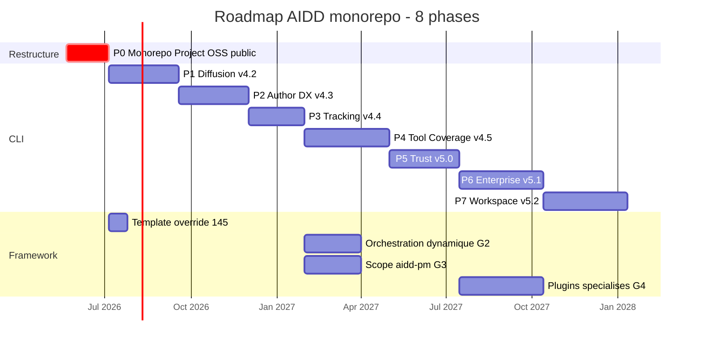

# Plan d'exécution - Monorepo open-source AIDD

> Date: 2026-05-21
> Suite de: `2026_05_21-backlog-audit-and-roadmap.md`
> Décisions actées par le porteur projet le 2026-05-21:
> 1. **Monorepo OUI** - `aidd-cli` fusionne dans `aidd-framework/cli/`, le CLI est un outil compagnon (helper) du framework.
> 2. **Entreprise OUI** - AIDD vise le marché entreprise. Les issues #226-231 sont conservées et engagées (pas de gate).
> 3. **Project dédié** - un GitHub Project dédié côté framework devient la source unique du backlog et de la roadmap, conçu pour les contraintes d'un projet open-source (le repo passera public à terme).

## État attendu (definition of done)

Le projet est "arrivé" quand tout ce qui suit est vrai:

1. `aidd-framework` est un **monorepo public** contenant `plugins/` (le framework) et `cli/` (le CLI compagnon).
2. `aidd-cli` est **archivé** (lecture seule, avis de redirection). Le paquet npm `@ai-driven-dev/cli` continue de publier depuis `cli/`.
3. Le repo méta `aidd` ne porte **plus aucun epic produit**.
4. Un **GitHub Project dédié** est la source unique du backlog et de la roadmap. L'ancien board #7 "AIDD - Produit" est archivé.
5. Le repo est **OSS-ready**: templates d'issues (dont epic), jeu de labels unifié, branch protection appliquée, issues "good first issue" curées, badges réactivés, Discussions activées.
6. La roadmap couvre **8 phases**, entreprise incluse, lisible publiquement dans la vue Roadmap du Project.
7. Un seul `release-please`, un seul CI, une seule ROADMAP.

---

## Track A - Migration monorepo (épic différée, issue #207)

> **DÉCISION 2026-05-21: la migration du repo CLI n'est PAS exécutée maintenant.** Elle devient une **epic dédiée** (issue #207, promue `epic`), planifiée après le lancement open-source. Dans l'intervalle, `aidd-cli` reste un repo séparé. Le contenu ci-dessous est le scope de cette epic future.

### Cible technique

```
aidd-framework/
├── plugins/              # le framework (6 plugins, inchangé)
├── cli/                  # le CLI compagnon (ex-aidd-cli, historique préservé)
│   ├── src/ tests/ config/ assets/...
│   └── package.json      # @ai-driven-dev/cli, publié depuis ce sous-dossier
├── .claude-plugin/marketplace.json
├── pnpm-workspace.yaml   # NOUVEAU: workspace pnpm, paquet `cli`
├── release-please-config.json  # FUSIONNÉ: marketplace + plugins + cli
└── .github/workflows/    # FUSIONNÉ
```

### Étapes

1. **Pré-requis**: `main` vert sur les deux repos, geler les merges sur `aidd-cli`, livrer la beta v4.1.2 en cours si besoin.
2. **Import avec historique**: cloner `aidd-cli`, `git filter-repo --to-subdirectory-filter cli`, puis merge `--allow-unrelated-histories` dans `aidd-framework`. L'historique des commits CLI reste accessible sous `cli/`.
3. **Fusion `release-please`**: ajouter au `packages` du `release-please-config.json` framework une entrée `"cli"` avec `"release-type": "node"` et `"package-name": "@ai-driven-dev/cli"`. Ajouter `"cli": "4.1.2"` au `.release-please-manifest.json`. Schéma de tag CLI **acté: `cli-v4.2.0`** (cohérent avec `include-component-in-tag` du framework).
4. **Fusion CI**: garder deux workflows distincts par filtres de chemin - `ci.yml` (framework, `paths: plugins/** docs/**`) et `ci-cli.yml` (CLI, `paths: cli/**`, vitest + biome + stryker + build). Ajouter `publish-cli.yml` déclenché sur tag `cli-v*` qui fait `cd cli && pnpm publish`.
5. **Workspace pnpm**: créer `pnpm-workspace.yaml` listant `cli`. Le CLI garde son `tsconfig`, `biome.json`, `vitest.config.ts` scoping sous `cli/`.
6. **Fusion outillage**: `lefthook.yml` (scoper les hooks CLI sur `cli/**`), `commitlint` (autoriser le scope `cli`), `dependabot.yml` (ajouter l'écosystème npm pour `cli/`), `CODEOWNERS` (ajouter la propriété de `cli/`).
7. **Mise à jour des références croisées**: README framework (la note "Using Cursor... aidd-cli repo" pointe désormais vers `cli/`), README CLI devient `cli/README.md`, fichiers `CLAUDE.md`, `ARCHITECTURE.md`, liens de la roadmap.
8. **Archivage `aidd-cli`**: README de redirection "Code déplacé dans ai-driven-dev/aidd-framework/cli/", puis archive GitHub (lecture seule). Le nom npm `@ai-driven-dev/cli` est conservé.
9. **Vérification**: `pnpm publish --dry-run` côté `cli/`, `/plugin marketplace add ai-driven-dev/aidd-framework` toujours fonctionnel, workflow orchestrateur `aidd-async.yml` toujours opérationnel.

### Risques et parades

| Risque | Parade |
|---|---|
| Collision de tags `release-please` | Schéma de tag explicite par paquet, tester sur une branche. |
| Rupture de continuité npm | Garder le nom du paquet et la version (4.1.2), publier depuis `cli/`, dry-run avant le premier vrai publish. |
| Consommateurs de la marketplace cassés | Le repo garde son nom et `plugins/` ne bouge pas: `/plugin marketplace add` inchangé. |
| Action orchestrateur cassée | `aidd-async.yml` reste à la racine, tester sur une issue jetable. |

---

## Track B - GitHub Project dédié

### Décision

Créer un **nouveau Project** (Projects v2) au niveau de l'organisation `ai-driven-dev`. Tant que le monorepo n'est pas fait, le Project **rassemble au même endroit les issues des deux repos** (`aidd-framework` et `aidd-cli`): il est la source unique du backlog et de la roadmap dès maintenant, indépendamment de la structure des repos. Archiver le board #7 "AIDD - Produit" (130 items, mélangé). Nom proposé: **"AIDD Roadmap"**.

### Champs

| Champ | Type | Valeurs |
|---|---|---|
| Status | single-select | Backlog, Ready, In progress, In review, Done |
| Phase | single-select | P0 Restructure, P1 Diffusion, P2 Author DX, P3 Tracking, P4 Tool Coverage, P5 Trust, P6 Enterprise, P7 Workspace |
| Area | single-select | framework-core, cli, plugin-context, plugin-dev, plugin-vcs, plugin-pm, plugin-orchestrator, plugin-refine, docs, infra |
| Priority | single-select | P0, P1, P2, P3 |
| Type | single-select | epic, feat, bug, chore, docs |
| Estimate | number | points |

> Le tableau ci-dessus est le design cible. Pour les champs réellement créés le 2026-05-21 (Status laissé par défaut, "Type" renommé "Work Type" car collision avec l'Issue Type natif GitHub, Priority en Critical/High/Medium/Low), voir le Journal d'exécution en fin de document.

### Vues

1. **Roadmap** - layout roadmap, groupé par Phase, daté: la vue publique de la direction produit.
2. **Board** - layout board, par Status: le tableau de travail.
3. **Triage** - table, filtre `no:Phase`: les entrées à classer.
4. **Good first issues** - filtre label `good first issue`: l'onboarding contributeur (contrainte OSS).
5. **Epics** - filtre `Type = epic`: la vue macro.

### Automatisations

- Auto-add des issues et PR de `aidd-framework`.
- Item fermé ou PR mergée -> Status `Done`.
- Auto-archive des items `Done` après 2 semaines.
- Repointer le workflow existant `.github/workflows/add-to-project.yml` vers le nouveau Project.

### Migration des epics

Les epics de phase du CLI (#171-176) deviennent les **epics canoniques** du monorepo et entrent dans le Project. Les epics du repo méta `aidd` (#250, #252-257, #260) sont fermés (voir Track D).

---

## Track C - OSS readiness

État des lieux du repo `aidd-framework` (déjà bien outillé):

| Élément | État | Action |
|---|---|---|
| LICENSE, CODE_OF_CONDUCT, CONTRIBUTING, GOVERNANCE, SECURITY | présents | RAS |
| ROADMAP.md | présent | mettre à jour avec les 8 phases (Track E) |
| ISSUE_TEMPLATE (bug, feature, config) | présents | **ajouter un template `epic`** |
| PULL_REQUEST_TEMPLATE, CODEOWNERS, FUNDING.yml, dependabot.yml | présents | mettre à jour CODEOWNERS et dependabot pour `cli/` |
| rulesets/main.json | présent | **appliquer la branch protection une fois le repo public** (les rulesets ne sont pas appliqués sur repo privé en plan gratuit) |
| labels.yml | présent | **unifier les labels** (voir ci-dessous) |
| CI, CodeQL | présents | fusionner avec le CI du CLI (Track A) |
| Badges README | désactivés (TODO en commentaire) | **réactiver au passage public** |
| GitHub Discussions | à vérifier | **activer** pour le support communautaire |
| docs portal aidd.dev (#212) | non fait | planifié Phase 1 |

### Unification des labels

Le framework a le jeu GitHub standard (`bug`, `enhancement`, `good first issue`...) plus les labels orchestrateur. Le CLI a un jeu structuré `phase:*`, `type:*`, `area:*` (38 labels). Le monorepo a besoin d'**un seul jeu**:

- Garder `phase:0..7`, `type:{epic,feat,bug,chore,docs}`, `area:*` (importés du CLI).
- Garder `good first issue`, `help wanted`, `security`, `dependencies`, et les labels orchestrateur (`to-implement`, `claude/working`, etc.).
- Aligner `labels.yml` du framework sur ce jeu fusionné; appliquer via le workflow de sync de labels.

### Curatation contributeurs

Marquer 8 à 12 issues `good first issue` (candidates naturelles: ajout de règles techno dans un plugin, documentation de skill, petits correctifs CLI). Renseigner la vue "Good first issues" du Project.

---

## Track D - Réorganisation du backlog (mise à jour des décisions)

### Impact des décisions

- **Décision 2 (entreprise OUI)**: les issues #226-231 ne sont plus supprimées. La Phase 6 Enterprise est engagée. Le "gate décision entreprise" de l'audit est retiré.
- **Décision 1 (monorepo)**: framework #35 et CLI #81 (support GitLab) sont désormais dans le même repo: les **fusionner en une seule issue**.
- **Décision 3 (Project unique)**: tous les epics convergent dans le nouveau Project; les epics du repo méta `aidd` sont fermés.

### À fermer (17 issues + le milestone)

- Framework: #65, #66, #67, #68, #69, #70, #71 + le milestone "Plugin Architecture".
- Framework: #51, #32.
- Méta `aidd`: #250, #252, #253, #254, #255, #256, #257, #260.

### À recadrer (3 issues)

- Framework #80 -> recréer en G5 (orchestrateur réagit aux checks CI et au quality-gate).
- Framework #53 -> recréer en G4 (plugins de règles techno-spécifiques).
- Framework #35 + CLI #81 -> **fusionner** en une issue unique "support GitLab" dans le monorepo.

### À créer (5 issues neuves)

| ID | Titre | Phase | Area |
|---|---|---|---|
| G1 | feat: cible Mistral Vibe (target `vibe`) | P4 | cli |
| G2 | feat: orchestration dynamique selon les plugins installés | P4 | plugin-orchestrator |
| G3 | feat: scope projet complet `aidd-pm` (backlog grooming, audit brownfield) | P4 | plugin-pm |
| G4 | feat: plugins spécialisés (craftsmanship + stacks techno) | P6 parallèle | framework-core |
| G5 | feat: orchestrateur réagit aux checks CI et quality-gate | P3 | plugin-orchestrator |

---

## Track E - Roadmap finale (8 phases)

Entreprise incluse. Trust v1 séquencé avant Enterprise lourd (bon sens d'ingénierie, pas un gate). Milestones réalignés.

| Phase | Milestone | Contenu | Cible |
|---|---|---|---|
| **P0 Restructure** | v4.1.0 MVP Open-Source | Nettoyage backlog, Project dédié, OSS readiness, passage public (#203, #204, #195) | Q2 2026 |
| **Epic Monorepo** | (épic transverse) | Migration `aidd-cli` -> `aidd-framework/cli/` (#207). Planifiée après le lancement, P1 ou plus tard | Q3 2026+ |
| **P1 Diffusion** | v4.2.0 | Epic #171: npx, install script, GitHub Action, Docker, portail aidd.dev, télémétrie, complétions, guardrails git | Q3 2026 |
| **P2 Author DX** | v4.3.0 | Epic #172: scaffold, test, marketplace create/publish, lint, guide auteur | Q3-Q4 2026 |
| **P3 Tracking** | v4.4.0 | Epic #173: history, snapshots, diff, preview, drift trend, export, lifecycle + G5 | Q4 2026 |
| **P4 Tool Coverage** | v4.5.0 | Epic #174: Windsurf, Roo, Kiro, Amazon Q, GitLab, Antigravity, Gemini, Codex + G1 Vibe + G2 orchestration dynamique + G3 scope `aidd-pm` | Q4 2026-Q1 2027 |
| **P5 Trust** | v5.0.0 | CLI #223 signature, #224 permissions+sandbox, #225 matrice compat | Q1 2027 |
| **P6 Enterprise** | v5.1.0 | CLI #226-231: marketplace privée, multi-tenant, policies, audit streaming, SSO/SAML, rollout + G4 plugins spécialisés (parallèle) | Q2 2027 |
| **P7 Workspace** | v5.2.0 | Epic #176: workspace init/sync/upgrade, héritage config, dashboard cross-projet, mono/multi-repo | Q3 2027 |



---

## Séquencement de la Phase 0

L'ordre est conçu pour que le repo soit **déjà dans sa forme finale au moment du passage public** (pas de churn visible par les premiers contributeurs).

1. **P0.1 Nettoyage backlog** (risque faible): fermer les 18 issues, fermer le milestone, recadrer les 3, créer G1-G5, promouvoir #207 en epic. Réaligner les milestones.
2. **P0.2 Project dédié** (Track B): créer le Project, configurer les champs, rassembler les issues des deux repos, archiver le board #7.
3. **P0.3 OSS readiness** (Track C): unifier les labels, template epic, curation good-first-issue, vérifier Discussions/FUNDING.
4. **P0.4 Passage public** (#203): rendre `aidd-framework` public, appliquer la branch protection, réactiver les badges, annoncer.

La migration monorepo (Track A) n'est pas dans la Phase 0: c'est l'epic #207, planifiée plus tard.

---

## Actions immédiates demandant une validation

Avant exécution, le porteur projet valide:

- **P0.1 batch-close** des 18 issues + recadrage des 3 + création de G1-G5: **validé, en cours d'exécution le 2026-05-21**.
- **Création du Project "AIDD Roadmap"**: **validé, en cours d'exécution le 2026-05-21**.
- **Schéma de tag CLI**: **acté `cli-v4.2.0`** (pour l'epic monorepo future).
- **Migration monorepo**: **différée**, devient l'epic #207.

La migration monorepo (epic #207) et le passage public (#203) sont des opérations à fort impact: elles seront exécutées étape par étape avec validation explicite à chaque palier. L'archivage du board #7 attend que le workflow `add-to-project.yml` soit repointé vers le nouveau Project.

---

## Journal d'exécution

### 2026-05-21 - P0.1 Nettoyage backlog + P0.2 Project (exécutés)

**Fermetures (20 issues + 1 milestone):**

- Framework `completed`: #65, #66, #67, #68, #69, #70, #71 + milestone "Plugin Architecture".
- Framework `not planned`: #51, #32.
- Framework recadrées: #80 (-> #149), #53 (-> #148), #35 (-> aidd-cli#81).
- Méta `aidd` `not planned`: #250, #252, #253, #254, #255, #256, #257. `completed`: #260.

**Créations (5 issues):**

- `aidd-framework` #146 (G2 orchestration dynamique), #147 (G3 scope aidd-pm), #148 (G4 plugins spécialisés), #149 (G5 orchestrateur CI/quality-gate).
- `aidd-cli` #254 (G1 cible Mistral Vibe).

**Promotion:**

- `aidd-cli` #207 promue `epic` (migration monorepo différée).

**Project "AIDD Roadmap" (#8, https://github.com/orgs/ai-driven-dev/projects/8):**

- Créé au niveau org `ai-driven-dev`.
- Champs personnalisés: Phase (P0-P7, Epic), Area, Priority, Work Type.
- 61 issues ouvertes rassemblées (5 `aidd-framework` + 56 `aidd-cli`).
- Phase et Work Type renseignés sur les 61 items.
- Description et README renseignés.

### 2026-05-21 - Vues et automatisations (exécutées via Playwright)

**5 vues créées et sauvegardées:**

- **Roadmap** - layout Board, colonnes par Phase (P0-P7, Epic).
- **Board** - layout Board, colonnes par Status.
- **Triage** - layout Table, filtre `no:phase`.
- **Good first issues** - layout Table, filtre `label:"good first issue"`.
- **Epics** - layout Table, filtre `work-type:epic`.

**Automatisations:**

- **Auto-add to project** activé (repo `aidd-cli`, filtre `is:issue is:open`).
- **Item closed -> Status Done** : activé (workflow par défaut).
- **Pull request merged -> Status Done** : activé (workflow par défaut).
- 7 workflows actifs au total.

### 2026-05-21 - Finalisation

- **`add-to-project.yml` repointé** vers `projects/8` : PR #150 mergée dans `aidd-framework`.
- **Board #7 "AIDD - Produit" archivé** (fermé).
- **Auto-archive items** activé sur le Project #8 (filtre `is:issue is:closed updated:<@today-2w`).
- **Champs Area et Priority renseignés** sur les 61 items. Area dérivée du repo/plugin ; Priority via heuristique de phase (P0 Critical, P1-P2 High, P3-P4 Medium, P5-P7 Low) : valeur de départ à affiner en triage manuel.
- **`good first issue`** : 3 issues labellisées (`aidd-cli` #165, #76, #218). Set conservateur, à étendre selon la connaissance fine de la difficulté du code.

### Reste à faire

1. **Passage public du repo (#203)** : non exécuté. C'est le lancement open-source, décision à fort impact à prendre explicitement par le porteur projet, pas une tâche de nettoyage. Rendre le Project #8 public se fait à ce moment-là (sinon la roadmap d'un repo privé serait exposée).
2. Étendre la curation `good first issue` au-delà du set initial de 3.
