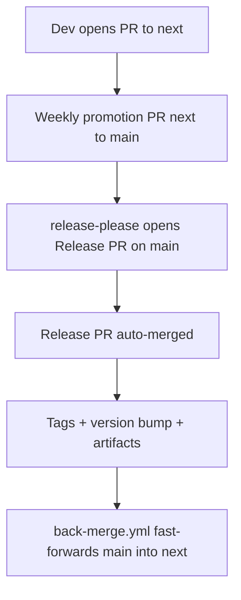

# Instruction: Branch model + CI automation

| Element         |  Value          |
| --------------- | --------------- |
| **Plan**        | `aidd_docs/tasks/2026_06/2026_06_19-rolling-weekly-releases.md` |
| **Branch name** | `feat/rolling-release-branch-model` |

## Architecture projection

```txt
.
├── .github/
│   ├── workflows/
│   │   ├── ci.yml              # 🔁 add auto-merge step for the release-please PR
│   │   └── back-merge.yml      # ✅ auto back-merge main -> next on release published
│   └── rulesets/
│       ├── main.json
│       └── next.json           # ✅ branch protection for next (based on main.json, lighter)
└── (repo) next                 # ✅ new long-lived integration branch
```

## User Journey



## Tasks to do

### `1)` Create the `next` branch

> Long-lived integration branch, cut from `main`.

1. Branch `next` from current `main`, push to origin.
2. Confirm it tracks `main` history (no divergence at creation).

### `2)` Add `next` branch protection

> Protect `next` like `main`, lighter on reviews.

1. Add `.github/rulesets/next.json` targeting `refs/heads/next`.
2. Require PRs and the same status checks (`lefthook`, `Commitlint`); keep `non_fast_forward` and `deletion`.
3. Keep the AIDD bot App in `bypass_actors` so the back-merge can push.

### `3)` Auto-merge the release-please PR

> Close the unversioned-code window on `main`.

1. In `ci.yml`, after the `release-please` step, add a step that enables auto-merge on the opened release PR (`gh pr merge --auto`) using the App token.
2. Ensure repo setting "Allow auto-merge" is on (note for the maintainer if it is a UI-only toggle).
3. Do not modify `build-and-attach`, `build-per-tool`, `build-plugin`.

### `4)` Back-merge workflow `main` -> `next`

> Keep `next` in sync after every release.

1. Add `.github/workflows/back-merge.yml`, triggered on release published (or push to `main` after a release).
2. Fast-forward / merge `main` into `next` using the App token; fail loudly if it cannot.

## Test acceptance criteria

| Task | Acceptance criteria                  |
| ---- | ------------------------------------ |
| 1 | `git ls-remote --heads origin next` returns a ref. |
| 2 | `.github/rulesets/next.json` exists, targets `refs/heads/next`, and validates as JSON (`jq . next.json`). |
| 3 | `ci.yml` contains a `gh pr merge --auto` step gated on the release-please PR; `yamllint`/`actionlint` passes. |
| 4 | `.github/workflows/back-merge.yml` exists, triggers on release, and `actionlint` passes. |
