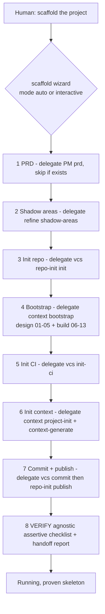

# Master Plan - scaffold -> bootstrap + pure-glue orchestrator wizard

## Context and ground truth (verified against the repo, not the brief)

This worktree (`worktree-fizzy-crunching-wave`, off `main` @ `c3beb5d`) does **NOT** contain the
scaffold skill or the repo-init skill. Both live only on branch **`feat/scafolding`**:

- `plugins/aidd-orchestrator/skills/01-scaffold/**` -> only on `feat/scafolding` (3 owned actions: `01-generate-architecture`, `02-implement-and-test`, `03-wire-ci`).
- `plugins/aidd-vcs/skills/00-repo-init/**` -> only on `feat/scafolding`.

**BLOCKER-0 (execution branch):** this migration MUST be executed on `feat/scafolding`
(or a branch cut from it), not on this worktree's branch. The plan below assumes work happens
on `feat/scafolding`. First action of execution is to confirm the working branch contains
`plugins/aidd-orchestrator/skills/01-scaffold/SKILL.md`.

Verified current state of the two layers:

- **Bootstrap (`aidd-context:01-bootstrap`)** currently ships exactly 5 actions: `01-gather-needs`,
  `02-propose-candidates`, `03-audit-candidates`, `04-pick-and-design`, `05-write-install-md`.
  The folder tree + Mermaid diagram are **already produced in `04-pick-and-design`** (SKILL.md
  row 04: "User picks winner; generate folder tree + Mermaid diagram"). So "the tree is designed
  once, in 04" is already largely true and only needs to be made explicit and protected.
  Bootstrap writes `aidd_docs/INSTALL.md` (not project-root `INSTALL.md`).
- **Scaffold (`feat/scafolding`)** is a 10-step flow; steps 4/5/6 are the three owned actions,
  every other step delegates to a skill. It already references `aidd-vcs:00-repo-init`,
  `aidd-refine:04-shadow-areas`, `aidd-context:01/02/03` **by literal plugin name** in its step
  table - which violates the Cross-plugin orthogonality rule; the migration must fix this.
- **Firewall:** `docs/ARCHITECTURE.md` -> section "Plugin concerns and layers" (the canonical
  taxonomy table) places `aidd-context` in layer **Knowledge production / Knowledge**, and the
  first of the three rules states: *"Knowledge vs execution is a firewall. Knowledge plugins
  produce artifacts you read ... and never write or run application source - `aidd-context`'s
  bootstrap deliberately creates no `package.json` or source files."* This directly contradicts
  the migration (bootstrap will now materialize the tree, install deps, run quality gates). This
  is **BLOCKER-1**, addressed in Phase 0.

Two gaps the brief assumes but the repo does not have:

- **No `aidd-context:07-design-system` skill exists.** Context ships skills `00-onboard` ..
  `06-discovery` only. The brief's `13-init-design-system` says "delegate aidd-context:07-design-system".
  Design-system capability today is the top-level **`impeccable`** skill (separate plugin). The plan
  resolves this by delegation-via-description-matching (no literal name), and flags creating
  `07-design-system` as an out-of-scope prerequisite if a dedicated context skill is required.
- The bootstrap **checklist asset names concrete techs** as examples (Vercel, Stripe, Clerk,
  Supabase...). Asset examples are acceptable; the agnostic rule applies to *action prompts*.

## Risk and impact score

| Criterion                       | Points |
| ------------------------------- | ------ |
| Breaking changes to public APIs (skill contracts: scaffold loses 3 actions, bootstrap gains 8) | +3 |
| 5+ modules affected (aidd-context, aidd-orchestrator, aidd-vcs, docs, aidd-refine/aidd-pm references) | +3 |
| Major refactoring (responsibility re-layering across two plugins) | +2 |

Score = 8 (>= 3) -> **master plan** with independent child phases.

Each phase is designed to land independently and leave the repo coherent (no half-migrated state
that breaks an existing flow), per the "independent phases for compatibility" rule.

## User journey (target end-state)

## Architecture projection

### Modify

- `docs/ARCHITECTURE.md - reconcile the Knowledge/execution firewall with bootstrap now writing+running code (Phase 0).`
- `plugins/aidd-context/skills/01-bootstrap/SKILL.md - extend actions table 01-13, split "design" vs "build", update description (no longer "docs only"), add delegation notes.`
- `plugins/aidd-context/skills/01-bootstrap/actions/01-gather-needs.md - TRIM: treat PRD as input, only ask block-2 technical constraints.`
- `plugins/aidd-context/skills/01-bootstrap/actions/04-pick-and-design.md - make "tree designed here, and ONLY here" explicit and load-bearing.`
- `plugins/aidd-context/skills/01-bootstrap/assets/checklist.md - mark PRD-sourced block-1 items as inputs; keep block-2 as the gather focus.`
- `plugins/aidd-context/skills/01-bootstrap/README.md - reflect the build phase and new actions.`
- `plugins/aidd-context/.claude-plugin/plugin.json - bump version / description if the manifest carries the docs-only claim.`
- `plugins/aidd-orchestrator/skills/01-scaffold/SKILL.md - strip to pure glue: empty actions, auto|interactive mode line, todo-list-driven 8-step sequence, agnostic delegation by description.`
- `plugins/aidd-orchestrator/skills/01-scaffold/README.md - reflect zero owned actions + wizard role.`
- `plugins/aidd-vcs/skills/00-repo-init/SKILL.md - decide: host init-ci here vs a new sibling skill (Phase 4 decision).`
- `aidd_docs/memory/architecture.md - if it restates the firewall, keep it consistent with docs/ARCHITECTURE.md.`
- `README.md (repo root) - pointer to the scaffold wizard, no duplicated tutorial (Phase 6).`

### Create

- `plugins/aidd-context/skills/01-bootstrap/actions/06-init-structure.md - materialize INSTALL.md tree + stubs.`
- `plugins/aidd-context/skills/01-bootstrap/actions/07-init-dependencies.md - install deps + relevant building blocks.`
- `plugins/aidd-context/skills/01-bootstrap/actions/08-init-env.md - env/config wiring.`
- `plugins/aidd-context/skills/01-bootstrap/actions/09-init-database.md - DB init + data building block.`
- `plugins/aidd-context/skills/01-bootstrap/actions/10-init-quality-gate.md - typecheck+format+lint+commit-linter+pre-commit in ONE action.`
- `plugins/aidd-context/skills/01-bootstrap/actions/11-init-tests.md - delegate the test capability (aidd-dev:06-test) by description.`
- `plugins/aidd-context/skills/01-bootstrap/actions/12-init-containers.md - container/runtime up-down.`
- `plugins/aidd-context/skills/01-bootstrap/actions/13-init-design-system.md - front-only, delegate design-system capability by description.`
- `plugins/aidd-vcs/skills/00-repo-init/actions/03-init-ci.md OR plugins/aidd-vcs/skills/<NN>-init-ci/** - the new CI capability (Phase 4 decision).`
- `(possibly) plugins/aidd-context/skills/01-bootstrap/references/install-md-contract.md - the seam contract every init-* reads from INSTALL.md.`

### Delete

- `plugins/aidd-orchestrator/skills/01-scaffold/actions/01-generate-architecture.md - logic absorbed by bootstrap 06.`
- `plugins/aidd-orchestrator/skills/01-scaffold/actions/02-implement-and-test.md - logic absorbed by bootstrap 07-12 + wizard step 8 verify.`
- `plugins/aidd-orchestrator/skills/01-scaffold/actions/03-wire-ci.md - logic moves to aidd-vcs init-ci.`
- `plugins/aidd-orchestrator/skills/01-scaffold/references/project-doc-spec.md - moved (agnostified) into the wizard as step 8; delete from scaffold/references.`

### Applicable rules

No machine-readable `rules/*` files with `description`/`paths` frontmatter govern these prompt
files. The governing constraints are documentation-level and load-bearing:

| Source | Rule | Why it applies |
| --- | --- | --- |
| `docs/ARCHITECTURE.md` "Plugin concerns and layers" | Knowledge/execution firewall | Bootstrap moving to write+run code violates it as written - must be reconciled first (P0). |
| `docs/ARCHITECTURE.md` "Cross-plugin orthogonality" | No literal cross-plugin names; discover by description | Every wizard step and every delegating init-* action must use description matching, not `aidd-vcs:...`. |
| `CLAUDE.md` (worktree) | "For every plugin change, think hard about where responsibility belongs" + "Never duplicate across docs - link to canonical home" | Drives the layer split and the no-duplicate-checklist + README-pointer decisions. |
| `docs/CREATE_PLUGIN.md` | Skill scoped to one concern; orchestrator = sequencing across concerns | Confirms scaffold = pure glue, init-* = build concern under context. |

## Phases (independent, ordered)

### Phase 0 - Firewall taxonomy reconciliation (BLOCKING, do first)

Resolve the contradiction before any code-writing action lands in bootstrap.

Tasks:
- Re-read `docs/ARCHITECTURE.md` "Plugin concerns and layers": the table row `aidd-context | Knowledge production | Knowledge` and the "Knowledge vs execution is a firewall" rule that explicitly cites bootstrap creating no `package.json`/source.
- Decide and apply ONE of two reconciliations (recommend option A):
  - **Option A (recommended): refine the firewall wording.** Keep `aidd-context` as Knowledge, but redefine the firewall so it forbids *authoring business/domain source*, while permitting *materializing an already-validated design* (the INSTALL.md tree, stubs, dependency install, quality-gate config) as a deterministic projection of a knowledge artifact. Update the bootstrap sentence accordingly ("bootstrap materializes the validated INSTALL.md into a running skeleton but writes no business logic - that is `aidd-dev`'s concern"). This preserves the architecture-100%/business-0% invariant that scaffold already enforced.
  - **Option B: relocate bootstrap's build phase.** Keep the firewall literal and move init-* into an Execution-layer home. Rejected unless A proves untenable - it fragments the design->build seam the brief wants unified.
- Update any echo of the firewall in `aidd_docs/memory/architecture.md`.

Gate / test: a grep for "deliberately creates no" / "never write or run application source" in
`docs/ARCHITECTURE.md` no longer contradicts bootstrap; the taxonomy table still assigns every
plugin exactly one concern; the "architecture yes, business logic no" boundary is stated explicitly.

### Phase 1 - Tree designed exactly once (in bootstrap action 04)

Tasks:
- Edit `04-pick-and-design.md`: state that the folder/route tree + Mermaid + file conventions
  (naming, tests, colocation) are decided HERE and nowhere else, validated by the user, and persisted
  into `INSTALL.md` (via 05). Pull in the route-surface + conventions detail currently in scaffold's
  deleted `01-generate-architecture` (steps 1-2: route surface, tree, conventions) so no design
  knowledge is lost.
- Edit `05-write-install-md.md` so INSTALL.md carries the tree + conventions as the seam contract.
- Optionally add `references/install-md-contract.md` documenting which INSTALL.md sections each
  init-* action consumes (single source of the seam).

Gate / test: the string "folder tree" / "route surface" / "file conventions" appears in exactly one
design action (04); no later init-* action re-designs the tree (they read it from INSTALL.md).

### Phase 2 - Write the agnostic build actions 06-13

Each action: agnostic prompt (no tech named - read `aidd_docs/INSTALL.md`), self-contained
inputs/outputs/depends-on/process/test, its own inline gate, and delegates where an executor exists
(by description matching, never literal plugin name). Building blocks are dispersed (per brief) into
06/07/09, not a standalone action.

Tasks (one per file):
- `06-init-structure` - materialize the INSTALL.md tree + reachable stub per route (back+front),
  applying the file conventions; absorbs scaffold `01-generate-architecture` steps 3-5.
- `07-init-dependencies` - resolve + install the stack's dependency manager and deps; wire the
  relevant building blocks (auth/email/storage/jobs/payments/logging) as swappable abstractions
  with smoke tests, per their INSTALL.md selection.
- `08-init-env` - environment/config/secrets scaffolding (`.env.example`, config loader),
  env-flag selection between dev stub and real provider for blocks.
- `09-init-database` - initialize the data building block (engine bootstrap, migration tooling,
  one round-trip smoke test). No schema design (that stays a later dev concern).
- `10-init-quality-gate` - ONE action: typecheck + auto-format + lint + commit-linter + pre-commit
  hook wiring, all green. Absorbs the Quality block of the old project-doc-spec.
- `11-init-tests` - delegate the test-authoring capability (matches `aidd-dev:06-test` by
  description); ensure a unit test and an e2e test pass and coverage is configured.
- `12-init-containers` - if a container/runtime is in INSTALL.md, ensure it ups and downs cleanly;
  no-op + report otherwise.
- `13-init-design-system` - front-only; delegate the design-system capability by description
  (today: `impeccable`); no-op for backend-only projects. Document the `07-design-system` gap.
- Update `SKILL.md`: actions table 01-13 split into "Design (01-05)" and "Build (06-13)";
  default flow `01 -> ... -> 13`; description no longer says "docs only, no code"; add the
  delegation/agnostic transversal rules; bump `plugin.json` if it restates docs-only.
- Update bootstrap `README.md`.

Gate / test: each new action file has the five required sections and a `## Test`; no action body
contains a concrete tech name or a literal cross-plugin name (grep); `SKILL.md` lists 01-13 and the
flow is sequential with the audit (03) gate preserved.

### Phase 3 - Strip scaffold to pure glue (auto|interactive, todo-list driven)

Tasks:
- Delete the three owned actions and the empty owned-actions concept from `01-scaffold` (the
  `actions/` dir ends empty or is removed).
- Rewrite `SKILL.md` as pure glue: an 8-step sequence (PRD -> shadow-areas -> repo-init ->
  bootstrap[design+all init-*] -> init-ci -> init-context -> commit/publish -> VERIFY+handoff),
  every step delegating by description matching (strip all literal `aidd-*` names from the step
  table - this also fixes the pre-existing orthogonality violation).
- Add the `auto|interactive` modes section, reusing the exact convention from `aidd-dev:00-sdlc`:
  mode detected from `$ARGUMENTS` at entry; gates pause only in interactive; `auto` never asks.
- Make it todo-list driven: materialize the 8 steps as a task list at entry; a step closes only
  when its delegated capability returns success (reuse sdlc's "Runtime tracking" wording).
- Keep the "Resume" behavior (detect done steps, present check/uncheck list).
- Update scaffold `README.md`.

Gate / test: `01-scaffold/actions/` is empty/absent; `SKILL.md` contains a `## Modes` table with
`auto`/`interactive`; no literal `aidd-` plugin name appears in `SKILL.md`; the 8-step sequence
matches the target journey.

### Phase 4 - New CI capability in aidd-vcs

Decision first: host `init-ci` as **`00-repo-init/actions/03-init-ci.md`** (CI is part of repo
setup, smallest surface) vs a **new sibling skill `aidd-vcs:NN-init-ci`**. Recommend the action
inside repo-init unless CI warrants its own router. Document the choice.

Tasks:
- Port the agnostified logic of the deleted scaffold `03-wire-ci` (resolve CI platform from
  INSTALL.md, emit minimal pipeline that runs the tests, no platform assumed, output the CI URL).
- If a new skill: add `SKILL.md` + `plugin.json` skills entry + `README.md` + `evals/`.
- Wire scaffold wizard step 5 to discover this capability by description.

Gate / test: the CI capability is reachable, agnostic (no CI platform named in the prompt), reads
INSTALL.md, and its `## Test` asserts a green pipeline; `plugin.json` validates against the manifest
schema (lefthook hook).

### Phase 5 - Move + agnostify the assertive checklist into wizard step 8

Tasks:
- Take `scaffold/references/project-doc-spec.md`, strip tech-specific items to capability level:
  "Lighthouse thresholds configured" -> "Performance budget enforced (front-only)";
  "A11y UI lib installed" / "Accessibility tests" -> "Accessibility checks pass (front-only)";
  keep Project/Quality/Testing/Deployment/App buckets as capability assertions.
- Relocate it to the wizard (e.g. `01-scaffold/references/verify-checklist.md` or inline in step 8),
  because the final verify spans repo + build + CI + context, which bootstrap alone cannot see.
- Delete the old `project-doc-spec.md` from scaffold and remove the `@../references/project-doc-spec.md`
  includes from the (now deleted) scaffold actions.
- Confirm each init-* keeps its OWN inline gate (Phase 2) - step 8 is the union verify, not a
  replacement for per-action gates.

Gate / test: wizard step 8 references the agnostic checklist; no Lighthouse / a11y-library literal
remains; no orphan include of `project-doc-spec.md` anywhere (grep); the checklist asserts repo,
build, CI, and context artifacts together.

### Phase 6 - Root README pointer (no duplicate tutorial)

Tasks:
- Add/adjust a single pointer in the repo-root `README.md` to "scaffold a new project" -> the
  scaffold wizard, linking the canonical home; do NOT duplicate a step-by-step tutorial (honors
  "Never duplicate across docs - link to canonical home").

Gate / test: README has one pointer, no reproduced step list; link resolves to the scaffold skill.

### Phase 7 - Validate on eval scenarios

Tasks:
- Update/extend `plugins/aidd-orchestrator/skills/01-scaffold/evals/scenarios.json` and
  `plugins/aidd-context/skills/01-bootstrap/evals/scenarios.json` to cover: auto vs interactive,
  PRD-exists skip, front-only (design-system + a11y) vs backend-only (skip 12/13 cleanly),
  and resume mid-flow.
- Run the project validation hooks (lefthook / `validate` workflow equivalents) and the eval
  scenarios.
- Run the cross-plugin literal-name grep across all changed prompts (the orthogonality guard).

Gate / test (this is the master success_condition): all phase gates green; eval scenarios pass;
literal-name grep returns zero across changed files.

## Open decisions to confirm with the human before execution

1. **Execution branch** - confirm work lands on `feat/scafolding` (this worktree lacks scaffold +
   repo-init). BLOCKING.
2. **Firewall reconciliation** - Option A (refine wording) vs Option B (relocate). Recommend A.
3. **`07-design-system`** - delegate to existing `impeccable` by description (recommended, no new
   skill) vs create a dedicated `aidd-context:07-design-system` (out of scope, adds a phase).
4. **CI home** - `repo-init/actions/03-init-ci` vs new `aidd-vcs:NN-init-ci` skill. Recommend the
   action inside repo-init.
5. **Building-blocks dispersion** - confirm the 06/07/09 split matches intent (data->09,
   providers->07, structure->06) vs a different grouping.

## Confidence: 9/10

Reasons (checks):
- Ground truth verified directly against the filesystem and `feat/scafolding` (not the brief);
  the bootstrap action count, the firewall location, the missing repo-init/07-design-system, and
  the scaffold orthogonality violation are all confirmed.
- The layer split maps cleanly onto the existing seam (INSTALL.md) and reuses an established
  convention (sdlc auto|interactive) verbatim.
- Phases are independently landable and each carries a concrete gate.

Risks (checks against):
- The firewall reconciliation is a doc-judgement call the human must approve (Phase 0 decision).
- `07-design-system` gap means step 13 depends on description-matching to `impeccable`, which is a
  different plugin layer - acceptable but worth confirming.
- The brief's "action 01 TRIM (PRD is input)" assumes the wizard always runs PRD first; in
  bootstrap-standalone use (no wizard) the PRD may be absent - action 01 must degrade gracefully
  (ask block-1 too when no PRD is provided).
