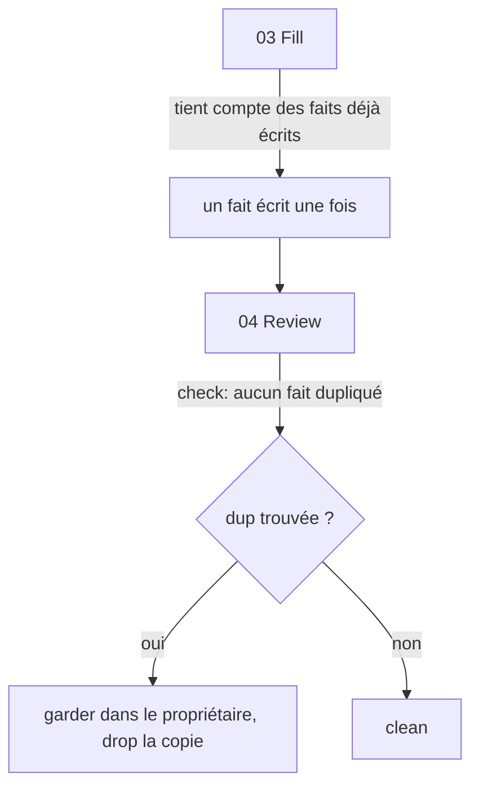

# Instruction: Fill non aveugle + règle dédup

Part of [`plan.md`](./plan.md).

## Architecture projection

<!-- 🔁 = modifié. Chemins sous plugins/aidd-context/skills/02-project-memory/ -->

```txt
.
├── SKILL.md                       🔁 transversal rule "un fait = un fichier"
└── actions/
    ├── 03-generate-memory.md      🔁 étape 6 : fill non aveugle
    └── 04-review-memory.md        🔁 check dédup cross-fichiers
```

## User Journey



## Tasks to do

### `1)` 03-generate-memory.md — casser le fill aveugle

> Le multiplicateur de duplication. Le fill ne doit plus être aveugle aux autres templates.

1. Étape 6 (`**Fill.**`) : retirer "in parallel".
2. Reformuler l'amorce pour que chaque template soit rempli en tenant compte des faits déjà capturés par les templates précédents, afin de ne pas redire un fait (le référencer plutôt que le recopier).

### `2)` SKILL.md — transversal rule (forte + points explicites)

> Étend le principe "pointer vers le code" au cross-mémoire, sans tuer l'auto-suffisance. Règle forte, avec les propriétaires nommés.

1. Ajouter aux Transversal rules, formulé fort : "**Un fait vit dans un seul fichier mémoire.** Un autre fichier le référence, jamais ne le recopie." Suivi des points de propriété (fact → owner) :
   - point d'entrée + zones top-level → `codebase-map`
   - stack/framework macro → `architecture` ; une lib de domaine → son concern (ORM→database, runner→testing, form lib→forms)
   - flux interne entre modules → `architecture` ; services externes → `integration`
   - commandes de gate (typecheck/test/build) → `coding-assertions`

### `3)` 04-review-memory.md — review dédup sémantique (non sautable)

> Le check est sémantique, pas un grep (cf. preuve empirique : substring sur-compte). Forte, indépendante, avec checklist concrète.

1. Étape 2 (`**Review.**`) : ajouter un check fort et explicite — "Lire tous les fichiers ensemble. Pour **chaque fait de la liste de propriété** (cf. transversal), vérifier qu'il vit dans un seul fichier ; toute copie ailleurs = à supprimer, en gardant le propriétaire. Juger sémantiquement, pas par correspondance de chaîne."
2. Option (formulée plugin-agnostique, sans dépendance dure à `aidd-dev`) : "Cette review peut être confiée à un checker subagent indépendant en contexte frais ; sa checklist DRY couvre déjà la dédup." (Note : `aidd-dev:checker` convient s'il est installé.)

## Test acceptance criteria

| Task | Acceptance criteria                                                                          |
| ---- | -------------------------------------------------------------------------------------------- |
| 1    | L'étape 6 de `03` ne contient plus "in parallel" et mentionne la prise en compte des faits déjà écrits. |
| 2    | `SKILL.md` Transversal rules contient la règle forte "un fait = un fichier" + les 4 points fact→owner. |
| 3    | L'étape Review de `04` contient le check dédup sémantique (par fait de la liste de propriété) + l'option checker subagent. |
| 1-3  | `aidd framework build --target codex` passe sans erreur.                                     |
