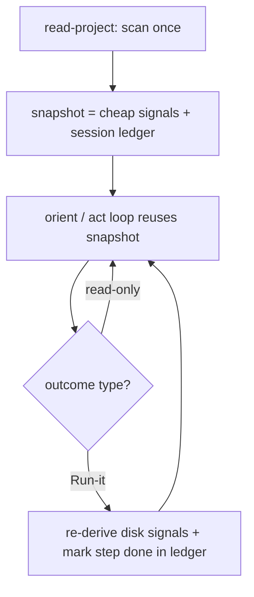

# Instruction: Lighten the read loop

Part of [`plan.md`](./plan.md).

## Architecture projection

<!-- Tree of the final architecture: ❌ deleted, ✅ created, ✏️ modified. -->

```txt
plugins/aidd-context/skills/00-onboard/
├── SKILL.md                    ✏️ transversal: read-once + ledger advance
└── actions/
    ├── 01-read-project.md      ✏️ produce the reusable snapshot + session ledger
    ├── 02-orient.md            ✏️ consume the ledger: exclude done/skipped stages
    └── 03-act.md               ✏️ write the ledger: mark run done, declined skipped
```

The ledger is one indivisible mechanism — produce (01), write (03), **read (02)**. They must ship together, or the loop re-nags. The first build sliced the consumer into a later phase and the loop kept re-suggesting done steps; this phase wires all three.

## User Journey



## Tasks to do

### `1)` Snapshot = cheap signals + a session ledger

> `01-read-project` produces one reusable snapshot. Cheap disk signals alone cannot tell a step is done, so the snapshot also carries a session ledger.

1. Capture the cheap signals, each a presence test: memory-bank state (bank dir with filled files = synced; absent or empty = weak), an architecture doc (`aidd_docs/INSTALL.md`) present, manifest + stack, presence of tests (real test files exist, not just a configured runner), code presence (any source outside `aidd_docs/` — an empty repo has none), specs/plans under `aidd_docs/`, current plan status (the `plan.md` status field), open PRs. Plus a bounded richer read, done in the same single pass: a light code-quality sample (size and complexity hotspots = "messy") and a bug-marker scan (TODO/FIXME/error reports), so audit and debug can rank later. Reading memory-file contents to judge "synced" and this bounded code sample are the sanctioned non-cheap reads — done once, never per loop.
2. Carry a **per-session step ledger**: which flow steps the user has run, and which they have skipped, this session. This is session state onboard holds, not derived from disk — it is how onboard knows a step is done when its completion leaves no cheap signal (track to an external tracker, ship's merge, a read-only review).
3. Hold the snapshot (signals + ledger) in context as the single source orient and act both read; never reach back to the filesystem mid-loop.
4. Keep the read silent: still prints nothing.

### `2)` Advance the loop without re-nagging

> A step is done when a disk signal proves it OR the ledger records it run this session. The loop must never re-suggest a just-done step.

1. In `SKILL.md`, change the transversal "Re-read after each step" to "Read once; after any Run-it outcome re-derive the disk signals and update the ledger; reuse the snapshot for read-only outcomes."
2. In `03-act`, after a "Run it" outcome: re-derive the cheap disk signals **and** mark the step the user ran as done in the ledger. The default (phase 4) is the earliest flow step that is neither satisfied by a disk signal nor recorded done-this-session, so the just-completed step is never re-offered even when it left no disk trace. Every read-only outcome (explain step, explain project, show flow, different step, hand off, stop) reuses the existing snapshot unchanged.

### `3)` Wire the ledger end-to-end

> Producer and writer are useless without a consumer. `02-orient` must read the ledger, and a declined step must be written as skipped.

1. In `02-orient`, the earliest-unmet-stage rule excludes any stage the ledger marks done or skipped: a stage is met if a disk fact satisfies it **or** the ledger records it.
2. In `03-act`, a "different step" marks the declined suggested step as skipped in the ledger, so it is not re-suggested this session.

## Test acceptance criteria

| Task | Acceptance criteria                                                                                  |
| ---- | --------------------------------------------------------------------------------------------------- |
| 1    | The snapshot lists every named signal plus the session ledger of run/skipped steps, is emitted once; `01-read-project` still prints nothing. |
| 2    | After a Run-it outcome, the just-run step is marked done in the ledger and is never re-offered as the default, even when it left no disk signal (bootstrap, track, ship, review); read-only outcomes reuse the snapshot. |
| 3    | `02-orient` excludes ledger done/skipped stages when choosing the default; a "different step" writes the declined step as skipped. The off-disk Track case advances on the next loop instead of re-nagging. |
