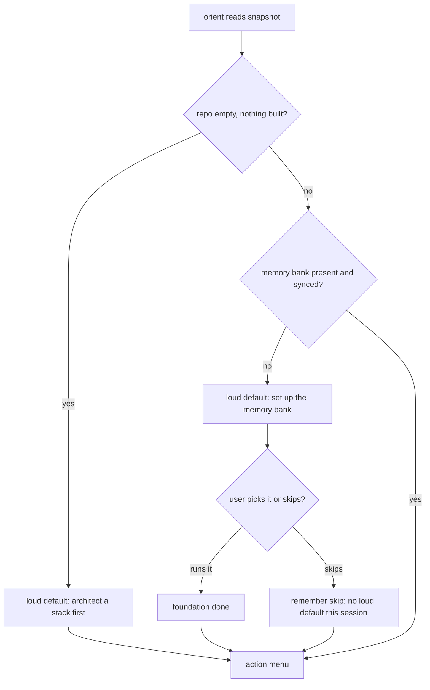

# Instruction: Foundation-first, skippable

Part of [`plan.md`](./plan.md).

## Architecture projection

<!-- Tree of the final architecture: ❌ deleted, ✅ created, ✏️ modified. -->

```txt
plugins/aidd-context/skills/00-onboard/
├── SKILL.md                    ✏️ transversal: foundation is the strong default, skip remembered
└── actions/
    └── 02-orient.md            ✏️ pre-select the memory foundation when weak, skippable
```

## User Journey



## Tasks to do

### `1)` The foundation gate, with an explicit empty-repo branch

> The gate has two states, both normative in the diagram above, not just prose.

1. **Empty repo.** When the snapshot shows an empty repo (no code, no manifest), the loud pre-selected default is "architect a stack first" — not the memory foundation.
2. **Content but weak memory.** When the repo has content and the memory bank is missing or unsynced, the loud pre-selected default is "set up the memory bank", with a one-line why. Foundation = memory init + sync, including the context-file memory blocks.
3. **Memory fine, or empty repo handled:** go straight to the action menu (phase 4).
4. Keep it skippable: the user can pick any other action; never block.

### `2)` Skip is global, recorded in the ledger

> Enforce without harassing, and preserve suggest-never-force, for every step — not just the foundation.

1. When the user skips **any** loud default (architect a stack, the memory foundation, or a later step), record it in the session ledger and do not re-fire it this session. This covers the empty-repo "architect" default too, not only the memory foundation.
2. The post-skip default has a defined owner: the earliest flow step that is neither satisfied by a disk signal, nor done-this-session, nor skipped-this-session (phase 1 + phase 4). The skipped step drops to a plain (non-loud) listed option. If nothing qualifies, there is no loud default and the menu shows the tools + footer only.
3. In `SKILL.md`, keep "Suggest, never force" and add one line: a default may be loud and pre-selected, but it is always skippable, and a skipped step is remembered for the session.

## Test acceptance criteria

| Task | Acceptance criteria                                                                                       |
| ---- | -------------------------------------------------------------------------------------------------------- |
| 1    | An empty repo loudly pre-selects "architect a stack first"; a content repo with weak memory loudly pre-selects "set up the memory bank"; both are skippable and both branches are in the diagram. |
| 2    | Any skipped step (architect, foundation, or later) is recorded in the ledger and not re-fired this session; the post-skip default is the earliest step not done/skipped, or none; `SKILL.md` keeps "suggest never force" + the skip-remembered note. |
