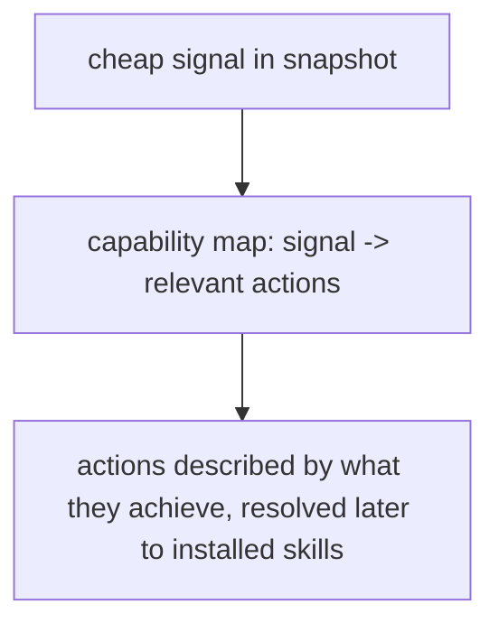

# Instruction: Evolve journey into the capability map

Part of [`plan.md`](./plan.md).

## Architecture projection

<!-- Tree of the final architecture: ❌ deleted, ✅ created, ✏️ modified. -->

```txt
plugins/aidd-context/skills/00-onboard/
└── references/
    └── journey.md              ✏️ map each cheap signal to the actions it makes relevant
```

## User Journey



## Tasks to do

### `1)` Map signals to relevant secondary tools

> The flow walk still owns the default step. This map only ranks the secondary tools beside it — it never computes the default.

1. In `references/journey.md`, keep the flow stages and the resolve-to-installed-skill rules unchanged; they remain the source of the default step (with its hedges).
2. Add a layer mapping each snapshot signal to the secondary tools it makes relevant, gated to the flow stage where it applies: real test files absent at build/review → adding tests; the code-quality sample flags messiness at build/review → audit; the bug-marker scan flags reported bugs → debug; open PR → nothing new (ship is the flow default). A tool never surfaces outside its relevant stage.
3. Keep it plugin-agnostic: every entry is named by what a skill achieves, never a hardcoded skill or plugin id.

### `2)` Reconcile the placement table with the default rules

> The "Where the project sits" table is a source of truth; it must agree with phase-4.

1. In `references/journey.md`, edit the placement table so the need-stage rows (memory set up + rough idea / clear need) no longer imply a single loud "Clarify" suggestion — they offer Clarify and Track as choices with no loud default, matching phase-4.
2. Add the empty-repo row's pairing with phase-2 (empty repo → architect a stack) and the build-done rows' Review-or-Ship pairing, so the table never disagrees with the gate or the menu.

## Test acceptance criteria

| Task | Acceptance criteria                                                                          |
| ---- | ------------------------------------------------------------------------------------------- |
| 1    | `journey.md` maps each named signal to a stage-gated secondary tool, never to the default step, and still names no skill or plugin id. |
| 2    | The placement table's need-stage rows show no loud default, and no table row contradicts the phase-2 gate or the phase-4 menu. |
