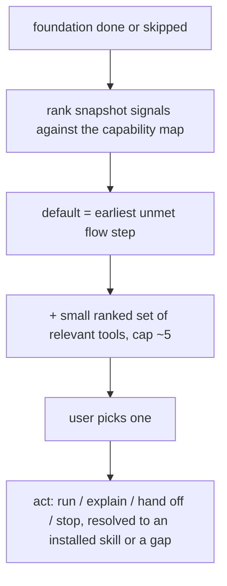

# Instruction: Ranked action menu in orient + act

Part of [`plan.md`](./plan.md).

## Architecture projection

<!-- Tree of the final architecture: ❌ deleted, ✅ created, ✏️ modified. -->

```txt
plugins/aidd-context/skills/00-onboard/
├── README.md                   ✏️ describe the foundation-gate + ranked-menu flow
└── actions/
    ├── 02-orient.md            ✏️ build a ranked action set, not one suggestion
    └── 03-act.md               ✏️ act on a pick from the set
```

## User Journey



## Tasks to do

### `1)` Orient builds one reconciled menu

> One default mechanism, one render order, never less informative than today.

1. **Default = flow walk.** In `02-orient`, the default step is the flow walk's earliest **unmet** step (journey.md), where unmet = not satisfied by a disk signal, not done-this-session, and not skipped-this-session (the phase-1 ledger). This is what stops the just-run step being re-offered. Its hedges, driven by the plan-status signal:
   - Plan status `in-progress` → default is **Build alone** (the status is a cheap signal the build is not done; no premature Review).
   - Build looks done but nothing reviewed (plan status `implemented`, or an open PR) → present **Review and Ship together**, Review first, so Review is never skipped.
   - Build-doneness genuinely unprovable (no plan status either way) → hedge **Build and Review**.
   - Need stage → offer **Clarify and Track** as choices, Clarify listed first as a soft recommendation, but **not** a loud pre-selected default (no snapshot signal separates rough idea from clear need).
2. **Secondary tools = signal map.** Beside the default, add the stage-gated tools the capability map (phase 3) marks relevant, each resolved to an installed skill or marked a gap. The signal map never overrides the default. Cap **the default + secondary block** at ~5 lines; this cap scopes that block only.
3. **One render order, always:** the foundation step first when memory is weak (phase 2), else the flow default(s); then the ranked secondary tools; then the standing affordances as **one compact footer line**, never dropped — explain the step first, explain this project (when memory is filled), see the flow + skills, go to a different step, hand off, stop. The footer is outside the ~5-line cap, so the menu is never less informative than today's.
4. Drop the old fixed 8-item list; keep labels plain.

### `2)` Act on the pick; refresh docs

1. In `03-act`, handle a pick from the ranked set with the existing outcomes (run / explain / hand off / stop), looping back per phase 1's refresh rule.
2. Update `README.md` to describe the new flow: foundation gate, then the project-adapted ranked menu.

## Test acceptance criteria

| Task | Acceptance criteria                                                                                       |
| ---- | -------------------------------------------------------------------------------------------------------- |
| 1    | Default from the flow walk only; plan-status `in-progress` → Build alone; build-done-unreviewed → Review+Ship; need-stage → Clarify-first soft recommendation with no loud default; default+secondary block ≤ ~5 lines; standing affordances render as one footer line outside the cap. |
| 2    | A pick runs through `03-act`'s outcomes; `README.md` documents the foundation-gate + reconciled-menu flow; the menu is never less informative than today's onboard on any state. |
