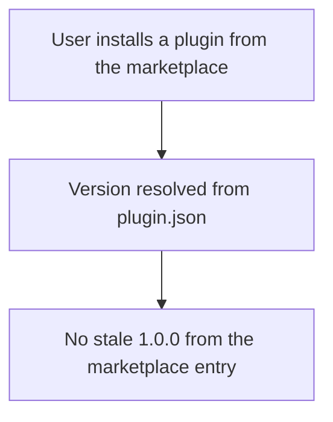

# Instruction: Marketplace version cleanup

| Element         |  Value          |
| --------------- | --------------- |
| **Plan**        | `aidd_docs/tasks/2026_06/2026_06_19-rolling-weekly-releases.md` |
| **Branch name** | `chore/marketplace-version-single-source` |

## Architecture projection

```txt
.
└── .claude-plugin/
    └── marketplace.json   # 🔁 remove the stale `version` field from each plugin entry
```

## User Journey



## Tasks to do

### `1)` Remove `version` from plugin entries

> `plugin.json` is the single source of version truth.

1. In `.claude-plugin/marketplace.json`, delete the `version` key from each of the six plugin entries.
2. Keep the top-level marketplace `version` (bumped by release-please via `extra-files`).
3. Leave `release-please-config.json` untouched (it already bumps each `plugin.json` and the marketplace top-level `version`).

## Test acceptance criteria

| Task | Acceptance criteria                  |
| ---- | ------------------------------------ |
| 1 | `jq '.plugins[] | has("version")' .claude-plugin/marketplace.json` returns `false` for every entry, and `jq '.version' .claude-plugin/marketplace.json` still returns the marketplace version. |
