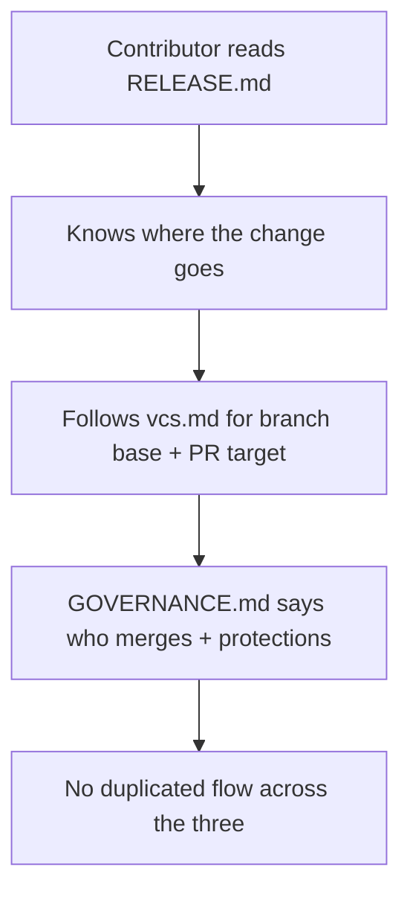

# Instruction: Docs alignment

| Element         |  Value          |
| --------------- | --------------- |
| **Plan**        | `aidd_docs/tasks/2026_06/2026_06_19-rolling-weekly-releases.md` |
| **Branch name** | `docs/release-flow-alignment` |

## Architecture projection

```txt
.
├── RELEASE.md                     # ✅ already written; review only, no rewrite
├── GOVERNANCE.md                  # 🔁 extend branch protection to next, link RELEASE.md
├── CONTRIBUTING.md                # 🔁 default PR target = next
└── aidd_docs/memory/vcs.md        # 🔁 next branch, from/target columns, default branch, back-merge pointer, link RELEASE.md
```

## User Journey



## Tasks to do

### `1)` Review RELEASE.md

> Already written this session; confirm it stays the single home of the flow.

1. Confirm principle (incl. hotfix), where-your-change-goes mermaid (two merges to `main`), commit-type -> changelog table, the two rules, weekly + hotfix steps.
2. Keep it succinct; no branch-mechanics table (that is vcs.md), no tooling config (that is vcs.md).

### `2)` Edit vcs.md

> Owns the executable mechanics. No flow narrative.

1. Add `next` as the integration branch and the default working/PR branch.
2. Add `branched from` + `PR target` to the branch-types table: `feat/fix/docs/refactor/chore/test` from+to `next`; `hotfix` from+to `main`.
3. Keep release tooling (release-please in `ci.yml` watching `main`, config/manifest paths, tags `<plugin>-v<semver>`); add a one-line pointer to the automated back-merge.
4. Link to `RELEASE.md` for the flow; do not restate it.

### `3)` Edit GOVERNANCE.md

> Authority home for branch protection.

1. Extend "Branch protection on `main`" to cover `next` (PR + checks, no direct push), referencing `.github/rulesets/next.json`.
2. Link to `RELEASE.md` for the release flow; remove any duplicated flow text.

### `4)` Edit CONTRIBUTING.md

> Point contributors at the default target.

1. State that PRs target `next` by default; `hotfix/*` targets `main`.
2. Link to `RELEASE.md` and `vcs.md` instead of repeating them.

## Test acceptance criteria

| Task | Acceptance criteria                  |
| ---- | ------------------------------------ |
| 1 | `RELEASE.md` contains a `hotfix` principle bullet and a mermaid block; `markdownlint RELEASE.md` passes. |
| 2 | `vcs.md` mentions `next`, has `from`/`PR target` columns, and links to `RELEASE.md`; no mermaid flow block present. |
| 3 | `GOVERNANCE.md` names `next` in branch protection and links `RELEASE.md`. |
| 4 | `CONTRIBUTING.md` states `next` as the default PR target and links `RELEASE.md`. |
| all | `grep -RIl "next.*integration\|weekly promotion" RELEASE.md GOVERNANCE.md aidd_docs/memory/vcs.md` shows the flow narrative only in `RELEASE.md`. |
