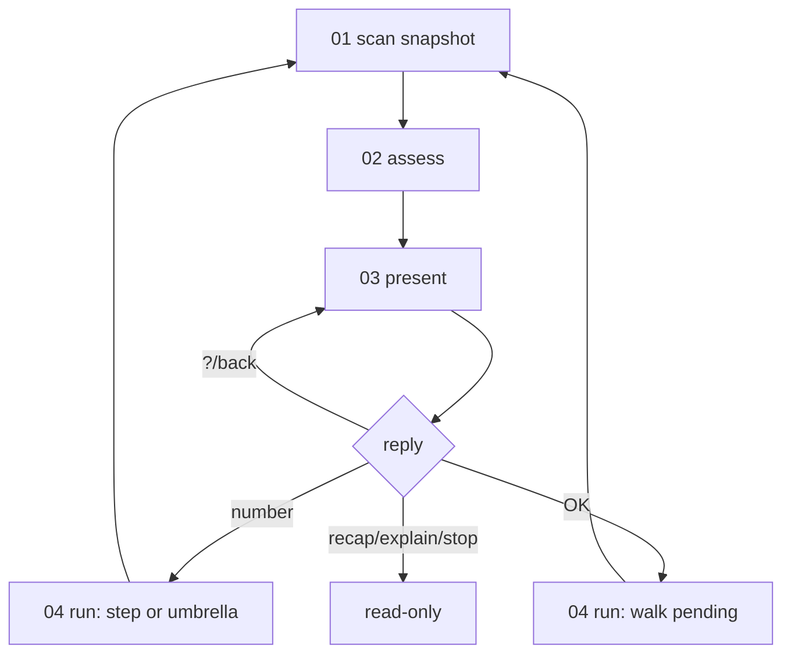

<!-- Fill or omit these sections; never add, rename, or reorder one. -->

# Instruction: Assess + run actions

## Architecture projection

> Tree of the final files. ✅ create · ✏️ modify · ❌ delete

```txt
plugins/aidd-context/skills/00-onboard/
├── actions/
│   ├── ✅ 02-assess.md         # snapshot => decision (state class, ranked next, chosen screen)
│   ├── ✅ 04-run.md            # renamed from 03-run.md, executes the reply
│   └── ❌ 03-run.md
└── references/
    ├── ✅ order/ranking.md      # next-action order (from checks.md)
    ├── ✅ order/idle-menu.md    # 3 umbrellas + explore (from checks.md)
    ├── ✅ order/screen-map.md   # Mermaid: state => which screen
    ├── ✅ run/replies.md        # key routing (from run-tiers.md)
    ├── ✅ run/tiers.md          # auto/guided/manual + default-overridable (from run-tiers.md)
    ├── ✅ run/return.md         # return-to-onboard on GUIDED handoff (from run-tiers.md)
    └── ❌ run-tiers.md          # content split into run/
```

## User Journey



## Tasks to do

### `1)` Build the assess action + order refs

> Turn the raw snapshot into one decision.

1. `order/ranking.md`: 1 unmet foundation, 2 earliest dev-flow step, 3 fired health tool, 4 idle menu; hold 2-4 while a foundation is unmet.
2. `order/idle-menu.md`: umbrellas `start new work [1]` · `improve the project [2]` · `customize the AI [3]` · `explore [?]`; an umbrella pick re-renders its installed members.
3. `order/screen-map.md`: a Mermaid `stateDiagram` mapping state (greenfield / existing / drift / idle / mid-work) to the screen to render.
4. `02-assess.md`: read the `01-scan` snapshot, load `order/`, output the decision (state class, ranked next-action, chosen screen); hand to `03-present`. No rendering here.

### `2)` Carve the run refs + build 04-run

> Execute a reply, delegate the how.

1. `run/replies.md`: keys `[n] [OK] [?] recap explain skip stop`, each's effect; read-only vs re-scan; `[?]`/`back` re-render via `03-present` without re-assessing.
2. `run/tiers.md`: AUTO/GUIDED/MANUAL semantics; tier is a default, overridable when the skill supports the other mode.
3. `run/return.md`: on a GUIDED handoff, tell the user to re-run onboard to return; the ledger drops the handed-off step.
4. Rename `03-run.md` => `04-run.md`: load `run/replies.md` always, `run/tiers.md` only when running a step, `run/return.md` only on a GUIDED handoff; write the ledger per `state/done-rule.md` after each handled step.

## Test acceptance criteria

<!-- Each criterion is an observable behavior, not a command. -->

| Task | Acceptance criteria                                                                     |
| ---- | --------------------------------------------------------------------------------------- |
| 1    | `02-assess` outputs a decision and renders nothing; `screen-map.md` is a Mermaid diagram. |
| 1    | Ranking holds dev-flow/health/idle while a foundation is unmet; an umbrella pick re-renders a member sub-list. |
| 2    | `[?]`/`back` re-render via `03-present` with no re-scan and no re-assess.                 |
| 2    | A GUIDED handoff emits the return-to-onboard line; the re-scan does not re-recommend the handed-off step. |
