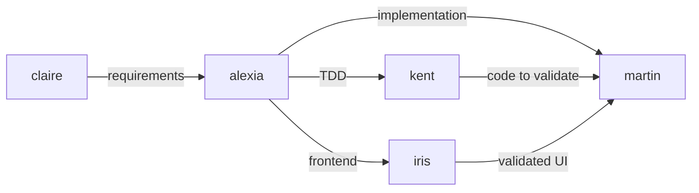

# AGENTS COORDINATION

| AGENT NAME | ROLE DESCRIPTION                                                                   | RESPONSIBILITIES                                                                                                                        | STATUS |
| ---------- | ---------------------------------------------------------------------------------- | --------------------------------------------------------------------------------------------------------------------------------------- | ------ |
| `alexia`   | Autonomous end-to-end feature implementation without human intervention             | - Implement features end-to-end without asking questions   - Make all implementation decisions autonomously based on project rules    | prod   |
| `claire`   | PM discovery agent - from fuzzy idea to actionable backlog                          | - Transform fuzzy requests into crystal-clear requirements   - Guide PMs through full discovery flow with iterative questioning       | prod   |
| `kent`     | TDD & Tidy First development guide                                                 | - Drive the Red → Green → Refactor TDD cycle   - Separate structural changes from behavioral changes                                | prod   |
| `iris`     | Frontend specialist - implement from Figma, verify UI conformity, validate journeys | - Implement components from Figma designs   - Verify UI conformity and validate user journeys                                        | prod   |
| `martin`   | Code quality and validation agent                                                  | - Run commands to validate build, lint and tests   - Enforce coding assertions and module-specific rules                             | prod   |

## Communication flow (if applicable)

<!-- To coordinate effectively, agents will follow this communication flow IF they depend on each other: -->

## Usage

### `alexia`

> Use Alexia when you want a fully autonomous senior engineer to implement a feature or fix end-to-end without questions.

Use-cases :

- **Autonomous feature delivery** : Implement a complete feature from request to final report with minimal human interaction.
- **Exploratory implementation** : Try a pragmatic implementation path quickly while respecting project rules and best practices.

### `claire`

> Use Claire when you need to transform a vague feature request into crystal-clear requirements before planning.

Use-cases :

- **Fuzzy requests** : Turn incomplete or ambiguous feature ideas into comprehensive requirements.
- **Discovery phase** : Systematically uncover edge cases, constraints, and missing context through iterative questioning.

### `kent`

> Use Kent when you explicitly want strict Test-Driven Development and Tidy First refactoring discipline.

Use-cases :

- **New critical logic** : Design and implement core domain behavior with a tight Red → Green → Refactor loop.
- **Huge or risky refactors** : Separate structural from behavioral changes and validate each step with tests.

### `iris`

> Use Iris every time you need to verify or review a frontend implementation against initial requirements.

Use-cases :

- **Frontend implementation** : Generate components from Figma designs with exact values (colors, spacing, typography).
- **UI validation** : Verify that a frontend implementation fully conforms to the original design or requirements.
- **User journey testing** : Validate complete user flows and interactions step by step.

### `martin`

> Use Martin every time you need to ensure the codebase still builds correctly and all tests and coding rules pass.

Use-cases :

- **Build validation** : Verify that the project compiles and all tests pass after changes.
- **Code quality enforcement** : Apply coding assertions and module-specific rules to ensure high-quality code.
