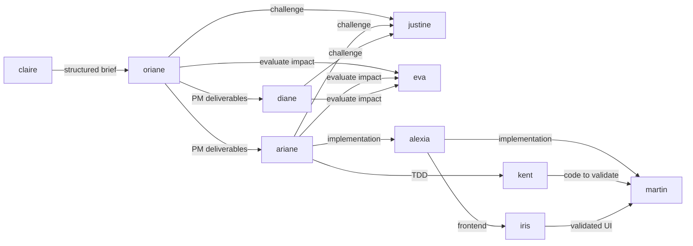

# AGENTS COORDINATION

| AGENT NAME | ROLE DESCRIPTION                                                                   | RESPONSIBILITIES                                                                                                                        | STATUS |
| ---------- | ---------------------------------------------------------------------------------- | --------------------------------------------------------------------------------------------------------------------------------------- | ------ |
| `alexia`   | Autonomous end-to-end feature implementation without human intervention             | - Implement features end-to-end without asking questions   - Make all implementation decisions autonomously based on project rules    | prod   |
| `claire`   | Product Discovery — clarifies fuzzy ideas into actionable briefs                    | - Transform fuzzy ideas via Brain Dump → Brief → Research → Prompt Package   - Clarify ambiguities at any project stage              | prod   |
| `oriane`   | PM Orchestrator — orchestrates all product workflows                   | - Run PM skills sequentially with challenge gates   - Adapt flow based on existing deliverables and user request                  | prod   |
| `ariane`   | Architect — handles technical architecture and implementation planning            | - Make justified architecture decisions from PRD and constraints   - Create implementation plans                                      | prod   |
| `diane`    | UX Designer — handles design systems, user flows, accessibility, UX copy          | - Create and maintain design systems   - Map user flows, spec accessibility, write UX copy, audit UX                                 | prod   |
| `eva`      | Impact Evaluator — evaluates decision impacts globally                              | - Assess impacts across 5 dimensions (technical, business, users, regulatory, operational)   - Provide structured impact reports     | prod   |
| `justine`  | Clarity challenger — challenges deliverables and identifies gaps                    | - Ensure no deliverable moves forward until clear and complete   - Cover 95% of ambiguities through iterative questioning            | prod   |
| `kent`     | TDD & Tidy First development guide                                                 | - Drive the Red → Green → Refactor TDD cycle   - Separate structural changes from behavioral changes                                | prod   |
| `iris`     | Frontend specialist - implement from Figma, verify UI conformity, validate journeys | - Implement components from Figma designs   - Verify UI conformity and validate user journeys                                        | prod   |
| `martin`   | Code quality and validation agent                                                  | - Run commands to validate build, lint and tests   - Enforce coding assertions and module-specific rules                             | prod   |

## Communication flow (if applicable)

<!-- To coordinate effectively, agents will follow this communication flow IF they depend on each other: -->

## Usage

### `alexia`

> Use Alexia when you want a fully autonomous senior engineer to implement a feature or fix end-to-end without questions.

Use-cases :

- **Autonomous feature delivery** : Implement a complete feature from request to final report with minimal human interaction.
- **Exploratory implementation** : Try a pragmatic implementation path quickly while respecting project rules and best practices.

### `claire`

> Use Claire when you have a fuzzy idea and need to structure it into an actionable brief.

Use-cases :

- **Fuzzy ideas** : Transform vague ideas via Brain Dump → Brief → Research → Prompt Package.
- **Clarification** : Clarify ambiguous requirements at any stage of a project.
- **Discovery phase** : Conduct market research and generate personas from data.

### `oriane`

> Use Oriane when you need to orchestrate a full product workflow (greenfield or brownfield).

Use-cases :

- **Greenfield projects** : Run the full Constitution → Discovery → PRD → User Stories pipeline.
- **Brownfield evolution** : Run the System Overview → Change Brief → User Stories pipeline.
- **Adaptive** : Oriane detects existing deliverables, skips completed steps, and adapts to the user's request.
- **Skills** : `pm-constitution`, `pm-product-brief`, `pm-prd`, `pm-user-stories`, `pm-system-overview`, `pm-change-brief`.

### `ariane`

> Use Ariane when you need technical architecture decisions or implementation planning.

Use-cases :

- **Greenfield architecture** : Run Architecture Decision → Extract Milestones pipeline.
- **Brownfield architecture** : Run Architecture Impact → Impact Plan pipeline.
- **Technical decisions** : Make justified architecture decisions linked to functional requirements.
- **Skills** : `architecture-decision`, `architecture-milestones`, `architecture-impact`, `architecture-impact-plan`.

### `diane`

> Use Diane when you need design system creation, user flow mapping, accessibility specs, UX copy, or UX audits.

Use-cases :

- **Design system** : Create or update the design system from PRD user journeys.
- **User flows** : Map complete user flows with all states (happy, error, empty, loading, permission, offline, first-time).
- **Accessibility** : Generate actionable a11y specifications per component.
- **UX copy** : Generate i18n-ready microcopy for the entire product.
- **UX audit** : Evaluate an existing product against Nielsen's 10 heuristics.
- **Skills** : `design-system`, `design-system-update`, `ux-flow-map`, `ux-accessibility`, `ux-copy`, `ux-audit`.

### `eva`

> Use Éva when you need to evaluate the global impact of a decision or change.

Use-cases :

- **Impact assessment** : Evaluate impacts across 5 dimensions (technical, business, users, regulatory, operational).
- **Alternative comparison** : Compare multiple approaches with a structured impact matrix.
- **Decision support** : Get a GO / GO with mitigations / NO-GO recommendation.
- **Skills** : None (standalone evaluation service callable by oriane, ariane, diane, or any user).

### `justine`

> Use Justine when you need to challenge deliverables, find gaps, and ensure everything is justified before moving forward.

Use-cases :

- **Deliverable review** : Challenge any product deliverable for completeness, contradictions, and missing elements.
- **Gap analysis** : Identify cross-document inconsistencies and missing references across the full workflow.

### `kent`

> Use Kent when you explicitly want strict Test-Driven Development and Tidy First refactoring discipline.

Use-cases :

- **New critical logic** : Design and implement core domain behavior with a tight Red → Green → Refactor loop.
- **Huge or risky refactors** : Separate structural from behavioral changes and validate each step with tests.

### `iris`

> Use Iris every time you need to verify or review a frontend implementation against initial requirements.

Use-cases :

- **Frontend implementation** : Generate components from Figma designs with exact values (colors, spacing, typography).
- **UI validation** : Verify that a frontend implementation fully conforms to the original design or requirements.
- **User journey testing** : Validate complete user flows and interactions step by step.

### `martin`

> Use Martin every time you need to ensure the codebase still builds correctly and all tests and coding rules pass.

Use-cases :

- **Build validation** : Verify that the project compiles and all tests pass after changes.
- **Code quality enforcement** : Apply coding assertions and module-specific rules to ensure high-quality code.
