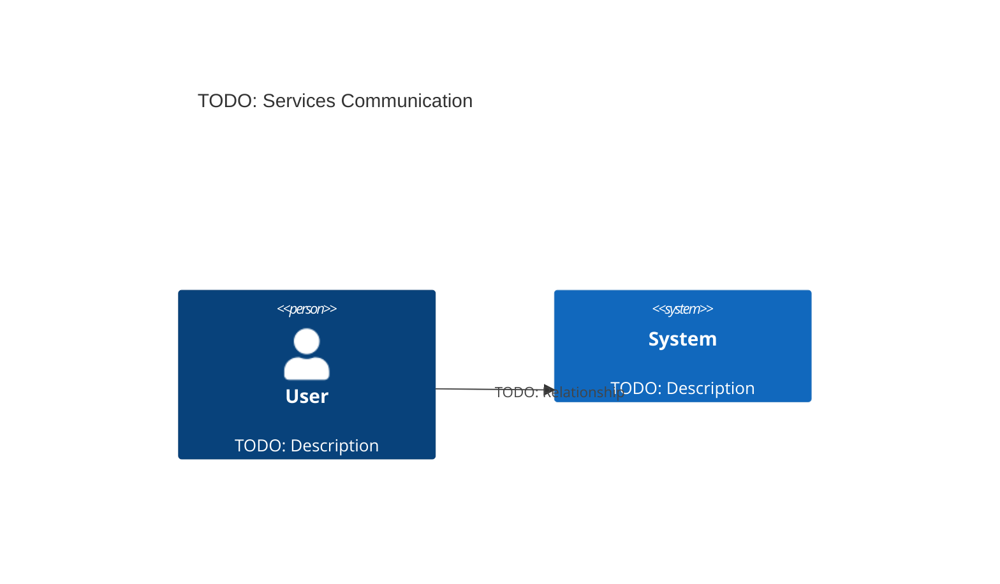

# Architecture

- [Language/Framework](#languageframework)
- [Mobile? (if applicable)](#mobile-if-applicable)
  - [Naming Conventions](#naming-conventions)
- [Services communication](#services-communication)
  - [\<Communication 1\>](#communication-1)
  - [External Services](#external-services)
    - [\<External Service 1\>](#external-service-1)

## Language/Framework

```json
@<path to package manifest>
```


## Mobile? (if applicable)


### Naming Conventions

- **Files**: [pattern - camelCase/kebab-case/PascalCase]
- **Components?**: [pattern - PascalCase]
- **Functions**: [pattern - camelCase]
- **Variables**: [pattern - camelCase]
- **Constants**: [pattern - UPPER_CASE]
- **Types/Interfaces**: [pattern - PascalCase]

## Services communication

Internal communication between services, (e.g. for frontend: React Form Component → State Management → API Service → Backend API Endpoint, but way more detailed).

### <Communication 1>



### External Services

List of external services used in the project (e.g., AWS, Firebase, Stripe), including their purpose and integration points.

#### <External Service 1>


