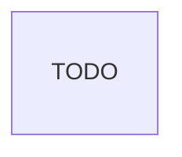

# Database

This part provides detailed information about the database used in the project, including its type, connection details, migration strategies, and tools for seeding and mocking data.

```json
@<path to database config files>
```



## Main entities and relationships

Very high level overview of the main entities and their relationships.

- Relations (high-level only)
- Link to auto-generated schema


## Migrations

[Migration tool] - [How migrations are handled in the project]

## Seeding

[Seeding tool] - [How seeding is handled in the project]
