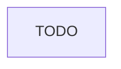

# Forms

This part describe how frontend forms are handled in the project, including libraries used, validation strategies, and state management.

## State Management

- [How form state is managed, e.g., local state, global state, etc.]
- [Approach to handling form submissions and resets]
- [Handling of form data persistence, if applicable]

## Validation

- [Client-side validation strategies]

## Error handling

- [Frontend error handling and display mechanisms]

## Form Flow

[From form filling to services communication, describe the detailed flow]

