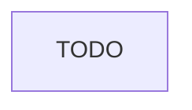

<!--  AI INSTRUCTIONS ONLY -- Follow those rules, do not output them.

- ENGLISH ONLY
- Text is straight to the point, no emojis, no style, use bullet points.
- Replace placeholders (`{variables}`) with actual user inputs.
- Define flow of the feature, from start to end.
- Interpret comments on this file to help you fill it.
-->

# Instruction: {title}

## Feature

- **Summary**: {Summarize feature based plan, goal oriented}
- **Stack**: `[TECH_STACK_WITH_VERSIONS]` <!-- Output all stacks that will be used! -->
- **Branch name**: `{suggested-branch-name}`
- **Parent Plan**: `{master-file}` or `none`
- **Sequence**: `{N of M}` or `standalone`
- Confidence: {Confidence}
- Time to implement: {Time to implement}

## Existing files

- @{affected files path}

### New file to create

- {not found in current project - no comments}

## User Journey

## Implementation phases

### {Phase n}

> {straight to point goal}

1. {ultra concise task1, with logical
2. {...}
3. {...}

## Validation flow

<!-- What would a REAL user do to 100% validate the feature? -->

1. {Step 1...}
