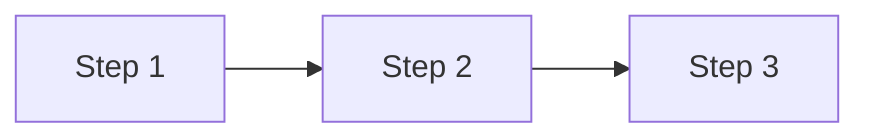

# <Skill Name>

## Goal

<One sentence: what this skill achieves>

## Rules

- <Constraint or convention to follow>
- <Another rule>

## Quick Start

<Minimal example to get started - keep under 50 lines>

```bash
# Example command or code
```

## Workflow

> Optional: use when the skill involves multiple steps.



### Step 1: <Name>

**Do:**

1. <Action>
2. <Action>

**Success criteria:** <What indicates this step is complete>

### Step 2: <Name>

**Do:**

1. <Action>

**Success criteria:** <What indicates this step is complete>

## Advanced Features

> Optional: link to references for complex features.

- **Feature A**: See [references/feature-a.md](./#)
- **Feature B**: See [references/feature-b.md](./#)

## Resources

| Type      | Path                   | Description        |
| --------- | ---------------------- | ------------------ |
| Script    | `scripts/<name>.sh`    | <What it does>     |
| Reference | `references/<name>.md` | <What it contains> |
| Template  | `assets/<name>.md`     | <What it's for>    |
