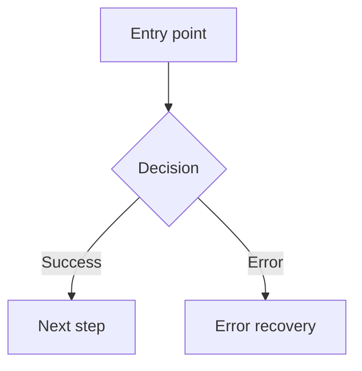

# User Flows - [Project Name]

## Scope

**This document owns**: flow diagrams, state transition tables, recovery paths, entry/exit points for every user journey.

**Out of scope** (reference only):
- Exact user-facing text (error messages, CTAs) → See `ux_copy.md`
- Component visual patterns and tokens → See `design_system.md`

## 1. Flow Inventory

| Flow | Entry point | Exit point | Complexity |
|------|------------|-----------|------------|
| [Registration] | [Landing page] | [Dashboard] | [High/Medium/Low] |
| [Core feature] | [Dashboard] | [Result screen] | [High/Medium/Low] |

## 2. Flow Details

### [Flow Name]

### State Table

| Step | Happy path | Error | Empty | Loading | Permission denied | Offline | First-time |
|------|-----------|-------|-------|---------|------------------|---------|------------|
| [Step 1] | [Response type] | [Recovery path] | [Guidance type] | [Feedback type] | [Redirect/message type] | [Available actions] | [Onboarding variant] |
| [Step 2] | [Response type] | [Recovery path] | [Guidance type] | [Feedback type] | [Redirect/message type] | [Available actions] | [Onboarding variant] |

> Document the **type of response** at each step (error notification, redirect, confirmation), not the exact text. Exact wording is in `ux_copy.md`.

### Recovery Paths

| Error | Recovery action | Destination |
|-------|----------------|------------|
| [Error type] | [What the user can do] | [Where they end up] |

## 3. Cross-Flow Transitions

| From flow | Trigger | To flow | Context preserved |
|-----------|---------|---------|-------------------|
| [Flow A] | [User action] | [Flow B] | [What state carries over] |
