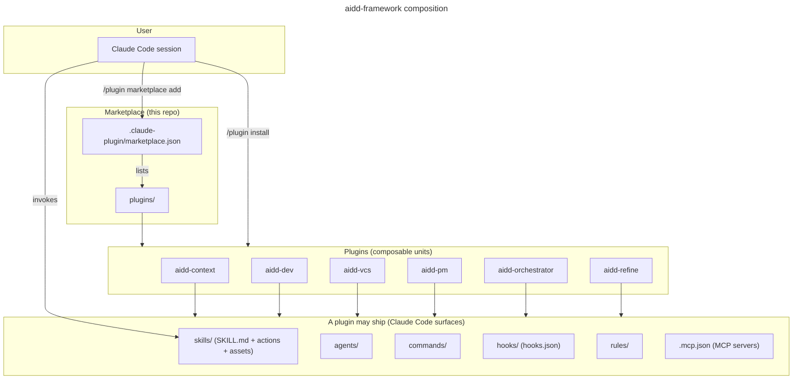
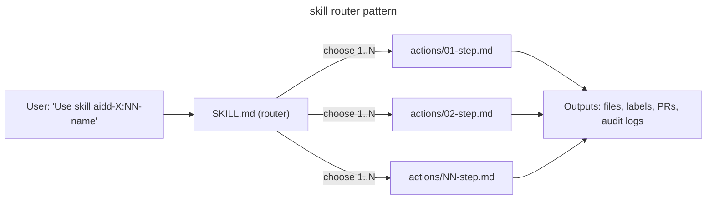

# Architecture

How the AI-Driven Dev Framework composes inside Claude Code.

## High-level



## Anatomy of a plugin

Every plugin under `plugins/<plugin>/` follows the same shape:

```
plugins/<plugin>/
├── .claude-plugin/
│   └── plugin.json        # manifest (name, version, description, skills[], $schema)
├── README.md              # human-facing landing page
├── CATALOG.md             # per-plugin auto-generated index
├── CHANGELOG.md           # release-please-managed
├── skills/                # router-based skills
│   └── <NN>-<name>/
│       ├── SKILL.md        # contract (name, description, actions table)
│       ├── README.md       # human-facing skill landing
│       ├── actions/        # atomic actions invoked by the router
│       ├── assets/         # templates and static files
│       └── references/     # extended docs the skill links into
├── agents/                 # named AI agents          (optional)
├── commands/               # slash commands           (optional)
├── hooks/hooks.json        # lifecycle hooks          (optional)
├── rules/                  # coding rules             (optional)
└── .mcp.json               # MCP server configuration (optional)
```

A plugin bundles **any subset** of the Claude Code surfaces (skills, agents, commands, hooks, rules, MCP servers); only `skills/` and the manifest are universal. Browse the [plugins](../plugins/) to see which surfaces each one ships.

The `plugin.json` is validated against [`claude-code-plugin-manifest`](https://www.schemastore.org/claude-code-plugin-manifest.json) by the `lefthook` pre-commit hook (when the JSON-schema validator, `pipx`/`check-jsonschema`, is available); the same hook validates `marketplace.json` against [`claude-code-marketplace`](https://www.schemastore.org/claude-code-marketplace.json). The `validate` workflow re-runs the hooks on every push and PR.

## Plugin concerns and layers

Every capability lives in exactly one plugin, chosen by **concern**. This taxonomy decides placement; it is only implicit in each `plugin.json`, so it is canonical here.

| Plugin              | Concern              | Layer        |
| ------------------- | -------------------- | ------------ |
| `aidd-context`      | Knowledge production | Knowledge    |
| `aidd-pm`           | Product management   | Knowledge    |
| `aidd-refine`       | Meta-cognition       | Knowledge    |
| `aidd-dev`          | Code transformation  | Execution    |
| `aidd-vcs`          | Version control      | External     |
| `aidd-orchestrator` | Orchestration        | Coordination |

Three rules follow:

- **Knowledge vs execution is a firewall.** Knowledge plugins produce artifacts you *read* (docs, plans, memory) and never write or run application source - `aidd-context`'s bootstrap deliberately creates no `package.json` or source files. Real code belongs to `aidd-dev` or an orchestrator's own setup actions.
- **Concern decides placement, not existence.** A missing capability goes in the plugin whose concern owns it, then the caller delegates. Never reimplement it in the calling plugin because the right home lacks it today.
- **Orchestration = sequencing across multiple concerns** with little domain logic. Any skill may delegate a sub-step ([Cross-plugin orthogonality](#cross-plugin-orthogonality)); doing so once does not make it an orchestrator. The orchestrator owns only glue and delegates the depth, handing off through a seam artifact (e.g. an `INSTALL.md` one plugin produces and another consumes).

## Skills are routers

A skill's `SKILL.md` is a manifest plus an actions table. Claude Code loads the SKILL.md when the skill is invoked; the body decides which action(s) to run.



Each action is a self-contained markdown file with inputs, outputs, depends-on, process steps, and a test checklist. Actions can call other skills via the `Skill` tool, so a skill discovers a capability it needs at runtime (by matching skill descriptions, never by hardcoded plugin name) and delegates to it.

## Skills and agents

- A **skill** is a caller-agnostic recipe; it runs in the context of whoever invokes it.
- An **agent** is an isolated executor; it runs in its own context and returns only a result.

Choose by context, not complexity: keep the work visible to the caller → skill; isolate it and take only the result → agent.

Composition rules:

- **Spawning is an orchestration decision, never a skill's.** A recipe skill never spawns an agent; it runs in the caller's context. Only a high-level orchestrator skill (for example the SDLC) spawns agents, and it decides per step whether to isolate the work in an agent or run the recipe inline.
- An orchestrator spawns each step as a leaf agent that runs a recipe, or runs the recipe itself when the step needs no isolation. The SDLC owns planning (runs `01-plan` in its own context) and spawns two workers: `executor` (runs `02-implement`) and `checker` (runs `05-review`). The agent is the isolation; the recipe inside it never spawns again.
- An agent invokes only the recipe skills it declares under `# Skills you may invoke`, never an orchestrator skill, and never reads a skill's files. It names a same-plugin skill by its `plugin:folder` address (deterministic); it names a cross-plugin skill by capability, per cross-plugin orthogonality.
- An agent never delegates flow work to another agent and never invokes an orchestrator skill. It may spawn a read-only recon helper (for example `Explore`) that mutates nothing and spawns nothing. So the write path stays two layers deep and delegation can never cycle.

## Cross-plugin orthogonality

Plugins do not reference each other by name. When skill A needs a capability owned by skill B, it discovers a candidate at runtime through description matching. This rule keeps the marketplace forkable, the plugins swappable, and the docs maintainable.

The rule is enforced both socially (PR template checklist) and mechanically (lefthook hooks could be extended to grep for cross-plugin literal references).

## See also

- [`CREATE_PLUGIN.md`](CREATE_PLUGIN.md) - build and publish your own plugin.
- [`GLOSSARY.md`](GLOSSARY.md) - terminology used across the framework.
- [`../CONTRIBUTING.md`](../CONTRIBUTING.md) - contribution flow.
