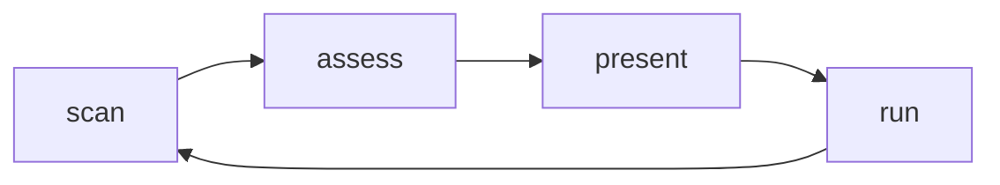

# Onboard

## Actions

Run the actions in that order, looping. Read an action's file in `actions/` before running it.

| #  | Action  | Does                 |
| -- | ------- | -------------------- |
| 01 | scan    | read the project     |
| 02 | assess  | decide the next step |
| 03 | present | show the screen      |
| 04 | run     | act on the reply     |

## Transversal rules

- Guide, do not lecture or dump.
- Name real commands only, never invented ones.
- Never run a GUIDED step unattended.
- Never test a plugin version against a registry.
- Never trust a stale status.
- Wait for an explicit reply before running anything.
