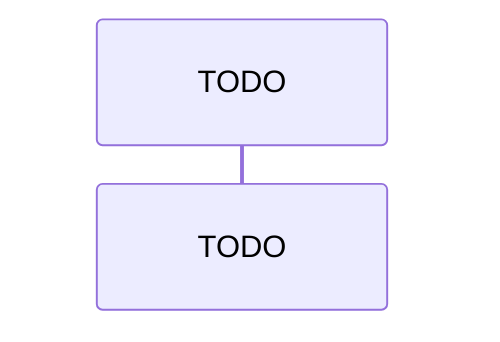

# Communicating with the backend

This part describes how clients (frontend, other services) communicate with the backend, globally: the API surface it exposes, the request and response contracts, and the main entities involved.

## Overview

The backend exposes its capabilities through services and API endpoints that clients consume. This section outlines that communication surface.

- **API definition**: [link to OpenAPI files or similar, if applicable]
- **Services**: [List of services the backend exposes, e.g. authentication service, data API, ...]
- **Request Types**: [Types of requests the backend accepts, e.g. GET, POST, PUT, DELETE, ...]
- **Entities**: [Main entities exposed over the API and where they are defined]
- **Data Flow**: [How a request is handled from entry point to response]
- **Error Handling**: [Error contract: status codes, error body shape]
- **Validation**: [How incoming requests are validated]

### Data Flow

When a client creates a new entity, the backend typically handles the request as follows:

