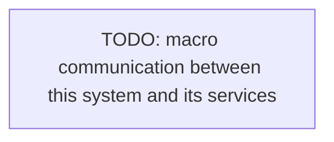

# Integration

How this system talks to others: internal communication and external services.

## Internal

- <How services or modules communicate (HTTP, events, gRPC)>

## External services

- <Each external service (payments, email, storage), its purpose, integration point>

<!--
Capture: the macro communication map and the external integrations.
Skip: implementation detail. Keep the diagram macro. Remove this comment when filled.
-->
