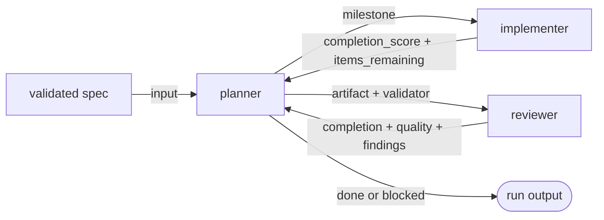

# AGENTS COORDINATION

| AGENT NAME    | ROLE DESCRIPTION                                                                       | RESPONSIBILITIES                                                                                                                                                                              | STATUS |
| ------------- | -------------------------------------------------------------------------------------- | --------------------------------------------------------------------------------------------------------------------------------------------------------------------------------------------- | ------ |
| `planner`     | Run orchestrator - turns a validated spec into milestones and drives execution         | - Decompose spec into milestones with acceptance criteria   - Spawn `implementer` and `reviewer` in fresh contexts per milestone   - Re-spawn on incomplete or low-quality output, escalate on cap | prod   |
| `implementer` | Milestone executor - codes, tests, repairs within the input scope                      | - Implement substep by substep, validate after each   - Commit atomically per ticked checkbox (one box = one commit)   - Report `completion_score` honestly                                       | prod   |
| `reviewer`    | Independent critic - verifies an artifact against an explicit validator                | - Judge each criterion as fulfilled / partial / unfulfilled with evidence   - Compute `completion_score` and `quality_score`   - Surface findings precise enough to act on without further investigation | prod   |

## Communication flow

The three agents only talk through the `planner`. The `implementer` and `reviewer` never call each other directly.

## Usage

### `planner`

> Use the planner when a validated spec needs to be turned into an executable plan, or when a previous run came back with incomplete or low-quality output.

Use-cases :

- **New spec to plan** : decompose into milestones with acceptance criteria sized for one implementer pass.
- **Re-spawn loop** : a previous implementer or reviewer returned `completion_score < 100` or quality below threshold - feed the findings back, decide whether to re-spawn or escalate.
- **Replan on human input** : a human surfaced a missing constraint or asked for a scope change - incorporate and reschedule.

### `implementer`

> Use the implementer when the planner has handed off a single milestone, a fix list, or `items_remaining` from a previous incomplete pass.

Use-cases :

- **Milestone implementation** : code the milestone, run tests, repair until acceptance criteria pass, commit per checkbox.
- **Targeted fix list** : fix exactly what the reviewer flagged, no scope expansion.
- **Resumed incomplete pass** : pick up `items_remaining` from a previous spawn and finish.

### `reviewer`

> Use the reviewer when an artifact (code, spec, plan, doc) needs an independent verdict against an explicit validator.

Use-cases :

- **Spec validation** : check a draft spec against a spec-validator checklist before freezing it.
- **Milestone verdict** : verify the implementer's output against the milestone's acceptance criteria.
- **Plan or doc review** : audit any reviewable artifact against a checklist file (YAML, JSON, markdown).
