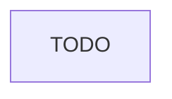

# Instruction: {title}

Part of [`plan.md`](./plan.md).

## Architecture projection

<!-- Tree of the final architecture: ❌ deleted, ✅ created, ✏️ modified. -->

```txt
.
```

## User Journey



## Wireframe

```txt
{the confirmed wireframe, or omit this section when the phase has no UI}
```

## Tasks to do

### `{number})` {name}

> {straight to point goal}

1. {ultra concise step}
   ...

## Test acceptance criteria

| Task | Acceptance criteria                  |
| ---- | ------------------------------------ |
| 1... | {focused deterministic verification} |
