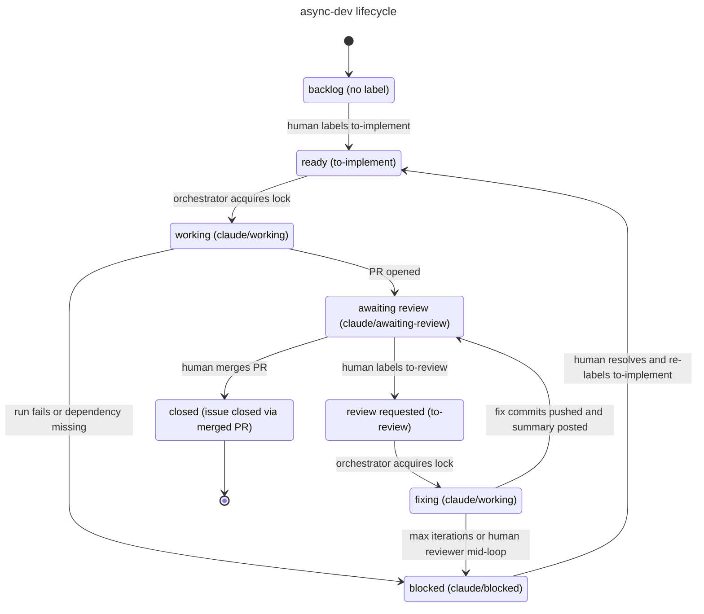

# 02 - Run async-dev

Drives one async-dev cycle: locks a ready issue, delegates the implementation
to the loaded SDLC capability, opens a pull request, and writes an audit
record. The skill never implements code itself - it coordinates.

## Lifecycle



Humans only touch the `to-*` labels. Claude only touches the `claude/*` labels. The split is enforced by the workflow's dispatch step.

## When to use

- A fresh GitHub issue carries `to-implement` (or the equivalent `@claude
  /implement` mention) and you want the pipeline to pick it up.
- A poll script / cron / mention surfaces a new ready issue.

## When NOT to use

- For the post-PR review-and-fix loop → use `03-review-async-dev`.
- To configure the workflow, labels, or secrets → use `01-setup-async-dev`.
- To dispatch multiple issues at once → invoke once per issue; the lock keeps
  parallel runs from colliding.

## How to invoke

```
Use skill aidd-orchestrator:02:run-async-dev on issue #<N>
```

The skill walks 6 atomic actions:

1. `poll-ready` - list ready issues.
2. `resolve-deps` - filter out blocked ones.
3. `acquire-lock` - swap `to-implement` → `claude/working`.
4. `check-sdlc` - discover the SDLC capability by description.
5. `delegate-sdlc` - invoke that capability via the `Skill` tool with the
   delegation contract (branch name, base, body containing `Closes #N`).
6. `write-audit` - commit and push the audit JSON to the PR branch, create
   the GitHub Check Run, transition the label to `claude/awaiting-review`.

## Outputs

- A feature branch `feat/issue-<N>-<slug>` on the repo.
- A pull request with body containing `Closes #<N>`.
- `aidd_docs/async-runs/<YYYY_MM>/<run-id>.json` on the PR branch.
- A GitHub Check Run `aidd-async/<run-id>`.
- Label transition on the issue: `to-implement` → `claude/working` →
  `claude/awaiting-review` (or `claude/blocked` on failure, with a comment
  describing the cause).

## Prerequisites

- `01-setup-async-dev` has already run on the repo.
- The required secrets are present (Anthropic + GitHub write).
- An SDLC capability is loaded (the run aborts to `claude/blocked` otherwise).

## Failure semantics

Any failure between actions 03 and 06 swaps the lock for `claude/blocked` and
posts the cause on the issue. The audit record carries the error details.
The most common cause is a write token that lacks the `workflows` scope when
the issue touches `.github/workflows/**`.

## Technical details

See [`SKILL.md`](SKILL.md) for the action contract and [`actions/`](actions/)
for each step. The delegation contract enforced by action 05 is the
non-bypassable core of this skill - the orchestrator MUST call the SDLC via
the `Skill` tool, never inline its own edits.
