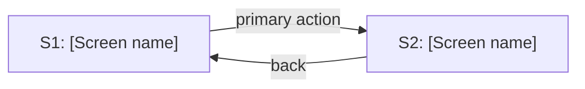

# [Feature name] - Wireframes

[One-paragraph summary of the feature and the screens it introduces or changes.]

## 1. Screen Inventory

| ID  | Screen        | Purpose                          | Source (user flow / criterion) |
| --- | ------------- | -------------------------------- | ------------------------------ |
| S1  | [Screen name] | [What the user does here]        | [Flow or acceptance criterion] |
| S2  | [Screen name] | [What the user does here]        | [Flow or acceptance criterion] |

## 2. Layouts

Low-fidelity, structure only. No colors, typography, or spacing.

### S1 - [Screen name]

```text
+--------------------------------------------------+
| [Logo]                          [Nav] [Account]  |
+--------------------------------------------------+
|  [Page title]                                    |
|                                                  |
|  +-------------------+  +---------------------+   |
|  | [Primary content] |  | [Secondary panel]   |   |
|  |                   |  |                     |   |
|  +-------------------+  +---------------------+   |
|                                                  |
|  [ Primary action ]   [ Secondary action ]       |
+--------------------------------------------------+
```

#### Component hierarchy

- Header
  - Logo
  - Nav
  - Account menu
- Main
  - Page title
  - Primary content
  - Secondary panel
- Actions
  - Primary action
  - Secondary action

### S2 - [Screen name]

```text
[ASCII layout for the next screen]
```

#### Component hierarchy

- [Region]
  - [Element]

## 3. Navigation Flow



## 4. States and Annotations

Per screen, describe the non-default states.

### S1 - [Screen name]

- **Empty**: [What the user sees with no data.]
- **Loading**: [Placeholder or skeleton behavior.]
- **Error**: [Message and recovery path.]
- **Notes**: [Edge cases, permissions, validation rules worth flagging.]

## 5. Responsive Notes

- **Breakpoints**: [Mobile, tablet, desktop expectations.]
- **Mobile-first?**: [Yes/No and what collapses or reflows.]
- **Priority content**: [What stays visible on small screens.]

## 6. Open Questions

- [ ] TBD: [Question that blocks finalizing a screen.]
- [ ] TBD: [Decision still needed from product or design.]
