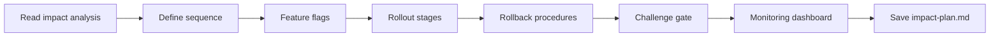

# Impact Plan

## Goal

Produce a concrete, incremental deployment plan with feature flags, progressive rollout stages, rollback procedures, and monitoring configuration.

## Rules

- No big bang deployments on critical flows
- Every change must be behind a feature flag with a documented TTL
- Rollback must be possible in under 5 minutes
- Monitoring must compare before/after baselines
- Criteria for progression between rollout phases must be measurable and binary
- Requirements started from $ARGUMENTS

## Quick Start

```text
Generate an impact plan for the architecture changes
```

## Workflow



### Step 1: Define Implementation Sequence

**Do:**

1. Read the architecture impact analysis from $ARGUMENTS or referenced files
2. If `milestones.md` exists, read it to align the rollout plan with the initial milestone sequencing — reuse phase boundaries where possible and flag divergences
3. Define implementation sequence ordered by risk (highest risk first):
   - Phase 1: Feature flags setup + infrastructure preparation
   - Phase 2: Data migrations (behind flags)
   - Phase 3: Code changes (behind flags)
   - Phase 4: Progressive rollout
   - Phase 5: Cleanup (remove flags, old code)

**Success criteria:** Sequence defined, risk-ordered

### Step 2: Document Feature Flags

**Do:**

1. For each feature flag, document:
   - Name (convention: `FEATURE_[MODULE]_[NAME]_ENABLED`)
   - Type (release, experiment, ops, permission)
   - Default value (always OFF)
   - TTL (planned removal date)
   - Rollback behavior
   - Describe flags at specification level — no implementation code or SDK usage examples

**Success criteria:** All flags documented with TTL and rollback behavior

### Step 3: Define Rollout & Rollback

**Do:**

1. Define progressive rollout stages:
   - Canary (1-5%) → 24-48h
   - Early Adopters (10-25%) → 3-5 days
   - Majority (50-75%) → 3-5 days
   - Full (100%)
2. Set progression criteria for each stage (error rate, latency, business metrics)
3. Document rollback procedure: step-by-step actions, estimated time, data loss assessment
4. Assess rollback reversibility for each component:
   - **Fully reversible**: feature flag toggle, code revert (no data change)
   - **Partially reversible**: data migration with rollback script (potential data loss window)
   - **Irreversible**: destructive data migration, third-party integration changes — requires extended canary phase and explicit stakeholder sign-off

**Success criteria:** Rollout stages defined with binary progression criteria, rollback procedure documented

### Step 4: Challenge Gate

**Do:**

1. Verify the impact plan against these criteria:
   - All critical changes behind feature flags with documented TTL
   - Progressive rollout stages defined with binary progression criteria
   - Rollback achievable in under 5 minutes (or irreversibility acknowledged with extended canary)
   - Rollback reversibility assessed per component (fully / partially / irreversible)
   - Monitoring dashboard defined with before/after baselines
   - No big bang deployment on critical flows

**Success criteria:** All criteria pass. If any criterion fails, STOP — list each failing criterion with what is missing or incorrect. Iterate with the user until every criterion passes. Do NOT proceed to the next step until the gate is fully passed.

### Step 5: Monitoring & Save

**Do:**

1. Define monitoring dashboard: before/after baseline, flag status, error tracking, alert thresholds
2. Save as `{{DOCS}}/tasks/YYYY-MM-DD-{change-name}/impact-plan.md`

**Success criteria:** Monitoring defined, file saved and accessible

## Resources

| Type  | Path                                                             | Description                             |
| ----- | ---------------------------------------------------------------- | --------------------------------------- |
| Input | `{{DOCS}}/tasks/YYYY-MM-DD-{change-name}/architecture-impact.md` | Impact analysis                         |
| Input | `{{DOCS}}/memory/internal/system_overview.md`                    | System overview                         |
| Input | `{{DOCS}}/memory/internal/milestones.md`                         | Initial milestone sequencing (if available) |
