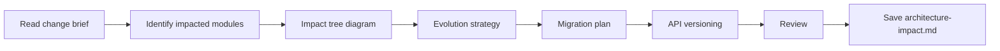

# Architecture Impact

## Goal

Map every module, service, and data structure impacted by a brownfield change, choose an evolution strategy, and plan reversible migrations.

## Rules

- Trace impact through direct, indirect, and transitive dependencies
- Every migration must be reversible (rollback plan mandatory)
- Zero-downtime migrations by default, justify any downtime
- Breaking changes require explicit versioning strategy
- Requirements started from $ARGUMENTS

## Quick Start

```text
Analyze the architecture impact of adding multi-tenant support
```

## Workflow



### Step 1: Identify Impacted Modules

**Do:**

1. Read the change brief/PRD and system overview
2. Identify all impacted modules:
   - **Direct**: modules that are modified
   - **Indirect**: modules that depend on modified ones
   - **Transitive**: modules that depend on indirect ones

**Success criteria:** All impacted modules identified at all dependency levels

### Step 2: Document Impact

**Do:**

1. Generate an impact tree diagram (Mermaid) with severity coloring
2. For each impacted module, document:
   - Type of impact (modification, interface change, behavior change)
   - Files concerned (estimated count)
   - Tests to adapt
   - Risk level (high/medium/low)

**Success criteria:** Impact tree complete, all modules documented with risk levels

### Step 3: Choose Strategy & Plan Migrations

**Do:**

1. Choose evolution strategy using decision tree:
   - Feature Flags → for reversible changes on critical flows
   - Strangler Fig → for complete module replacement
   - Branch by Abstraction → for interface refactoring
   - Big Bang → only for simple, isolated changes
2. Plan data migrations (if any):
   - Incremental steps (add → dual-write → backfill → switch → cleanup)
   - Rollback procedure for each step
   - Zero-downtime validation
3. Define API versioning strategy for breaking changes

**Success criteria:** Strategy chosen and justified, migration plan with rollback procedures

### Step 4: Review & Save

**Do:**

1. Present impact analysis for review
2. **WAIT FOR USER APPROVAL**
3. Save as `aidd_docs/tasks/architecture-impact.md`

**Success criteria:** Impact analysis validated and saved

## Resources

| Type  | Path                                     | Description          |
| ----- | ---------------------------------------- | -------------------- |
| Input | `aidd_docs/memory/system_overview.md`   | System overview      |
