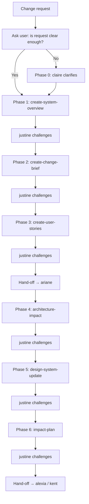

# Brownfield Workflow

## Goal

Transform a change request on an existing system into a complete impact plan through structured sequential phases: clarification, PM documentation, and architecture/design.

When executing, create a task in `{{DOCS}}/tasks/` following the @{{DOCS}}/templates/aidd/plan.md template to track each phase.

## Rules

- Sequential execution — one phase at a time, validate before next
- Challenge gate after each deliverable via justine
- Impact evaluation available via eva at any decision point
- User approval required at every step
- Preserve first — always identify what must NOT change before specifying what changes
- Always ask user if their change request is clear enough to proceed — never let the AI judge clarity
- If user says no, start with claire for clarification (Phase 0)
- Detect existing state — check `{{DOCS}}/memory/` for existing deliverables, skip completed steps

## Workflow

## Steps

- @{{TOOLS}}/skills/brownfield-workflow/steps/00-clarification.md
- @{{TOOLS}}/skills/brownfield-workflow/steps/01-system-overview.md
- @{{TOOLS}}/skills/brownfield-workflow/steps/02-change-brief.md
- @{{TOOLS}}/skills/brownfield-workflow/steps/03-user-stories.md
- @{{TOOLS}}/skills/brownfield-workflow/steps/04-architecture-impact.md
- @{{TOOLS}}/skills/brownfield-workflow/steps/05-design-system-update.md
- @{{TOOLS}}/skills/brownfield-workflow/steps/06-impact-plan.md

## Resources

| Type  | Path       | Description               |
| ----- | ---------- | ------------------------- |
| Agent | `claire`   | Clarification (Phase 0)   |
| Agent | `justine`  | Challenge gates           |
| Agent | `eva`      | Impact evaluation         |
| Agent | `oriane`   | PM phases (1-3)           |
| Agent | `ariane`   | Archi/Design phases (4-6) |
