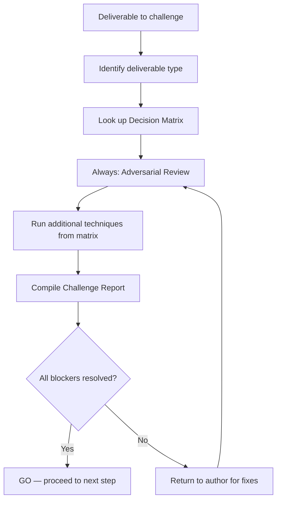

# Challenge Methods

## Goal

Provide a structured toolkit of challenge techniques to validate deliverables at every workflow gate. Each technique targets specific blind spots and biases.

## Techniques

### 1. Adversarial Review (default)

**Apply to**: Every deliverable, always.

- Assume the deliverable is wrong and try to disprove it
- Look for internal contradictions, missing edge cases, unstated assumptions
- Question every "obvious" choice — why this and not the alternative?

### 2. Cross-Agent Collaboration

**Apply to**: Deliverables that span multiple domains (PM + architecture, design + business).

- Request a second opinion from another domain's perspective
- Business reviews architecture for business alignment
- Technical reviews PRD for technical feasibility
- Evaluate cross-domain impacts

### 3. Pre-mortem Analysis

**Apply to**: Architecture decisions, impact plans, milestones.

- Assume the project has failed — what went wrong?
- Identify the top 3 most likely failure modes
- For each failure mode: what signal would we see first? What mitigation exists?
- If no mitigation exists, flag as blocker

### 4. Checklists & Validation Gates

**Apply to**: All deliverables with structured templates.

- Verify every required section is present and complete
- Check cross-references between documents (NSM consistency, scope alignment)
- Validate format compliance (Gherkin for acceptance criteria, Mermaid for diagrams)
- Binary pass/fail — no partial credit

### 5. Red Team vs Blue Team

**Apply to**: Security-sensitive decisions, critical architecture choices, NFRs.

- Red Team: actively try to break the proposed solution (attack vectors, failure scenarios, abuse cases)
- Blue Team: defend the solution and propose countermeasures
- Document the exchange and resulting hardening decisions

### 6. First Principles + Inversion

**Apply to**: Complex features, over-engineered solutions, scope decisions.

- Decompose to first principles: what is the simplest version that solves the problem?
- Inversion: what would make this solution fail? What should we explicitly NOT do?
- Compare proposed solution against the first-principles minimum — justify every addition

### 7. Socratic Questioning

**Apply to**: Fuzzy requirements, unclear motivations, assumption-heavy deliverables.

- Ask "why?" at least 3 levels deep for every major decision
- Challenge the problem definition itself — are we solving the right problem?
- Probe for hidden stakeholders, unspoken constraints, implicit assumptions

## Decision Matrix

Select techniques based on deliverable type:

| Deliverable | Techniques (in order) |
|---|---|
| Constitution | 1 (Adversarial) + 7 (Socratic) + 6 (First Principles) |
| Product Brief | 1 (Adversarial) + 7 (Socratic) + 3 (Pre-mortem) |
| PRD | 1 (Adversarial) + 4 (Checklists) + 6 (First Principles) |
| User Stories | 1 (Adversarial) + 4 (Checklists) |
| System Overview | 1 (Adversarial) + 2 (Cross-Agent) |
| Change Brief | 1 (Adversarial) + 7 (Socratic) + 3 (Pre-mortem) |
| Architecture Decision | 1 (Adversarial) + 3 (Pre-mortem) + 5 (Red/Blue) + 6 (First Principles) |
| Architecture Impact | 1 (Adversarial) + 3 (Pre-mortem) + 2 (Cross-Agent) |
| Design System | 1 (Adversarial) + 4 (Checklists) + 2 (Cross-Agent) |
| Design System Update | 1 (Adversarial) + 4 (Checklists) + 2 (Cross-Agent) |
| Impact Plan | 1 (Adversarial) + 3 (Pre-mortem) + 5 (Red/Blue) |
| Milestones | 1 (Adversarial) + 3 (Pre-mortem) + 4 (Checklists) |

## Workflow

