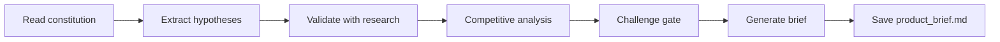

# Create Product Brief

## Goal

Validate that the right problem is being solved for the right people, then synthesize findings into a structured product brief.

## Rules

- Never skip validation — assumptions must be challenged with data
- Hypotheses must be testable and falsifiable
- Competitive analysis must identify table stakes AND differentiators
- The product brief is generated ONLY after challenge gate passes
- Requirements started from $ARGUMENTS

## Quick Start

```text
Create a product brief based on our constitution
```

## Workflow



### Step 1: Extract Hypotheses

**Do:**

1. Read the constitution or idea from $ARGUMENTS
2. Extract key hypotheses to validate (problem, persona, market)
3. For each hypothesis, propose a validation method and risk if false

**Success criteria:** All key hypotheses identified with validation methods

### Step 2: Research & Validate

**Do:**

1. **WAIT FOR USER RESPONSE** — user provides research data (interviews, surveys, market data)
2. Synthesize research findings: frustrations, patterns, unmet needs
3. Conduct competitive analysis: table stakes, differentiators, value map

**Success criteria:** Research synthesized, competitive landscape mapped

### Step 3: Challenge Gate

**Do:**

1. Run challenge gate: is this the right problem? right people? real differentiation?

**Success criteria:** Challenge gate passed — all critical questions answered

### Step 4: Generate Brief

**Do:**

1. Generate the product brief with all sections
2. **WAIT FOR USER APPROVAL**
3. Save as `aidd_docs/memory/product_brief.md`

**Success criteria:** Product brief validated and saved

## Resources

| Type     | Path                                          | Description              |
| -------- | --------------------------------------------- | ------------------------ |
| Input    | `aidd_docs/memory/constitution.md`            | Project constitution     |
| Template | `aidd_docs/templates/pm/brief.md`             | Brief template           |
| Template | `aidd_docs/templates/pm/discovery_package.md` | Discovery package        |
| Template | `aidd_docs/templates/pm/persona.md`           | Persona template         |
