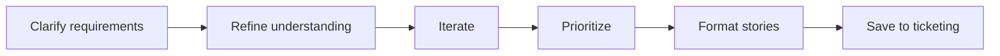

# Create User Stories

## Goal

Generate well-structured user stories from feature requirements through systematic Product Owner questioning.

## Rules

- No technical aspect, focus on user needs
- Requirements started from $ARGUMENTS
- Lean, concise approach
- 3 max questions per iteration
- Sort by implementation priority
- All checklists must be satisfied

### INVEST Checklist

- [ ] **I**ndependent — can be developed without other stories
- [ ] **N**egotiable — details can be discussed
- [ ] **V**aluable — delivers value to the user
- [ ] **E**stimable — team can estimate the effort
- [ ] **S**mall — fits in a single sprint
- [ ] **T**estable — acceptance criteria are verifiable

### Definition of Ready

- [ ] Acceptance criteria defined
- [ ] Dependencies identified
- [ ] Story points estimated
- [ ] No blocking questions

## Quick Start

```text
Create user stories for the authentication feature
```

## Workflow



### Step 1: Clarify Requirements

**Do:**

1. Ask clarifying questions to understand completeness (problem, features, criteria, scope, constraints)
2. Refine story understanding with user
3. Iterate until both sides are satisfied

**Success criteria:** All user needs understood, no blocking questions

### Step 2: Prioritize & Format

**Do:**

1. Prioritize stories by implementation order
2. Format stories using user story template
3. Validate each story against INVEST checklist and Definition of Ready

**Success criteria:** All stories pass INVEST checklist and Definition of Ready

### Step 3: Save

**Do:**

1. Save stories to the ticketing system

**Success criteria:** Stories saved and accessible

## Resources

| Type     | Path                                     | Description          |
| -------- | ---------------------------------------- | -------------------- |
| Template | `aidd_docs/templates/pm/user_story.md`  | User story template  |
