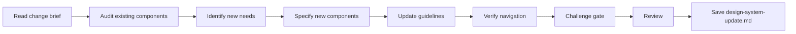

# Design System Update

## Goal

Audit existing UI patterns and generate a coherent design system update plan that integrates new components without breaking visual consistency.

## Rules

- Reuse existing components before creating new ones
- New components must use shared design tokens (colors, spacing, fonts)
- Every new component needs justification vs adapting an existing one
- WCAG AA accessibility is mandatory for every addition
- Navigation coherence must be preserved
- Requirements started from $ARGUMENTS
- **Standalone usage** — when not orchestrated, run `/challenge` after saving for adversarial review

## Quick Start

```text
Audit and update the design system for the new dashboard feature
```

## Workflow



### Step 1: Audit Existing Components

**Do:**

1. Read the change brief (or PRD) and existing design system from $ARGUMENTS
2. Audit existing components: inventory, variants, usage count, inconsistencies

**Success criteria:** Full inventory of existing components with usage patterns

### Step 2: Identify & Specify New Components

**Do:**

1. Identify which new components are needed vs which existing ones can be adapted
2. For each new component, specify: tokens, variants, states, accessibility, migration plan

**Success criteria:** Each new component justified, specified with full details

### Step 3: Update Guidelines & Verify

**Do:**

1. Update guidelines: palette, typography, spacing, interaction patterns
2. Verify navigation coherence: breadcrumbs, URLs, responsive, transitions

**Success criteria:** Guidelines updated, navigation coherence verified

### Step 4: Challenge Gate

**Do:**

1. Verify the design system update against these criteria:
   - New components use existing design tokens (colors, spacing, fonts)
   - No contradictory interaction patterns between old and new components
   - Navigation remains coherent (breadcrumbs, URLs, responsive, transitions)
   - WCAG AA accessibility maintained on every addition
   - Migration plan defined for replaced components (if applicable)

**Success criteria:** All criteria pass. Flag any failing criterion for user resolution before saving.


### Step 5: Review & Save

**Do:**

1. Present the update plan for review
2. **WAIT FOR USER APPROVAL**
3. Save as `{{DOCS}}/tasks/YYYY-MM-DD-{change-name}/design-system-update.md`

**Success criteria:** Design system update validated and saved

## Resources

| Type  | Path                                     | Description           |
| ----- | ---------------------------------------- | --------------------- |
| Input | `{{DOCS}}/memory/internal/change_brief.md`     | Change brief (brownfield) or `prd.md` (greenfield) |
| Input | `{{DOCS}}/memory/internal/design_system.md`    | Existing design system (if available) |
